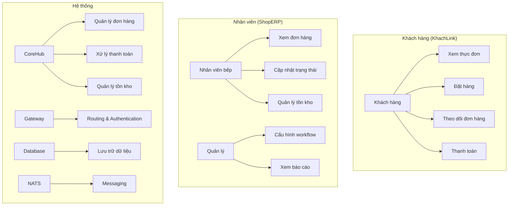
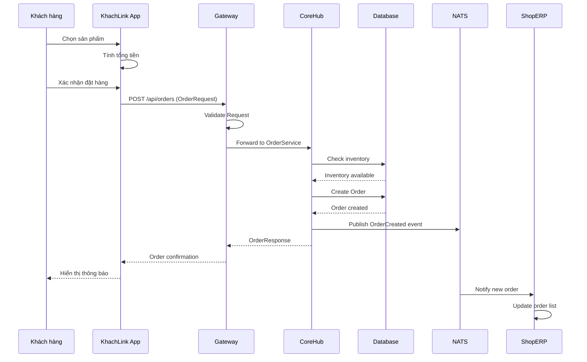
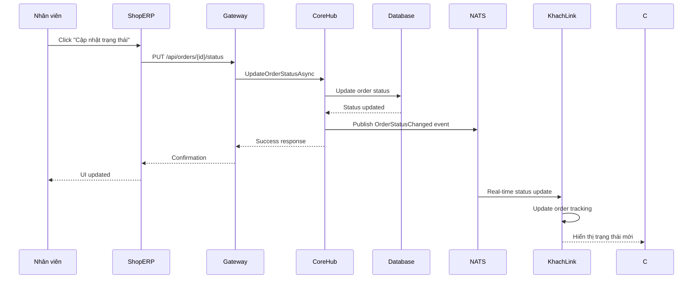
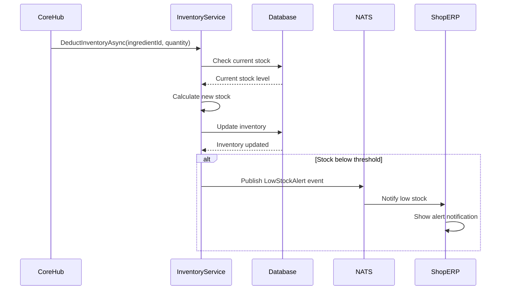
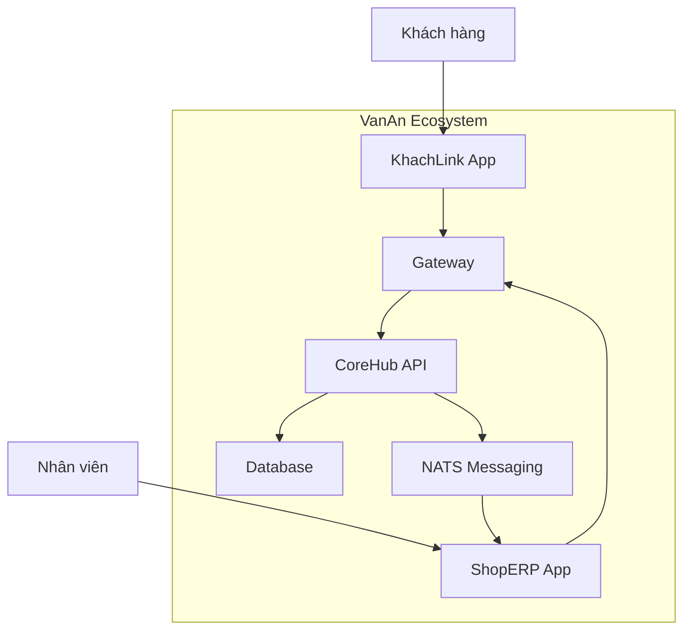
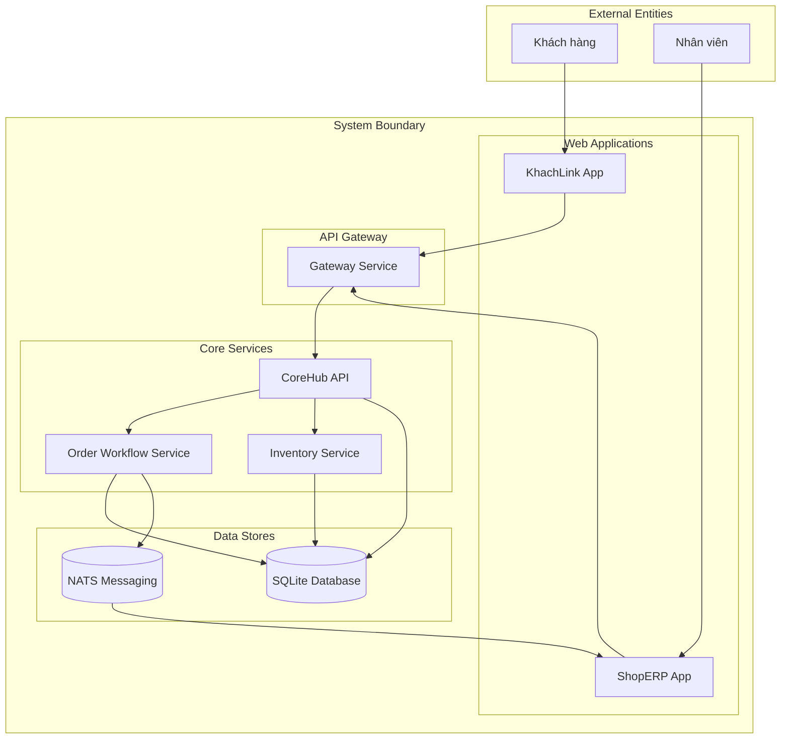
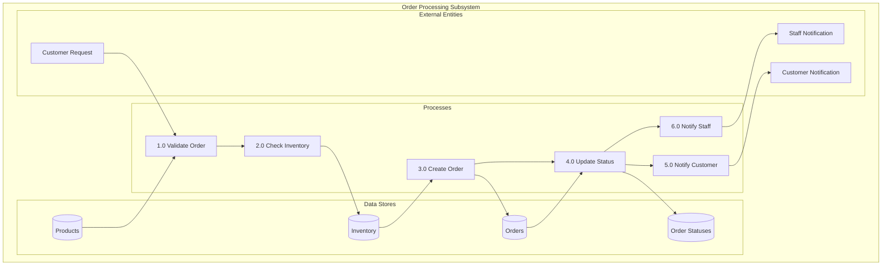
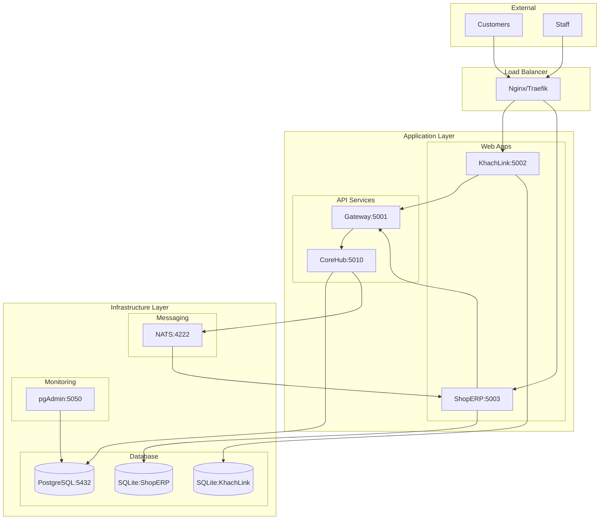
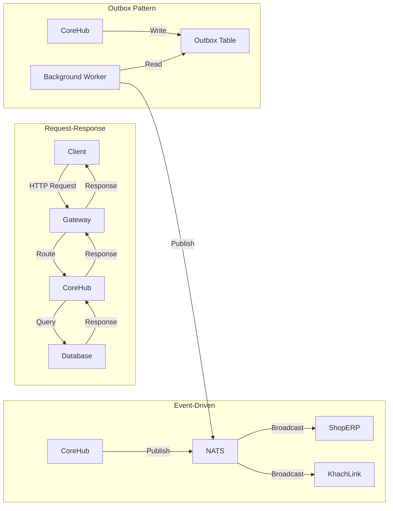
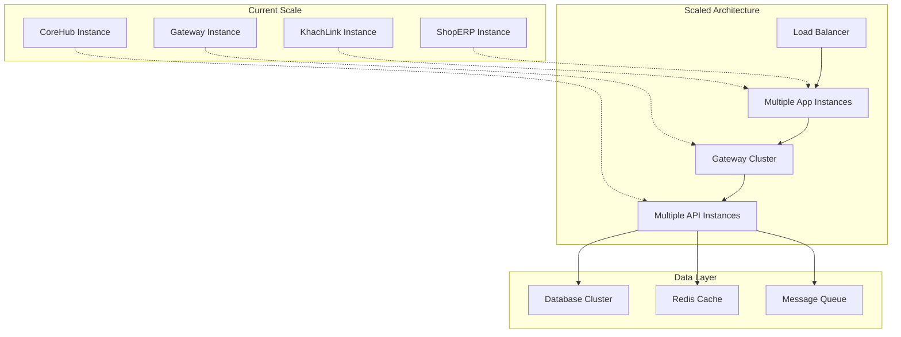

# 🏗️ VanAn Ecosystem - System Architecture Diagrams

## 📋 Table of Contents
1. [Use Case Diagram](#use-case-diagram)
2. [Class Diagram](#class-diagram)
3. [Sequence Diagram](#sequence-diagram)
4. [Data Flow Diagram (DFD)](#data-flow-diagram-dfd)
5. [Deployment Architecture](#deployment-architecture)

---

## 🎯 Use Case Diagram



### 📝 Use Case Descriptions

#### **Khách hàng (KhachLink)**
- **Xem thực đơn**: Hiển thị danh sách sản phẩm có sẵn
- **Đặt hàng**: Tạo đơn hàng mới với các sản phẩm đã chọn
- **Theo dõi đơn hàng**: Xem trạng thái hiện tại của đơn hàng
- **Thanh toán**: Xử lý thanh toán đơn hàng

#### **Nhân viên (ShopERP)**
- **Xem đơn hàng**: Hiển thị danh sách đơn hàng cần xử lý
- **Cập nhật trạng thái**: Thay đổi trạng thái của đơn hàng
- **Quản lý tồn kho**: Kiểm tra và cập nhật số lượng tồn kho
- **Cấu hình workflow**: Tùy chỉnh luồng xử lý đơn hàng
- **Xem báo cáo**: Xem thống kê và báo cáo kinh doanh

---

## 🏛️ Class Diagram

```mermaid
classDiagram
    %% Domain Models
    class Product {
        +Guid Id
        +string Name
        +string Description
        +decimal Price
        +DateTime CreatedAt
        +bool IsActive
    }
    
    class Ingredient {
        +Guid Id
        +string Name
        +string Description
        +decimal UnitPrice
        +string Unit
        +int CurrentStock
        +int MinThreshold
    }
    
    class Recipe {
        +Guid Id
        +Guid ProductId
        +Guid IngredientId
        +decimal Quantity
        +string Unit
    }
    
    class Inventory {
        +Guid Id
        +Guid IngredientId
        +int CurrentStock
        +int MinThreshold
        +DateTime LastUpdated
    }
    
    class Order {
        +Guid Id
        +string CustomerDeviceId
        +DateTime OrderDate
        +decimal TotalAmount
        +string CurrentStatusId
        +DateTime StatusStartedAt
        +List~OrderItem~ Items
    }
    
    class OrderItem {
        +Guid Id
        +Guid OrderId
        +Guid ProductId
        +int Quantity
        +decimal UnitPrice
        +decimal TotalPrice
    }
    
    class OrderStatus {
        +string Id
        +string DisplayName
        +int Sequence
        +bool IsActive
        +bool RequiresInventoryDeduction
    }
    
    %% Services
    class OrderWorkflowService {
        +IOrderWorkflowService
        +Task~Order~ CreateOrderAsync(OrderRequest request)
        +Task UpdateOrderStatusAsync(string orderId, string statusId)
        +Task~List~OrderStatus~~ GetAvailableStatusesAsync()
        +Task~Order~ GetOrderAsync(string orderId)
    }
    
    class InventoryService {
        +IInventoryService
        +Task~bool~ CheckAvailabilityAsync(Guid ingredientId, int quantity)
        +Task DeductInventoryAsync(Guid ingredientId, int quantity)
        +Task~List~Inventory~~ GetLowStockItemsAsync()
        +Task UpdateInventoryAsync(Guid ingredientId, int newQuantity)
    }
    
    %% Infrastructure
    class VanAnSqliteDbContext {
        +DbSet~Product~ Products
        +DbSet~Ingredient~ Ingredients
        +DbSet~Recipe~ Recipes
        +DbSet~Inventory~ Inventories
        +DbSet~Order~ Orders
        +DbSet~OrderItem~ OrderItems
        +DbSet~OrderStatus~ OrderStatuses
    }
    
    %% Relationships
    Product ||--o{ Recipe : "has"
    Ingredient ||--o{ Recipe : "used in"
    Ingredient ||--|| Inventory : "tracked by"
    Order ||--o{ OrderItem : "contains"
    Product ||--o{ OrderItem : "ordered as"
    Order ||--|| OrderStatus : "has status"
    
    OrderWorkflowService ..> Order : "manages"
    OrderWorkflowService ..> OrderStatus : "uses"
    InventoryService ..> Inventory : "manages"
    InventoryService ..> Ingredient : "tracks"
    
    VanAnSqliteDbContext ..> Product : "persists"
    VanAnSqliteDbContext ..> Ingredient : "persists"
    VanAnSqliteDbContext ..> Recipe : "persists"
    VanAnSqliteDbContext ..> Inventory : "persists"
    VanAnSqliteDbContext ..> Order : "persists"
    VanAnSqliteDbContext ..> OrderItem : "persists"
    VanAnSqliteDbContext ..> OrderStatus : "persists"
```

---

## 🔄 Sequence Diagram

### **1. Customer Order Flow**



### **2. Order Status Update Flow**



### **3. Inventory Management Flow**



---

## 📊 Data Flow Diagram (DFD)

### **Level 0 - Context Diagram**



### **Level 1 - System DFD**



### **Level 2 - Order Processing DFD**



---

## 🚀 Deployment Architecture



---

## 📋 Component Interactions

### **Message Flow Patterns**



---

## 🔐 Security Architecture

```mermaid
graph TD
    subgraph "Security Layers"
        L1[Network Security<br/>- HTTPS/TLS<br/>- Firewall Rules]
        L2[Authentication<br/>- DeviceId (Customers)<br/>- BiometricHash (Staff)]
        L3[Authorization<br/>- Role-based Access<br/>- API Key Validation]
        L4[Data Protection<br/>- Encrypted at Rest<br/>- Encrypted in Transit]
    end
    
    subgraph "Identity Management"
        CUST[Customer Identity<br/>DeviceId-based]
        STAFF[Staff Identity<br/>BiometricHash-based]
    end
    
    L1 --> L2
    L2 --> L3
    L3 --> L4
    
    CUST --> L2
    STAFF --> L2
```

---

## 📈 Performance & Scalability

### **Horizontal Scaling Strategy**



---

## 🎯 Key Design Principles

### **1. Clean Architecture**
- **Domain Layer**: Business logic and entities
- **Application Layer**: Use cases and services
- **Infrastructure Layer**: Data access and external services
- **Presentation Layer**: Web applications and APIs

### **2. Microservices Pattern**
- **Bounded Contexts**: Clear service boundaries
- **Database per Service**: Independent data stores
- **Event-Driven Communication**: Loose coupling
- **API Gateway**: Single entry point

### **3. Zero-Friction Identity**
- **DeviceId**: Customer identification
- **BiometricHash**: Staff authentication
- **No Passwords**: Eliminate friction

### **4. Outbox Pattern**
- **Transactional Consistency**: Reliable event publishing
- **Background Processing**: Async message delivery
- **Error Handling**: Retry mechanisms

---

## 📚 Glossary

| Term | Description |
|------|-------------|
| **KhachLink** | Customer-facing ordering application |
| **ShopERP** | Staff management application |
| **CoreHub** | Central API service |
| **Gateway** | API routing and authentication |
| **DeviceId** | Unique customer identifier |
| **BiometricHash** | Staff biometric identifier |
| **Outbox Pattern** | Reliable event publishing pattern |
| **NATS** | Lightweight messaging system |
| **Workflow** | Order processing flow |

---

*Last Updated: March 2026*
*Architecture Version: 1.0*
