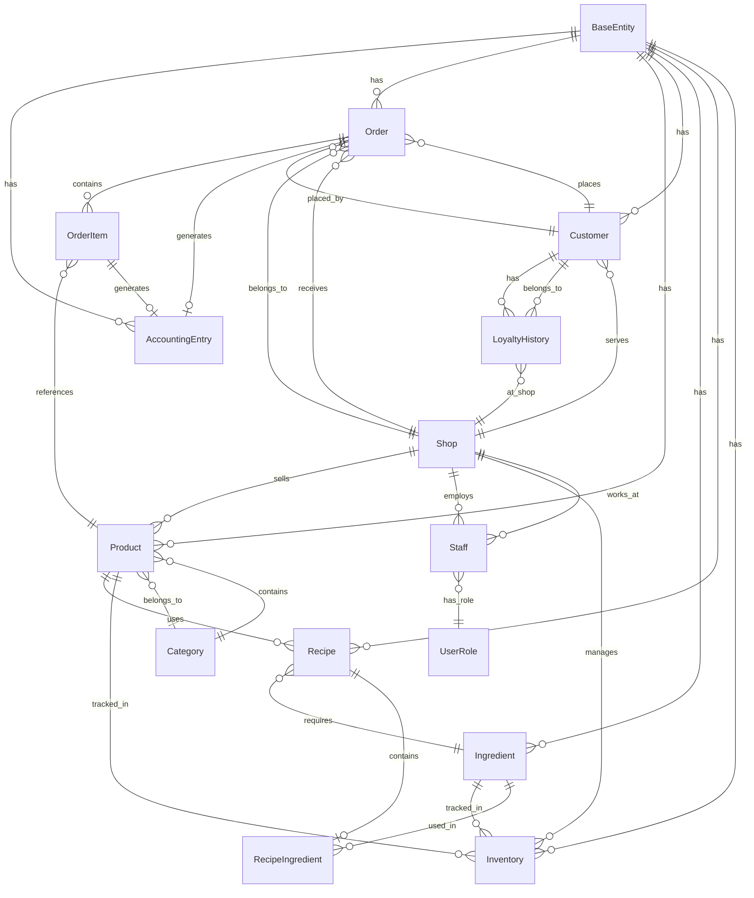

# PostgreSQL Central Database Schema

**Database:** vanan_central  
**Location:** Gateway (Port 5001) & CoreHub Services  
**Engine:** PostgreSQL  
**Connection:** Host=localhost;Port=5432;Database=vanan_central;Username=vanan;Password=***

---

## **1. DATABASE OVERVIEW**

### **1.1 Purpose**
- **Central data storage** for Gateway and CoreHub services
- **Primary database** for business operations
- **Shared by** Gateway API and CoreHub business services
- **Multi-tenant** architecture support

### **1.2 Connection Configuration**
```csharp
// Gateway/Program.cs & CoreHub Services
var connectionString = builder.Configuration.GetConnectionString("DefaultConnection");
builder.Services.AddDbContext<VanAnDbContext>(options =>
    options.UseNpgsql(connectionString));
```

---

## **2. ENTITY RELATIONSHIP DIAGRAM**



---

## **3. DETAILED TABLE SCHEMAS**

### **3.1 Base Tables**

#### **BaseEntity (Abstract)**
```sql
-- Base columns for all entities
CREATE TABLE BaseEntity (
    Id UUID PRIMARY KEY DEFAULT gen_random_uuid(),
    CreatedAt TIMESTAMP WITH TIME ZONE NOT NULL DEFAULT NOW(),
    UpdatedAt TIMESTAMP WITH TIME ZONE NOT NULL DEFAULT NOW(),
    IsDeleted BOOLEAN NOT NULL DEFAULT FALSE,
    TenantId UUID NOT NULL,
    INDEX idx BaseEntity_TenantId (TenantId),
    INDEX idx BaseEntity_CreatedAt (CreatedAt),
    INDEX idx BaseEntity_IsDeleted (IsDeleted)
);
```

#### **Shops Table**
```sql
CREATE TABLE Shops (
    Id UUID PRIMARY KEY DEFAULT gen_random_uuid(),
    Name VARCHAR(255) NOT NULL,
    Address TEXT,
    Phone VARCHAR(50),
    Email VARCHAR(255),
    IsActive BOOLEAN NOT NULL DEFAULT TRUE,
    CreatedAt TIMESTAMP WITH TIME ZONE NOT NULL DEFAULT NOW(),
    UpdatedAt TIMESTAMP WITH TIME ZONE NOT NULL DEFAULT NOW(),
    IsDeleted BOOLEAN NOT NULL DEFAULT FALSE,
    TenantId UUID NOT NULL,
    
    CONSTRAINT Shops_TenantId_FK FOREIGN KEY (TenantId) REFERENCES BaseEntity(Id),
    INDEX idx_Shops_TenantId (TenantId),
    INDEX idx_Shops_IsActive (IsActive)
);
```

### **3.2 Product Management**

#### **Categories Table**
```sql
CREATE TABLE Categories (
    Id UUID PRIMARY KEY DEFAULT gen_random_uuid(),
    Name VARCHAR(100) NOT NULL,
    Description TEXT,
    DisplayOrder INTEGER NOT NULL DEFAULT 0,
    IsActive BOOLEAN NOT NULL DEFAULT TRUE,
    CreatedAt TIMESTAMP WITH TIME ZONE NOT NULL DEFAULT NOW(),
    UpdatedAt TIMESTAMP WITH TIME ZONE NOT NULL DEFAULT NOW(),
    IsDeleted BOOLEAN NOT NULL DEFAULT FALSE,
    TenantId UUID NOT NULL,
    
    CONSTRAINT Categories_TenantId_FK FOREIGN KEY (TenantId) REFERENCES BaseEntity(Id),
    INDEX idx_Categories_TenantId (TenantId),
    INDEX idx_Categories_DisplayOrder (DisplayOrder),
    INDEX idx_Categories_IsActive (IsActive)
);
```

#### **Products Table**
```sql
CREATE TABLE Products (
    Id UUID PRIMARY KEY DEFAULT gen_random_uuid(),
    Name VARCHAR(255) NOT NULL,
    Description TEXT,
    Price DECIMAL(18,2) NOT NULL DEFAULT 0.00,
    CategoryId UUID NOT NULL,
    ImageUrl VARCHAR(500),
    IsActive BOOLEAN NOT NULL DEFAULT TRUE,
    VatRate DECIMAL(5,2) NOT NULL DEFAULT 10.00,
    PreparationTime INTEGER NOT NULL DEFAULT 0, -- minutes
    CreatedAt TIMESTAMP WITH TIME ZONE NOT NULL DEFAULT NOW(),
    UpdatedAt TIMESTAMP WITH TIME ZONE NOT NULL DEFAULT NOW(),
    IsDeleted BOOLEAN NOT NULL DEFAULT FALSE,
    TenantId UUID NOT NULL,
    
    CONSTRAINT Products_CategoryId_FK FOREIGN KEY (CategoryId) REFERENCES Categories(Id),
    CONSTRAINT Products_TenantId_FK FOREIGN KEY (TenantId) REFERENCES BaseEntity(Id),
    INDEX idx_Products_TenantId (TenantId),
    INDEX idx_Products_CategoryId (CategoryId),
    INDEX idx_Products_IsActive (IsActive),
    INDEX idx_Products_Price (Price)
);
```

#### **Ingredients Table**
```sql
CREATE TABLE Ingredients (
    Id UUID PRIMARY KEY DEFAULT gen_random_uuid(),
    Name VARCHAR(255) NOT NULL,
    Description TEXT,
    Unit VARCHAR(50) NOT NULL, -- kg, g, l, ml, pieces
    CurrentStock DECIMAL(18,3) NOT NULL DEFAULT 0.000,
    MinStockLevel DECIMAL(18,3) NOT NULL DEFAULT 0.000,
    MaxStockLevel DECIMAL(18,3) NOT NULL DEFAULT 1000.000,
    UnitCost DECIMAL(18,2) NOT NULL DEFAULT 0.00,
    IsActive BOOLEAN NOT NULL DEFAULT TRUE,
    CreatedAt TIMESTAMP WITH TIME ZONE NOT NULL DEFAULT NOW(),
    UpdatedAt TIMESTAMP WITH TIME ZONE NOT NULL DEFAULT NOW(),
    IsDeleted BOOLEAN NOT NULL DEFAULT FALSE,
    TenantId UUID NOT NULL,
    
    CONSTRAINT Ingredients_TenantId_FK FOREIGN KEY (TenantId) REFERENCES BaseEntity(Id),
    INDEX idx_Ingredients_TenantId (TenantId),
    INDEX idx_Ingredients_IsActive (IsActive),
    INDEX idx_Ingredients_CurrentStock (CurrentStock)
);
```

#### **Recipes Table**
```sql
CREATE TABLE Recipes (
    Id UUID PRIMARY KEY DEFAULT gen_random_uuid(),
    ProductId UUID NOT NULL,
    Name VARCHAR(255) NOT NULL,
    Instructions TEXT,
    YieldQuantity DECIMAL(18,3) NOT NULL DEFAULT 1.000,
    YieldUnit VARCHAR(50) NOT NULL DEFAULT 'serving',
    IsActive BOOLEAN NOT NULL DEFAULT TRUE,
    CreatedAt TIMESTAMP WITH TIME ZONE NOT NULL DEFAULT NOW(),
    UpdatedAt TIMESTAMP WITH TIME ZONE NOT NULL DEFAULT NOW(),
    IsDeleted BOOLEAN NOT NULL DEFAULT FALSE,
    TenantId UUID NOT NULL,
    
    CONSTRAINT Recipes_ProductId_FK FOREIGN KEY (ProductId) REFERENCES Products(Id),
    CONSTRAINT Recipes_TenantId_FK FOREIGN KEY (TenantId) REFERENCES BaseEntity(Id),
    INDEX idx_Recipes_TenantId (TenantId),
    INDEX idx_Recipes_ProductId (ProductId),
    INDEX idx_Recipes_IsActive (IsActive)
);
```

#### **RecipeIngredients Table**
```sql
CREATE TABLE RecipeIngredients (
    Id UUID PRIMARY KEY DEFAULT gen_random_uuid(),
    RecipeId UUID NOT NULL,
    IngredientId UUID NOT NULL,
    Quantity DECIMAL(18,3) NOT NULL DEFAULT 0.000,
    Unit VARCHAR(50) NOT NULL,
    IsOptional BOOLEAN NOT NULL DEFAULT FALSE,
    CreatedAt TIMESTAMP WITH TIME ZONE NOT NULL DEFAULT NOW(),
    UpdatedAt TIMESTAMP WITH TIME ZONE NOT NULL DEFAULT NOW(),
    IsDeleted BOOLEAN NOT NULL DEFAULT FALSE,
    TenantId UUID NOT NULL,
    
    CONSTRAINT RecipeIngredients_RecipeId_FK FOREIGN KEY (RecipeId) REFERENCES Recipes(Id) ON DELETE CASCADE,
    CONSTRAINT RecipeIngredients_IngredientId_FK FOREIGN KEY (IngredientId) REFERENCES Ingredients(Id),
    CONSTRAINT RecipeIngredients_TenantId_FK FOREIGN KEY (TenantId) REFERENCES BaseEntity(Id),
    INDEX idx_RecipeIngredients_TenantId (TenantId),
    INDEX idx_RecipeIngredients_RecipeId (RecipeId),
    INDEX idx_RecipeIngredients_IngredientId (IngredientId),
    UNIQUE (RecipeId, IngredientId, TenantId)
);
```

### **3.3 Inventory Management**

#### **Inventory Table**
```sql
CREATE TABLE Inventory (
    Id UUID PRIMARY KEY DEFAULT gen_random_uuid(),
    ShopId UUID NOT NULL,
    ProductId UUID,
    IngredientId UUID,
    CurrentStock DECIMAL(18,3) NOT NULL DEFAULT 0.000,
    MinStockLevel DECIMAL(18,3) NOT NULL DEFAULT 0.000,
    MaxStockLevel DECIMAL(18,3) NOT NULL DEFAULT 1000.000,
    LastUpdated TIMESTAMP WITH TIME ZONE NOT NULL DEFAULT NOW(),
    IsActive BOOLEAN NOT NULL DEFAULT TRUE,
    CreatedAt TIMESTAMP WITH TIME ZONE NOT NULL DEFAULT NOW(),
    UpdatedAt TIMESTAMP WITH TIME ZONE NOT NULL DEFAULT NOW(),
    IsDeleted BOOLEAN NOT NULL DEFAULT FALSE,
    TenantId UUID NOT NULL,
    
    CONSTRAINT Inventory_ShopId_FK FOREIGN KEY (ShopId) REFERENCES Shops(Id),
    CONSTRAINT Inventory_ProductId_FK FOREIGN KEY (ProductId) REFERENCES Products(Id),
    CONSTRAINT Inventory_IngredientId_FK FOREIGN KEY (IngredientId) REFERENCES Ingredients(Id),
    CONSTRAINT Inventory_TenantId_FK FOREIGN KEY (TenantId) REFERENCES BaseEntity(Id),
    CONSTRAINT Inventory_ProductOrIngredient CHECK (
        (ProductId IS NOT NULL AND IngredientId IS NULL) OR 
        (ProductId IS NULL AND IngredientId IS NOT NULL)
    ),
    INDEX idx_Inventory_TenantId (TenantId),
    INDEX idx_Inventory_ShopId (ShopId),
    INDEX idx_Inventory_ProductId (ProductId),
    INDEX idx_Inventory_IngredientId (IngredientId),
    INDEX idx_Inventory_CurrentStock (CurrentStock)
);
```

### **3.4 Customer Management**

#### **Customers Table**
```sql
CREATE TABLE Customers (
    Id UUID PRIMARY KEY DEFAULT gen_random_uuid(),
    DeviceId VARCHAR(255) UNIQUE, -- Zero-friction identity
    Name VARCHAR(255),
    Phone VARCHAR(50),
    Email VARCHAR(255),
    Address TEXT,
    IsActive BOOLEAN NOT NULL DEFAULT TRUE,
    CreatedAt TIMESTAMP WITH TIME ZONE NOT NULL DEFAULT NOW(),
    UpdatedAt TIMESTAMP WITH TIME ZONE NOT NULL DEFAULT NOW(),
    IsDeleted BOOLEAN NOT NULL DEFAULT FALSE,
    TenantId UUID NOT NULL,
    
    CONSTRAINT Customers_TenantId_FK FOREIGN KEY (TenantId) REFERENCES BaseEntity(Id),
    INDEX idx_Customers_TenantId (TenantId),
    INDEX idx_Customers_DeviceId (DeviceId),
    INDEX idx_Customers_IsActive (IsActive),
    INDEX idx_Customers_Phone (Phone)
);
```

#### **LoyaltyHistory Table**
```sql
CREATE TABLE LoyaltyHistory (
    Id UUID PRIMARY KEY DEFAULT gen_random_uuid(),
    CustomerId UUID NOT NULL,
    ShopId UUID NOT NULL,
    PointsEarned INTEGER NOT NULL DEFAULT 0,
    PointsRedeemed INTEGER NOT NULL DEFAULT 0,
    TransactionType VARCHAR(50) NOT NULL, -- 'Purchase', 'Redemption', 'Adjustment'
    ReferenceId UUID, -- Reference to Order or other transaction
    Description TEXT,
    CreatedAt TIMESTAMP WITH TIME ZONE NOT NULL DEFAULT NOW(),
    UpdatedAt TIMESTAMP WITH TIME ZONE NOT NULL DEFAULT NOW(),
    IsDeleted BOOLEAN NOT NULL DEFAULT FALSE,
    TenantId UUID NOT NULL,
    
    CONSTRAINT LoyaltyHistory_CustomerId_FK FOREIGN KEY (CustomerId) REFERENCES Customers(Id),
    CONSTRAINT LoyaltyHistory_ShopId_FK FOREIGN KEY (ShopId) REFERENCES Shops(Id),
    CONSTRAINT LoyaltyHistory_TenantId_FK FOREIGN KEY (TenantId) REFERENCES BaseEntity(Id),
    INDEX idx_LoyaltyHistory_TenantId (TenantId),
    INDEX idx_LoyaltyHistory_CustomerId (CustomerId),
    INDEX idx_LoyaltyHistory_ShopId (ShopId),
    INDEX idx_LoyaltyHistory_CreatedAt (CreatedAt),
    INDEX idx_LoyaltyHistory_TransactionType (TransactionType)
);
```

### **3.5 Order Management**

#### **Orders Table**
```sql
CREATE TABLE Orders (
    Id UUID PRIMARY KEY DEFAULT gen_random_uuid(),
    OrderNumber VARCHAR(50) UNIQUE NOT NULL,
    CustomerId UUID,
    ShopId UUID NOT NULL,
    OrderType VARCHAR(50) NOT NULL DEFAULT 'DINEIN', -- 'DINEIN', 'TAKEAWAY', 'DELIVERY'
    Status VARCHAR(50) NOT NULL DEFAULT 'Draft',
    Subtotal DECIMAL(18,2) NOT NULL DEFAULT 0.00,
    VatAmount DECIMAL(18,2) NOT NULL DEFAULT 0.00,
    TotalAmount DECIMAL(18,2) NOT NULL DEFAULT 0.00,
    CustomerNotes TEXT,
    StaffNotes TEXT,
    OrderDate TIMESTAMP WITH TIME ZONE NOT NULL DEFAULT NOW(),
    DeliveryDate TIMESTAMP WITH TIME ZONE,
    DeliveryAddress TEXT,
    CustomerDeviceId VARCHAR(255),
    IsActive BOOLEAN NOT NULL DEFAULT TRUE,
    CreatedAt TIMESTAMP WITH TIME ZONE NOT NULL DEFAULT NOW(),
    UpdatedAt TIMESTAMP WITH TIME ZONE NOT NULL DEFAULT NOW(),
    IsDeleted BOOLEAN NOT NULL DEFAULT FALSE,
    TenantId UUID NOT NULL,
    
    CONSTRAINT Orders_CustomerId_FK FOREIGN KEY (CustomerId) REFERENCES Customers(Id),
    CONSTRAINT Orders_ShopId_FK FOREIGN KEY (ShopId) REFERENCES Shops(Id),
    CONSTRAINT Orders_TenantId_FK FOREIGN KEY (TenantId) REFERENCES BaseEntity(Id),
    INDEX idx_Orders_TenantId (TenantId),
    INDEX idx_Orders_CustomerId (CustomerId),
    INDEX idx_Orders_ShopId (ShopId),
    INDEX idx_Orders_OrderNumber (OrderNumber),
    INDEX idx_Orders_Status (Status),
    INDEX idx_Orders_OrderDate (OrderDate),
    INDEX idx_Orders_TotalAmount (TotalAmount)
);
```

#### **OrderItems Table**
```sql
CREATE TABLE OrderItems (
    Id UUID PRIMARY KEY DEFAULT gen_random_uuid(),
    OrderId UUID NOT NULL,
    ProductId UUID NOT NULL,
    Quantity INTEGER NOT NULL DEFAULT 1,
    UnitPrice DECIMAL(18,2) NOT NULL DEFAULT 0.00,
    VatRate DECIMAL(5,2) NOT NULL DEFAULT 10.00,
    VatAmount DECIMAL(18,2) NOT NULL DEFAULT 0.00,
    TotalAmount DECIMAL(18,2) NOT NULL DEFAULT 0.00,
    Notes TEXT,
    IsActive BOOLEAN NOT NULL DEFAULT TRUE,
    CreatedAt TIMESTAMP WITH TIME ZONE NOT NULL DEFAULT NOW(),
    UpdatedAt TIMESTAMP WITH TIME ZONE NOT NULL DEFAULT NOW(),
    IsDeleted BOOLEAN NOT NULL DEFAULT FALSE,
    TenantId UUID NOT NULL,
    
    CONSTRAINT OrderItems_OrderId_FK FOREIGN KEY (OrderId) REFERENCES Orders(Id) ON DELETE CASCADE,
    CONSTRAINT OrderItems_ProductId_FK FOREIGN KEY (ProductId) REFERENCES Products(Id),
    CONSTRAINT OrderItems_TenantId_FK FOREIGN KEY (TenantId) REFERENCES BaseEntity(Id),
    INDEX idx_OrderItems_TenantId (TenantId),
    INDEX idx_OrderItems_OrderId (OrderId),
    INDEX idx_OrderItems_ProductId (ProductId),
    INDEX idx_OrderItems_Quantity (Quantity)
);
```

### **3.6 Staff Management**

#### **Staff Table**
```sql
CREATE TABLE Staff (
    Id UUID PRIMARY KEY DEFAULT gen_random_uuid(),
    ShopId UUID NOT NULL,
    Name VARCHAR(255) NOT NULL,
    Email VARCHAR(255),
    Phone VARCHAR(50),
    Role VARCHAR(50) NOT NULL DEFAULT 'Staff', -- 'Owner', 'StoreKeeper', 'Guard', 'Staff', 'Masterchef'
    Username VARCHAR(100) UNIQUE,
    PasswordHash VARCHAR(255),
    IsActive BOOLEAN NOT NULL DEFAULT TRUE,
    LastLogin TIMESTAMP WITH TIME ZONE,
    CreatedAt TIMESTAMP WITH TIME ZONE NOT NULL DEFAULT NOW(),
    UpdatedAt TIMESTAMP WITH TIME ZONE NOT NULL DEFAULT NOW(),
    IsDeleted BOOLEAN NOT NULL DEFAULT FALSE,
    TenantId UUID NOT NULL,
    
    CONSTRAINT Staff_ShopId_FK FOREIGN KEY (ShopId) REFERENCES Shops(Id),
    CONSTRAINT Staff_TenantId_FK FOREIGN KEY (TenantId) REFERENCES BaseEntity(Id),
    INDEX idx_Staff_TenantId (TenantId),
    INDEX idx_Staff_ShopId (ShopId),
    INDEX idx_Staff_Username (Username),
    INDEX idx_Staff_Role (Role),
    INDEX idx_Staff_IsActive (IsActive)
);
```

### **3.7 Accounting System**

#### **AccountingEntries Table**
```sql
CREATE TABLE AccountingEntries (
    Id UUID PRIMARY KEY DEFAULT gen_random_uuid(),
    Amount DECIMAL(18,2) NOT NULL DEFAULT 0.00,
    EntryType VARCHAR(50) NOT NULL, -- 'Revenue', 'Expense', 'TaxPayment', 'Adjustment'
    VatRate DECIMAL(5,2) NOT NULL DEFAULT 0.00,
    TransactionDate TIMESTAMP WITH TIME ZONE NOT NULL DEFAULT NOW(),
    ReversalEntryId UUID, -- For reversal entries (Bút toán)
    ReferenceId UUID, -- Reference to Order, Invoice, etc.
    ReferenceType VARCHAR(100), -- 'Order', 'Invoice', 'Payment', etc.
    Description TEXT,
    IsActive BOOLEAN NOT NULL DEFAULT TRUE,
    CreatedAt TIMESTAMP WITH TIME ZONE NOT NULL DEFAULT NOW(),
    UpdatedAt TIMESTAMP WITH TIME ZONE NOT NULL DEFAULT NOW(),
    IsDeleted BOOLEAN NOT NULL DEFAULT FALSE,
    TenantId UUID NOT NULL,
    
    CONSTRAINT AccountingEntries_ReversalEntryId_FK FOREIGN KEY (ReversalEntryId) REFERENCES AccountingEntries(Id),
    CONSTRAINT AccountingEntries_TenantId_FK FOREIGN KEY (TenantId) REFERENCES BaseEntity(Id),
    INDEX idx_AccountingEntries_TenantId (TenantId),
    INDEX idx_AccountingEntries_EntryType (EntryType),
    INDEX idx_AccountingEntries_TransactionDate (TransactionDate),
    INDEX idx_AccountingEntries_ReferenceId (ReferenceId),
    INDEX idx_AccountingEntries_ReversalEntryId (ReversalEntryId)
);
```

---

## **4. INDEXES AND PERFORMANCE**

### **4.1 Primary Indexes**
All tables have primary key indexes on `Id` (UUID).

### **4.2 Foreign Key Indexes**
All foreign keys have corresponding indexes for join performance.

### **4.3 Business Indexes**
- **TenantId** on all tables (multi-tenancy)
- **IsActive** on all tables (soft deletes)
- **CreatedAt** on all tables (auditing)
- **Business-specific** indexes (CustomerId, OrderDate, etc.)

### **4.4 Composite Indexes**
```sql
-- Order lookup optimization
CREATE INDEX idx_Orders_Shop_Status_Date ON Orders(ShopId, Status, OrderDate);

-- Customer loyalty optimization
CREATE INDEX idx_LoyaltyHistory_Customer_Shop_Date ON LoyaltyHistory(CustomerId, ShopId, CreatedAt);

-- Inventory optimization
CREATE INDEX idx_Inventory_Shop_Product_Stock ON Inventory(ShopId, ProductId, CurrentStock);
```

---

## **5. CONSTRAINTS AND VALIDATIONS**

### **5.1 Foreign Key Constraints**
All relationships are enforced with foreign key constraints.

### **5.2 Check Constraints**
```sql
-- Positive quantities
ALTER TABLE OrderItems ADD CONSTRAINT chk_OrderItems_Quantity_Positive 
CHECK (Quantity > 0);

-- Positive amounts
ALTER TABLE Orders ADD CONSTRAINT chk_Orders_TotalAmount_Positive 
CHECK (TotalAmount >= 0);

-- Valid VAT rates
ALTER TABLE Products ADD CONSTRAINT chk_Products_VatRate_Valid 
CHECK (VatRate IN (0, 5, 10));

-- Product or Ingredient constraint
ALTER TABLE Inventory ADD CONSTRAINT chk_Inventory_ProductOrIngredient 
CHECK ((ProductId IS NOT NULL AND IngredientId IS NULL) OR 
       (ProductId IS NULL AND IngredientId IS NOT NULL));
```

### **5.3 Unique Constraints**
```sql
-- Unique order numbers
ALTER TABLE Orders ADD CONSTRAINT uk_Orders_OrderNumber_Tenant 
UNIQUE (OrderNumber, TenantId);

-- Unique device IDs for customers
ALTER TABLE Customers ADD CONSTRAINT uk_Customers_DeviceId_Tenant 
UNIQUE (DeviceId, TenantId);

-- Unique staff usernames
ALTER TABLE Staff ADD CONSTRAINT uk_Staff_Username_Tenant 
UNIQUE (Username, TenantId);
```

---

## **6. DATA MIGRATION CONSIDERATIONS**

### **6.1 Multi-tenancy Migration**
Current system needs tenant ID population:
```sql
-- Add default tenant for existing data
UPDATE BaseEntity SET TenantId = '00000000-0000-0000-0000-000000000001' WHERE TenantId IS NULL;
```

### **6.2 Data Consistency**
- **Order totals** must be recalculated
- **Inventory levels** must be synchronized
- **Loyalty points** must be validated

---

## **7. SECURITY CONSIDERATIONS**

### **7.1 Row Level Security**
```sql
-- Enable RLS for tenant isolation
ALTER TABLE Orders ENABLE ROW LEVEL SECURITY;

CREATE POLICY tenant_isolation_policy ON Orders
FOR ALL TO vanan_app
USING (TenantId = current_setting('app.current_tenant_id')::UUID);
```

### **7.2 Data Encryption**
- **Sensitive data** (phone, email) encrypted at rest
- **Password hashes** using bcrypt
- **PII data** masked in logs

---

## **8. BACKUP AND RECOVERY**

### **8.1 Backup Strategy**
- **Daily full backups** at 2:00 AM
- **Hourly transaction log backups**
- **Point-in-time recovery** capability
- **Cross-region backup** replication

### **8.2 Recovery Procedures**
- **Automated failover** to standby
- **Manual recovery** procedures documented
- **RTO/RSLA targets**: 15 minutes / 5 minutes

---

## **9. MONITORING AND MAINTENANCE**

### **9.1 Performance Monitoring**
- **Query performance** tracking
- **Index usage** statistics
- **Connection pool** monitoring
- **Deadlock detection**

### **9.2 Maintenance Tasks**
- **Weekly VACUUM** operations
- **Monthly index rebuilds**
- **Quarterly statistics updates**
- **Annual capacity planning**

---

## **10. SUMMARY**

### **10.1 Database Characteristics**
- **Type:** PostgreSQL 15+
- **Size:** ~500MB (current), ~5GB (projected)
- **Tables:** 15 main tables
- **Indexes:** 45+ indexes
- **Constraints:** 30+ constraints

### **10.2 Key Features**
- **Multi-tenancy** support
- **Soft deletes** pattern
- **Audit trail** capability
- **Accounting compliance** (VAT 2026)
- **Performance optimized** indexes

### **10.3 Usage Patterns**
- **Read-heavy** (order lookup, inventory)
- **Write-moderate** (order creation, inventory updates)
- **Transactional** (financial operations)
- **Real-time** (order status updates)

---

**Status:** Central PostgreSQL database schema documented and ready for microservice migration planning.
