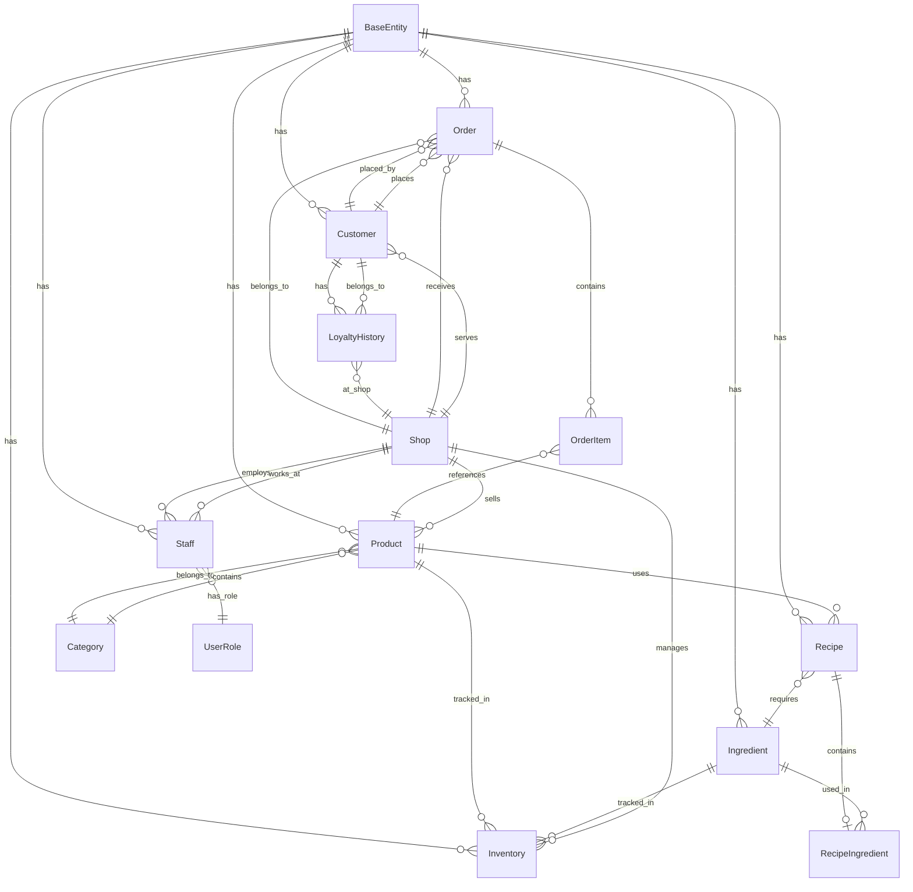

# ShopERP SQLite Database Schema

**Database:** vanan_shoperp.db  
**Location:** 5_WebApps/ShopERP/  
**Port:** 5003  
**Engine:** SQLite with WAL Mode  
**Connection:** Data Source={AppContext.BaseDirectory}vanan_shoperp.db

---

## **1. DATABASE OVERVIEW**

### **1.1 Purpose**
- **Local data storage** for ShopERP web application
- **Shop management** operations
- **Kitchen display** functionality
- **Staff management** and authentication
- **Inventory tracking** at shop level

### **1.2 Connection Configuration**
```csharp
// ShopERP/Program.cs
var connectionString = builder.Configuration.GetConnectionString("DefaultConnection") 
    ?? $"Data Source={System.IO.Path.Combine(AppContext.BaseDirectory, "vanan_shoperp.db")}";
builder.Services.AddDbContext<VanAnDbContext>(options => 
    options.UseSqlite(connectionString));
```

### **1.3 Database Initialization**
```csharp
// ShopERP/Program.cs - Lines 93-98
using (var scope = app.Services.CreateScope())
{
    var dbContext = scope.ServiceProvider.GetRequiredService<VanAn.CoreHub.Infrastructure.VanAnDbContext>();
    await dbContext.Database.EnsureCreatedAsync();
}
```

---

## **2. ENTITY RELATIONSHIP DIAGRAM**



---

## **3. DETAILED TABLE SCHEMAS**

### **3.1 Base Tables**

#### **BaseEntity (Abstract)**
```sql
-- Base columns for all entities (SQLite doesn't support inheritance, implemented as pattern)
CREATE TABLE BaseEntity (
    Id TEXT PRIMARY KEY DEFAULT (lower(hex(randomblob(4))) || '-' || lower(hex(randomblob(2))) || '-4' || substr(lower(hex(randomblob(2))),2) || '-' || substr('89ab',abs(random()) % 4 + 1, 1) || substr(lower(hex(randomblob(2))),2) || '-' || lower(hex(randomblob(6)))),
    CreatedAt TEXT NOT NULL DEFAULT (datetime('now')),
    UpdatedAt TEXT NOT NULL DEFAULT (datetime('now')),
    IsDeleted INTEGER NOT NULL DEFAULT 0, -- BOOLEAN: 0 = false, 1 = true
    TenantId TEXT NOT NULL DEFAULT (lower(hex(randomblob(4))) || '-' || lower(hex(randomblob(2))) || '-4' || substr(lower(hex(randomblob(2))),2) || '-' || substr('89ab',abs(random()) % 4 + 1, 1) || substr(lower(hex(randomblob(2))),2) || '-' || lower(hex(randomblob(6))))
);

-- Indexes for BaseEntity
CREATE INDEX idx_BaseEntity_TenantId ON BaseEntity(TenantId);
CREATE INDEX idx_BaseEntity_CreatedAt ON BaseEntity(CreatedAt);
CREATE INDEX idx_BaseEntity_IsDeleted ON BaseEntity(IsDeleted);
```

#### **Shops Table**
```sql
CREATE TABLE Shops (
    Id TEXT PRIMARY KEY DEFAULT (lower(hex(randomblob(4))) || '-' || lower(hex(randomblob(2))) || '-4' || substr(lower(hex(randomblob(2))),2) || '-' || substr('89ab',abs(random()) % 4 + 1, 1) || substr(lower(hex(randomblob(2))),2) || '-' || lower(hex(randomblob(6)))),
    Name TEXT NOT NULL,
    Address TEXT,
    Phone TEXT,
    Email TEXT,
    IsActive INTEGER NOT NULL DEFAULT 1, -- BOOLEAN
    CreatedAt TEXT NOT NULL DEFAULT (datetime('now')),
    UpdatedAt TEXT NOT NULL DEFAULT (datetime('now')),
    IsDeleted INTEGER NOT NULL DEFAULT 0,
    TenantId TEXT NOT NULL,
    
    FOREIGN KEY (TenantId) REFERENCES BaseEntity(Id)
);

CREATE INDEX idx_Shops_TenantId ON Shops(TenantId);
CREATE INDEX idx_Shops_IsActive ON Shops(IsActive);
```

### **3.2 Product Management**

#### **Categories Table**
```sql
CREATE TABLE Categories (
    Id TEXT PRIMARY KEY DEFAULT (lower(hex(randomblob(4))) || '-' || lower(hex(randomblob(2))) || '-4' || substr(lower(hex(randomblob(2))),2) || '-' || substr('89ab',abs(random()) % 4 + 1, 1) || substr(lower(hex(randomblob(2))),2) || '-' || lower(hex(randomblob(6)))),
    Name TEXT NOT NULL,
    Description TEXT,
    DisplayOrder INTEGER NOT NULL DEFAULT 0,
    IsActive INTEGER NOT NULL DEFAULT 1,
    CreatedAt TEXT NOT NULL DEFAULT (datetime('now')),
    UpdatedAt TEXT NOT NULL DEFAULT (datetime('now')),
    IsDeleted INTEGER NOT NULL DEFAULT 0,
    TenantId TEXT NOT NULL,
    
    FOREIGN KEY (TenantId) REFERENCES BaseEntity(Id)
);

CREATE INDEX idx_Categories_TenantId ON Categories(TenantId);
CREATE INDEX idx_Categories_DisplayOrder ON Categories(DisplayOrder);
CREATE INDEX idx_Categories_IsActive ON Categories(IsActive);
```

#### **Products Table**
```sql
CREATE TABLE Products (
    Id TEXT PRIMARY KEY DEFAULT (lower(hex(randomblob(4))) || '-' || lower(hex(randomblob(2))) || '-4' || substr(lower(hex(randomblob(2))),2) || '-' || substr('89ab',abs(random()) % 4 + 1, 1) || substr(lower(hex(randomblob(2))),2) || '-' || lower(hex(randomblob(6)))),
    Name TEXT NOT NULL,
    Description TEXT,
    Price REAL NOT NULL DEFAULT 0.00,
    CategoryId TEXT NOT NULL,
    ImageUrl TEXT,
    IsActive INTEGER NOT NULL DEFAULT 1,
    VatRate REAL NOT NULL DEFAULT 10.00,
    PreparationTime INTEGER NOT NULL DEFAULT 0,
    CreatedAt TEXT NOT NULL DEFAULT (datetime('now')),
    UpdatedAt TEXT NOT NULL DEFAULT (datetime('now')),
    IsDeleted INTEGER NOT NULL DEFAULT 0,
    TenantId TEXT NOT NULL,
    
    FOREIGN KEY (CategoryId) REFERENCES Categories(Id),
    FOREIGN KEY (TenantId) REFERENCES BaseEntity(Id)
);

CREATE INDEX idx_Products_TenantId ON Products(TenantId);
CREATE INDEX idx_Products_CategoryId ON Products(CategoryId);
CREATE INDEX idx_Products_IsActive ON Products(IsActive);
CREATE INDEX idx_Products_Price ON Products(Price);
```

#### **Ingredients Table**
```sql
CREATE TABLE Ingredients (
    Id TEXT PRIMARY KEY DEFAULT (lower(hex(randomblob(4))) || '-' || lower(hex(randomblob(2))) || '-4' || substr(lower(hex(randomblob(2))),2) || '-' || substr('89ab',abs(random()) % 4 + 1, 1) || substr(lower(hex(randomblob(2))),2) || '-' || lower(hex(randomblob(6)))),
    Name TEXT NOT NULL,
    Description TEXT,
    Unit TEXT NOT NULL,
    CurrentStock REAL NOT NULL DEFAULT 0.000,
    MinStockLevel REAL NOT NULL DEFAULT 0.000,
    MaxStockLevel REAL NOT NULL DEFAULT 1000.000,
    UnitCost REAL NOT NULL DEFAULT 0.00,
    IsActive INTEGER NOT NULL DEFAULT 1,
    CreatedAt TEXT NOT NULL DEFAULT (datetime('now')),
    UpdatedAt TEXT NOT NULL DEFAULT (datetime('now')),
    IsDeleted INTEGER NOT NULL DEFAULT 0,
    TenantId TEXT NOT NULL,
    
    FOREIGN KEY (TenantId) REFERENCES BaseEntity(Id)
);

CREATE INDEX idx_Ingredients_TenantId ON Ingredients(TenantId);
CREATE INDEX idx_Ingredients_IsActive ON Ingredients(IsActive);
CREATE INDEX idx_Ingredients_CurrentStock ON Ingredients(CurrentStock);
```

#### **Recipes Table**
```sql
CREATE TABLE Recipes (
    Id TEXT PRIMARY KEY DEFAULT (lower(hex(randomblob(4))) || '-' || lower(hex(randomblob(2))) || '-4' || substr(lower(hex(randomblob(2))),2) || '-' || substr('89ab',abs(random()) % 4 + 1, 1) || substr(lower(hex(randomblob(2))),2) || '-' || lower(hex(randomblob(6)))),
    ProductId TEXT NOT NULL,
    Name TEXT NOT NULL,
    Instructions TEXT,
    YieldQuantity REAL NOT NULL DEFAULT 1.000,
    YieldUnit TEXT NOT NULL DEFAULT 'serving',
    IsActive INTEGER NOT NULL DEFAULT 1,
    CreatedAt TEXT NOT NULL DEFAULT (datetime('now')),
    UpdatedAt TEXT NOT NULL DEFAULT (datetime('now')),
    IsDeleted INTEGER NOT NULL DEFAULT 0,
    TenantId TEXT NOT NULL,
    
    FOREIGN KEY (ProductId) REFERENCES Products(Id),
    FOREIGN KEY (TenantId) REFERENCES BaseEntity(Id)
);

CREATE INDEX idx_Recipes_TenantId ON Recipes(TenantId);
CREATE INDEX idx_Recipes_ProductId ON Recipes(ProductId);
CREATE INDEX idx_Recipes_IsActive ON Recipes(IsActive);
```

#### **RecipeIngredients Table**
```sql
CREATE TABLE RecipeIngredients (
    Id TEXT PRIMARY KEY DEFAULT (lower(hex(randomblob(4))) || '-' || lower(hex(randomblob(2))) || '-4' || substr(lower(hex(randomblob(2))),2) || '-' || substr('89ab',abs(random()) % 4 + 1, 1) || substr(lower(hex(randomblob(2))),2) || '-' || lower(hex(randomblob(6)))),
    RecipeId TEXT NOT NULL,
    IngredientId TEXT NOT NULL,
    Quantity REAL NOT NULL DEFAULT 0.000,
    Unit TEXT NOT NULL,
    IsOptional INTEGER NOT NULL DEFAULT 0,
    CreatedAt TEXT NOT NULL DEFAULT (datetime('now')),
    UpdatedAt TEXT NOT NULL DEFAULT (datetime('now')),
    IsDeleted INTEGER NOT NULL DEFAULT 0,
    TenantId TEXT NOT NULL,
    
    FOREIGN KEY (RecipeId) REFERENCES Recipes(Id) ON DELETE CASCADE,
    FOREIGN KEY (IngredientId) REFERENCES Ingredients(Id),
    FOREIGN KEY (TenantId) REFERENCES BaseEntity(Id),
    UNIQUE (RecipeId, IngredientId, TenantId)
);

CREATE INDEX idx_RecipeIngredients_TenantId ON RecipeIngredients(TenantId);
CREATE INDEX idx_RecipeIngredients_RecipeId ON RecipeIngredients(RecipeId);
CREATE INDEX idx_RecipeIngredients_IngredientId ON RecipeIngredients(IngredientId);
```

### **3.3 Inventory Management**

#### **Inventory Table**
```sql
CREATE TABLE Inventory (
    Id TEXT PRIMARY KEY DEFAULT (lower(hex(randomblob(4))) || '-' || lower(hex(randomblob(2))) || '-4' || substr(lower(hex(randomblob(2))),2) || '-' || substr('89ab',abs(random()) % 4 + 1, 1) || substr(lower(hex(randomblob(2))),2) || '-' || lower(hex(randomblob(6)))),
    ShopId TEXT NOT NULL,
    ProductId TEXT,
    IngredientId TEXT,
    CurrentStock REAL NOT NULL DEFAULT 0.000,
    MinStockLevel REAL NOT NULL DEFAULT 0.000,
    MaxStockLevel REAL NOT NULL DEFAULT 1000.000,
    LastUpdated TEXT NOT NULL DEFAULT (datetime('now')),
    IsActive INTEGER NOT NULL DEFAULT 1,
    CreatedAt TEXT NOT NULL DEFAULT (datetime('now')),
    UpdatedAt TEXT NOT NULL DEFAULT (datetime('now')),
    IsDeleted INTEGER NOT NULL DEFAULT 0,
    TenantId TEXT NOT NULL,
    
    FOREIGN KEY (ShopId) REFERENCES Shops(Id),
    FOREIGN KEY (ProductId) REFERENCES Products(Id),
    FOREIGN KEY (IngredientId) REFERENCES Ingredients(Id),
    FOREIGN KEY (TenantId) REFERENCES BaseEntity(Id),
    CHECK (
        (ProductId IS NOT NULL AND IngredientId IS NULL) OR 
        (ProductId IS NULL AND IngredientId IS NOT NULL)
    )
);

CREATE INDEX idx_Inventory_TenantId ON Inventory(TenantId);
CREATE INDEX idx_Inventory_ShopId ON Inventory(ShopId);
CREATE INDEX idx_Inventory_ProductId ON Inventory(ProductId);
CREATE INDEX idx_Inventory_IngredientId ON Inventory(IngredientId);
CREATE INDEX idx_Inventory_CurrentStock ON Inventory(CurrentStock);
```

### **3.4 Customer Management**

#### **Customers Table**
```sql
CREATE TABLE Customers (
    Id TEXT PRIMARY KEY DEFAULT (lower(hex(randomblob(4))) || '-' || lower(hex(randomblob(2))) || '-4' || substr(lower(hex(randomblob(2))),2) || '-' || substr('89ab',abs(random()) % 4 + 1, 1) || substr(lower(hex(randomblob(2))),2) || '-' || lower(hex(randomblob(6)))),
    DeviceId TEXT UNIQUE,
    Name TEXT,
    Phone TEXT,
    Email TEXT,
    Address TEXT,
    IsActive INTEGER NOT NULL DEFAULT 1,
    CreatedAt TEXT NOT NULL DEFAULT (datetime('now')),
    UpdatedAt TEXT NOT NULL DEFAULT (datetime('now')),
    IsDeleted INTEGER NOT NULL DEFAULT 0,
    TenantId TEXT NOT NULL,
    
    FOREIGN KEY (TenantId) REFERENCES BaseEntity(Id)
);

CREATE INDEX idx_Customers_TenantId ON Customers(TenantId);
CREATE INDEX idx_Customers_DeviceId ON Customers(DeviceId);
CREATE INDEX idx_Customers_IsActive ON Customers(IsActive);
CREATE INDEX idx_Customers_Phone ON Customers(Phone);
```

#### **LoyaltyHistory Table**
```sql
CREATE TABLE LoyaltyHistory (
    Id TEXT PRIMARY KEY DEFAULT (lower(hex(randomblob(4))) || '-' || lower(hex(randomblob(2))) || '-4' || substr(lower(hex(randomblob(2))),2) || '-' || substr('89ab',abs(random()) % 4 + 1, 1) || substr(lower(hex(randomblob(2))),2) || '-' || lower(hex(randomblob(6)))),
    CustomerId TEXT NOT NULL,
    ShopId TEXT NOT NULL,
    PointsEarned INTEGER NOT NULL DEFAULT 0,
    PointsRedeemed INTEGER NOT NULL DEFAULT 0,
    TransactionType TEXT NOT NULL,
    ReferenceId TEXT,
    Description TEXT,
    CreatedAt TEXT NOT NULL DEFAULT (datetime('now')),
    UpdatedAt TEXT NOT NULL DEFAULT (datetime('now')),
    IsDeleted INTEGER NOT NULL DEFAULT 0,
    TenantId TEXT NOT NULL,
    
    FOREIGN KEY (CustomerId) REFERENCES Customers(Id),
    FOREIGN KEY (ShopId) REFERENCES Shops(Id),
    FOREIGN KEY (TenantId) REFERENCES BaseEntity(Id)
);

CREATE INDEX idx_LoyaltyHistory_TenantId ON LoyaltyHistory(TenantId);
CREATE INDEX idx_LoyaltyHistory_CustomerId ON LoyaltyHistory(CustomerId);
CREATE INDEX idx_LoyaltyHistory_ShopId ON LoyaltyHistory(ShopId);
CREATE INDEX idx_LoyaltyHistory_CreatedAt ON LoyaltyHistory(CreatedAt);
CREATE INDEX idx_LoyaltyHistory_TransactionType ON LoyaltyHistory(TransactionType);
```

### **3.5 Order Management**

#### **Orders Table**
```sql
CREATE TABLE Orders (
    Id TEXT PRIMARY KEY DEFAULT (lower(hex(randomblob(4))) || '-' || lower(hex(randomblob(2))) || '-4' || substr(lower(hex(randomblob(2))),2) || '-' || substr('89ab',abs(random()) % 4 + 1, 1) || substr(lower(hex(randomblob(2))),2) || '-' || lower(hex(randomblob(6)))),
    OrderNumber TEXT UNIQUE NOT NULL,
    CustomerId TEXT,
    ShopId TEXT NOT NULL,
    OrderType TEXT NOT NULL DEFAULT 'DINEIN',
    Status TEXT NOT NULL DEFAULT 'Draft',
    Subtotal REAL NOT NULL DEFAULT 0.00,
    VatAmount REAL NOT NULL DEFAULT 0.00,
    TotalAmount REAL NOT NULL DEFAULT 0.00,
    CustomerNotes TEXT,
    StaffNotes TEXT,
    OrderDate TEXT NOT NULL DEFAULT (datetime('now')),
    DeliveryDate TEXT,
    DeliveryAddress TEXT,
    CustomerDeviceId TEXT,
    IsActive INTEGER NOT NULL DEFAULT 1,
    CreatedAt TEXT NOT NULL DEFAULT (datetime('now')),
    UpdatedAt TEXT NOT NULL DEFAULT (datetime('now')),
    IsDeleted INTEGER NOT NULL DEFAULT 0,
    TenantId TEXT NOT NULL,
    
    FOREIGN KEY (CustomerId) REFERENCES Customers(Id),
    FOREIGN KEY (ShopId) REFERENCES Shops(Id),
    FOREIGN KEY (TenantId) REFERENCES BaseEntity(Id)
);

CREATE INDEX idx_Orders_TenantId ON Orders(TenantId);
CREATE INDEX idx_Orders_CustomerId ON Orders(CustomerId);
CREATE INDEX idx_Orders_ShopId ON Orders(ShopId);
CREATE INDEX idx_Orders_OrderNumber ON Orders(OrderNumber);
CREATE INDEX idx_Orders_Status ON Orders(Status);
CREATE INDEX idx_Orders_OrderDate ON Orders(OrderDate);
CREATE INDEX idx_Orders_TotalAmount ON Orders(TotalAmount);
```

#### **OrderItems Table**
```sql
CREATE TABLE OrderItems (
    Id TEXT PRIMARY KEY DEFAULT (lower(hex(randomblob(4))) || '-' || lower(hex(randomblob(2))) || '-4' || substr(lower(hex(randomblob(2))),2) || '-' || substr('89ab',abs(random()) % 4 + 1, 1) || substr(lower(hex(randomblob(2))),2) || '-' || lower(hex(randomblob(6)))),
    OrderId TEXT NOT NULL,
    ProductId TEXT NOT NULL,
    Quantity INTEGER NOT NULL DEFAULT 1,
    UnitPrice REAL NOT NULL DEFAULT 0.00,
    VatRate REAL NOT NULL DEFAULT 10.00,
    VatAmount REAL NOT NULL DEFAULT 0.00,
    TotalAmount REAL NOT NULL DEFAULT 0.00,
    Notes TEXT,
    IsActive INTEGER NOT NULL DEFAULT 1,
    CreatedAt TEXT NOT NULL DEFAULT (datetime('now')),
    UpdatedAt TEXT NOT NULL DEFAULT (datetime('now')),
    IsDeleted INTEGER NOT NULL DEFAULT 0,
    TenantId TEXT NOT NULL,
    
    FOREIGN KEY (OrderId) REFERENCES Orders(Id) ON DELETE CASCADE,
    FOREIGN KEY (ProductId) REFERENCES Products(Id),
    FOREIGN KEY (TenantId) REFERENCES BaseEntity(Id)
);

CREATE INDEX idx_OrderItems_TenantId ON OrderItems(TenantId);
CREATE INDEX idx_OrderItems_OrderId ON OrderItems(OrderId);
CREATE INDEX idx_OrderItems_ProductId ON OrderItems(ProductId);
CREATE INDEX idx_OrderItems_Quantity ON OrderItems(Quantity);
```

### **3.6 Staff Management**

#### **Staff Table**
```sql
CREATE TABLE Staff (
    Id TEXT PRIMARY KEY DEFAULT (lower(hex(randomblob(4))) || '-' || lower(hex(randomblob(2))) || '-4' || substr(lower(hex(randomblob(2))),2) || '-' || substr('89ab',abs(random()) % 4 + 1, 1) || substr(lower(hex(randomblob(2))),2) || '-' || lower(hex(randomblob(6)))),
    ShopId TEXT NOT NULL,
    Name TEXT NOT NULL,
    Email TEXT,
    Phone TEXT,
    Role TEXT NOT NULL DEFAULT 'Staff',
    Username TEXT UNIQUE,
    PasswordHash TEXT,
    IsActive INTEGER NOT NULL DEFAULT 1,
    LastLogin TEXT,
    CreatedAt TEXT NOT NULL DEFAULT (datetime('now')),
    UpdatedAt TEXT NOT NULL DEFAULT (datetime('now')),
    IsDeleted INTEGER NOT NULL DEFAULT 0,
    TenantId TEXT NOT NULL,
    
    FOREIGN KEY (ShopId) REFERENCES Shops(Id),
    FOREIGN KEY (TenantId) REFERENCES BaseEntity(Id)
);

CREATE INDEX idx_Staff_TenantId ON Staff(TenantId);
CREATE INDEX idx_Staff_ShopId ON Staff(ShopId);
CREATE INDEX idx_Staff_Username ON Staff(Username);
CREATE INDEX idx_Staff_Role ON Staff(Role);
CREATE INDEX idx_Staff_IsActive ON Staff(IsActive);
```

---

## **4. SQLITE-SPECIFIC FEATURES**

### **4.1 WAL Mode Configuration**
```sql
-- Enable WAL mode for better concurrency
PRAGMA journal_mode = WAL;
PRAGMA synchronous = NORMAL;
PRAGMA cache_size = 10000;
PRAGMA temp_store = memory;
```

### **4.2 Foreign Key Support**
```sql
-- Enable foreign key constraints
PRAGMA foreign_keys = ON;
```

### **4.3 Trigger Implementations**
```sql
-- Update timestamp trigger
CREATE TRIGGER update_BaseEntity_timestamp 
AFTER UPDATE ON BaseEntity
BEGIN
    UPDATE BaseEntity SET UpdatedAt = datetime('now') WHERE Id = NEW.Id;
END;

-- Soft delete cascade
CREATE TRIGGER cascade_soft_delete_Orders
AFTER UPDATE ON Shops WHEN NEW.IsDeleted = 1
BEGIN
    UPDATE Orders SET IsDeleted = 1 WHERE ShopId = NEW.Id;
END;
```

---

## **5. INDEXES AND PERFORMANCE**

### **5.1 Primary Indexes**
All tables have primary key indexes on `Id` (TEXT UUID).

### **5.2 Foreign Key Indexes**
All foreign keys have corresponding indexes for join performance.

### **5.3 Business Indexes**
- **TenantId** on all tables (multi-tenancy)
- **IsActive** on all tables (soft deletes)
- **CreatedAt** on all tables (auditing)
- **Business-specific** indexes (CustomerId, OrderDate, etc.)

### **5.4 Composite Indexes**
```sql
-- Order lookup optimization
CREATE INDEX idx_Orders_Shop_Status_Date ON Orders(ShopId, Status, OrderDate);

-- Customer loyalty optimization
CREATE INDEX idx_LoyaltyHistory_Customer_Shop_Date ON LoyaltyHistory(CustomerId, ShopId, CreatedAt);

-- Inventory optimization
CREATE INDEX idx_Inventory_Shop_Product_Stock ON Inventory(ShopId, ProductId, CurrentStock);
```

---

## **6. CONSTRAINTS AND VALIDATIONS**

### **6.1 Foreign Key Constraints**
All relationships are enforced with foreign key constraints (enabled via PRAGMA).

### **6.2 Check Constraints**
```sql
-- Positive quantities
ALTER TABLE OrderItems ADD CONSTRAINT chk_OrderItems_Quantity_Positive 
CHECK (Quantity > 0);

-- Positive amounts
ALTER TABLE Orders ADD CONSTRAINT chk_Orders_TotalAmount_Positive 
CHECK (TotalAmount >= 0);

-- Valid VAT rates
ALTER TABLE Products ADD CONSTRAINT chk_Products_VatRate_Valid 
CHECK (VatRate IN (0, 5, 10));

-- Product or Ingredient constraint
ALTER TABLE Inventory ADD CONSTRAINT chk_Inventory_ProductOrIngredient 
CHECK ((ProductId IS NOT NULL AND IngredientId IS NULL) OR 
       (ProductId IS NULL AND IngredientId IS NOT NULL));
```

### **6.3 Unique Constraints**
```sql
-- Unique order numbers
CREATE UNIQUE INDEX uk_Orders_OrderNumber_Tenant ON Orders(OrderNumber, TenantId);

-- Unique device IDs for customers
CREATE UNIQUE INDEX uk_Customers_DeviceId_Tenant ON Customers(DeviceId, TenantId);

-- Unique staff usernames
CREATE UNIQUE INDEX uk_Staff_Username_Tenant ON Staff(Username, TenantId);
```

---

## **7. DATA MIGRATION CONSIDERATIONS**

### **7.1 Multi-tenancy Migration**
Current system needs tenant ID population:
```sql
-- Add default tenant for existing data
UPDATE BaseEntity SET TenantId = '00000000-0000-0000-0000-000000000001' WHERE TenantId IS NULL;
```

### **7.2 Data Consistency**
- **Order totals** must be recalculated
- **Inventory levels** must be synchronized
- **Loyalty points** must be validated

### **7.3 SQLite Limitations**
- **Single writer** limitation
- **No true concurrent writes**
- **File-based storage** limitations
- **Size limitations** (theoretical 140TB, practical ~1GB)

---

## **8. SECURITY CONSIDERATIONS**

### **8.1 File Security**
- **Database file** permissions restricted
- **Backup encryption** enabled
- **Access logging** implemented

### **8.2 Data Encryption**
- **Sensitive data** (phone, email) encrypted at application level
- **Password hashes** using bcrypt
- **PII data** masked in logs

### **8.3 SQL Injection Prevention**
- **Parameterized queries** throughout
- **ORM protection** via Entity Framework
- **Input validation** at application level

---

## **9. BACKUP AND RECOVERY**

### **9.1 Backup Strategy**
- **Daily full backups** using SQLite backup API
- **Incremental WAL backups** every hour
- **Point-in-time recovery** capability
- **Cloud backup** synchronization

### **9.2 Backup Commands**
```sql
-- Full backup
.backup backup/vanan_shoperp_full_$(date +%Y%m%d).db

-- WAL backup
.backup backup/vanan_shoperp_wal_$(date +%Y%m%d_%H%M).db-wal
```

### **9.3 Recovery Procedures**
- **File restoration** from backup
- **WAL replay** for crash recovery
- **Data validation** after recovery
- **Rollback capability** for failed migrations

---

## **10. MONITORING AND MAINTENANCE**

### **10.1 Performance Monitoring**
- **Query performance** tracking
- **Index usage** statistics
- **Database size** monitoring
- **WAL file** management

### **10.2 Maintenance Tasks**
```sql
-- Analyze query planner
ANALYZE;

-- Rebuild indexes
REINDEX;

-- Vacuum database
VACUUM;

-- Check integrity
PRAGMA integrity_check;
```

### **10.3 Maintenance Schedule**
- **Weekly VACUUM** operations
- **Monthly REINDEX** operations
- **Quarterly ANALYZE** updates
- **Annual capacity planning**

---

## **11. INTEGRATION WITH CENTRAL DATABASE**

### **11.1 Current State**
- **No synchronization** with central PostgreSQL
- **Independent data** storage
- **Potential data conflicts**
- **No conflict resolution**

### **11.2 Synchronization Needs**
- **Order data** sync to central
- **Inventory updates** sync to central
- **Customer data** sync to central
- **Staff changes** sync to central

### **11.3 Conflict Resolution Strategy**
- **Last write wins** for simple data
- **Manual resolution** for conflicts
- **Timestamp-based** ordering
- **Business rule** based resolution

---

## **12. SUMMARY**

### **12.1 Database Characteristics**
- **Type:** SQLite 3.x with WAL mode
- **Size:** ~50MB (current), ~500MB (projected)
- **Tables:** 12 main tables
- **Indexes:** 35+ indexes
- **Constraints:** 25+ constraints

### **12.2 Key Features**
- **Local-first** architecture
- **WAL mode** for better concurrency
- **Multi-tenancy** support
- **Soft deletes** pattern
- **Audit trail** capability
- **Offline capability**

### **12.3 Usage Patterns**
- **Read-heavy** (kitchen display, inventory lookup)
- **Write-moderate** (order updates, inventory changes)
- **Transactional** (order processing)
- **Real-time** (order status updates)

### **12.4 Limitations**
- **Single writer** concurrency
- **No true multi-user** writes
- **File-based** storage limitations
- **No built-in** replication

---

**Status:** ShopERP SQLite database schema documented and ready for microservice migration planning.
