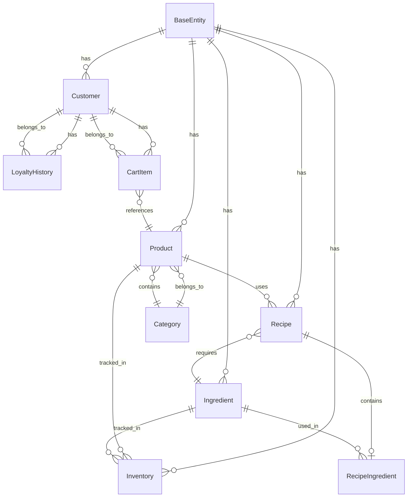

# KhachLink SQLite Database Schema

**Database:** vanan_khachlink.db  
**Location:** 5_WebApps/KhachLink/  
**Port:** 5002  
**Engine:** SQLite with WAL Mode  
**Connection:** Data Source={AppContext.BaseDirectory}vanan_khachlink.db

---

## **1. DATABASE OVERVIEW**

### **1.1 Purpose**
- **Local data storage** for KhachLink customer portal
- **Customer-facing** operations
- **Shopping cart** management
- **Product catalog** display
- **Customer loyalty** tracking

### **1.2 Connection Configuration**
```csharp
// KhachLink/Program.cs
var connectionString = builder.Configuration.GetConnectionString("DefaultConnection") 
    ?? $"Data Source={System.IO.Path.Combine(AppContext.BaseDirectory, "vanan_khachlink.db")}";
builder.Services.AddDbContext<VanAnDbContext>(options => 
    options.UseSqlite(connectionString));
```

### **1.3 Database Initialization**
```csharp
// KhachLink/Program.cs - Lines 58-63
using (var scope = app.Services.CreateScope())
{
    var dbContext = scope.ServiceProvider.GetRequiredService<VanAn.CoreHub.Infrastructure.VanAnDbContext>();
    await dbContext.Database.EnsureCreatedAsync();
}
```

---

## **2. ENTITY RELATIONSHIP DIAGRAM**



---

## **3. DETAILED TABLE SCHEMAS**

### **3.1 Base Tables**

#### **BaseEntity (Abstract)**
```sql
-- Base columns for all entities (SQLite doesn't support inheritance, implemented as pattern)
CREATE TABLE BaseEntity (
    Id TEXT PRIMARY KEY DEFAULT (lower(hex(randomblob(4))) || '-' || lower(hex(randomblob(2))) || '-4' || substr(lower(hex(randomblob(2))),2) || '-' || substr('89ab',abs(random()) % 4 + 1, 1) || substr(lower(hex(randomblob(2))),2) || '-' || lower(hex(randomblob(6)))),
    CreatedAt TEXT NOT NULL DEFAULT (datetime('now')),
    UpdatedAt TEXT NOT NULL DEFAULT (datetime('now')),
    IsDeleted INTEGER NOT NULL DEFAULT 0, -- BOOLEAN: 0 = false, 1 = true
    TenantId TEXT NOT NULL DEFAULT (lower(hex(randomblob(4))) || '-' || lower(hex(randomblob(2))) || '-4' || substr(lower(hex(randomblob(2))),2) || '-' || substr('89ab',abs(random()) % 4 + 1, 1) || substr(lower(hex(randomblob(2))),2) || '-' || lower(hex(randomblob(6))))
);

-- Indexes for BaseEntity
CREATE INDEX idx_BaseEntity_TenantId ON BaseEntity(TenantId);
CREATE INDEX idx_BaseEntity_CreatedAt ON BaseEntity(CreatedAt);
CREATE INDEX idx_BaseEntity_IsDeleted ON BaseEntity(IsDeleted);
```

### **3.2 Product Management**

#### **Categories Table**
```sql
CREATE TABLE Categories (
    Id TEXT PRIMARY KEY DEFAULT (lower(hex(randomblob(4))) || '-' || lower(hex(randomblob(2))) || '-4' || substr(lower(hex(randomblob(2))),2) || '-' || substr('89ab',abs(random()) % 4 + 1, 1) || substr(lower(hex(randomblob(2))),2) || '-' || lower(hex(randomblob(6)))),
    Name TEXT NOT NULL,
    Description TEXT,
    DisplayOrder INTEGER NOT NULL DEFAULT 0,
    IsActive INTEGER NOT NULL DEFAULT 1,
    CreatedAt TEXT NOT NULL DEFAULT (datetime('now')),
    UpdatedAt TEXT NOT NULL DEFAULT (datetime('now')),
    IsDeleted INTEGER NOT NULL DEFAULT 0,
    TenantId TEXT NOT NULL,
    
    FOREIGN KEY (TenantId) REFERENCES BaseEntity(Id)
);

CREATE INDEX idx_Categories_TenantId ON Categories(TenantId);
CREATE INDEX idx_Categories_DisplayOrder ON Categories(DisplayOrder);
CREATE INDEX idx_Categories_IsActive ON Categories(IsActive);
```

#### **Products Table**
```sql
CREATE TABLE Products (
    Id TEXT PRIMARY KEY DEFAULT (lower(hex(randomblob(4))) || '-' || lower(hex(randomblob(2))) || '-4' || substr(lower(hex(randomblob(2))),2) || '-' || substr('89ab',abs(random()) % 4 + 1, 1) || substr(lower(hex(randomblob(2))),2) || '-' || lower(hex(randomblob(6)))),
    Name TEXT NOT NULL,
    Description TEXT,
    Price REAL NOT NULL DEFAULT 0.00,
    CategoryId TEXT NOT NULL,
    ImageUrl TEXT,
    IsActive INTEGER NOT NULL DEFAULT 1,
    VatRate REAL NOT NULL DEFAULT 10.00,
    PreparationTime INTEGER NOT NULL DEFAULT 0,
    IsAvailable INTEGER NOT NULL DEFAULT 1,
    Featured INTEGER NOT NULL DEFAULT 0,
    CreatedAt TEXT NOT NULL DEFAULT (datetime('now')),
    UpdatedAt TEXT NOT NULL DEFAULT (datetime('now')),
    IsDeleted INTEGER NOT NULL DEFAULT 0,
    TenantId TEXT NOT NULL,
    
    FOREIGN KEY (CategoryId) REFERENCES Categories(Id),
    FOREIGN KEY (TenantId) REFERENCES BaseEntity(Id)
);

CREATE INDEX idx_Products_TenantId ON Products(TenantId);
CREATE INDEX idx_Products_CategoryId ON Products(CategoryId);
CREATE INDEX idx_Products_IsActive ON Products(IsActive);
CREATE INDEX idx_Products_IsAvailable ON Products(IsAvailable);
CREATE INDEX idx_Products_Featured ON Products(Featured);
CREATE INDEX idx_Products_Price ON Products(Price);
```

#### **Ingredients Table**
```sql
CREATE TABLE Ingredients (
    Id TEXT PRIMARY KEY DEFAULT (lower(hex(randomblob(4))) || '-' || lower(hex(randomblob(2))) || '-4' || substr(lower(hex(randomblob(2))),2) || '-' || substr('89ab',abs(random()) % 4 + 1, 1) || substr(lower(hex(randomblob(2))),2) || '-' || lower(hex(randomblob(6)))),
    Name TEXT NOT NULL,
    Description TEXT,
    Unit TEXT NOT NULL,
    CurrentStock REAL NOT NULL DEFAULT 0.000,
    MinStockLevel REAL NOT NULL DEFAULT 0.000,
    MaxStockLevel REAL NOT NULL DEFAULT 1000.000,
    UnitCost REAL NOT NULL DEFAULT 0.00,
    IsActive INTEGER NOT NULL DEFAULT 1,
    CreatedAt TEXT NOT NULL DEFAULT (datetime('now')),
    UpdatedAt TEXT NOT NULL DEFAULT (datetime('now')),
    IsDeleted INTEGER NOT NULL DEFAULT 0,
    TenantId TEXT NOT NULL,
    
    FOREIGN KEY (TenantId) REFERENCES BaseEntity(Id)
);

CREATE INDEX idx_Ingredients_TenantId ON Ingredients(TenantId);
CREATE INDEX idx_Ingredients_IsActive ON Ingredients(IsActive);
CREATE INDEX idx_Ingredients_CurrentStock ON Ingredients(CurrentStock);
```

#### **Recipes Table**
```sql
CREATE TABLE Recipes (
    Id TEXT PRIMARY KEY DEFAULT (lower(hex(randomblob(4))) || '-' || lower(hex(randomblob(2))) || '-4' || substr(lower(hex(randomblob(2))),2) || '-' || substr('89ab',abs(random()) % 4 + 1, 1) || substr(lower(hex(randomblob(2))),2) || '-' || lower(hex(randomblob(6)))),
    ProductId TEXT NOT NULL,
    Name TEXT NOT NULL,
    Instructions TEXT,
    YieldQuantity REAL NOT NULL DEFAULT 1.000,
    YieldUnit TEXT NOT NULL DEFAULT 'serving',
    IsActive INTEGER NOT NULL DEFAULT 1,
    CreatedAt TEXT NOT NULL DEFAULT (datetime('now')),
    UpdatedAt TEXT NOT NULL DEFAULT (datetime('now')),
    IsDeleted INTEGER NOT NULL DEFAULT 0,
    TenantId TEXT NOT NULL,
    
    FOREIGN KEY (ProductId) REFERENCES Products(Id),
    FOREIGN KEY (TenantId) REFERENCES BaseEntity(Id)
);

CREATE INDEX idx_Recipes_TenantId ON Recipes(TenantId);
CREATE INDEX idx_Recipes_ProductId ON Recipes(ProductId);
CREATE INDEX idx_Recipes_IsActive ON Recipes(IsActive);
```

#### **RecipeIngredients Table**
```sql
CREATE TABLE RecipeIngredients (
    Id TEXT PRIMARY KEY DEFAULT (lower(hex(randomblob(4))) || '-' || lower(hex(randomblob(2))) || '-4' || substr(lower(hex(randomblob(2))),2) || '-' || substr('89ab',abs(random()) % 4 + 1, 1) || substr(lower(hex(randomblob(2))),2) || '-' || lower(hex(randomblob(6)))),
    RecipeId TEXT NOT NULL,
    IngredientId TEXT NOT NULL,
    Quantity REAL NOT NULL DEFAULT 0.000,
    Unit TEXT NOT NULL,
    IsOptional INTEGER NOT NULL DEFAULT 0,
    CreatedAt TEXT NOT NULL DEFAULT (datetime('now')),
    UpdatedAt TEXT NOT NULL DEFAULT (datetime('now')),
    IsDeleted INTEGER NOT NULL DEFAULT 0,
    TenantId TEXT NOT NULL,
    
    FOREIGN KEY (RecipeId) REFERENCES Recipes(Id) ON DELETE CASCADE,
    FOREIGN KEY (IngredientId) REFERENCES Ingredients(Id),
    FOREIGN KEY (TenantId) REFERENCES BaseEntity(Id),
    UNIQUE (RecipeId, IngredientId, TenantId)
);

CREATE INDEX idx_RecipeIngredients_TenantId ON RecipeIngredients(TenantId);
CREATE INDEX idx_RecipeIngredients_RecipeId ON RecipeIngredients(RecipeId);
CREATE INDEX idx_RecipeIngredients_IngredientId ON RecipeIngredients(IngredientId);
```

### **3.3 Customer Management**

#### **Customers Table**
```sql
CREATE TABLE Customers (
    Id TEXT PRIMARY KEY DEFAULT (lower(hex(randomblob(4))) || '-' || lower(hex(randomblob(2))) || '-4' || substr(lower(hex(randomblob(2))),2) || '-' || substr('89ab',abs(random()) % 4 + 1, 1) || substr(lower(hex(randomblob(2))),2) || '-' || lower(hex(randomblob(6)))),
    DeviceId TEXT UNIQUE,
    Name TEXT,
    Phone TEXT,
    Email TEXT,
    Address TEXT,
    IsActive INTEGER NOT NULL DEFAULT 1,
    CreatedAt TEXT NOT NULL DEFAULT (datetime('now')),
    UpdatedAt TEXT NOT NULL DEFAULT (datetime('now')),
    IsDeleted INTEGER NOT NULL DEFAULT 0,
    TenantId TEXT NOT NULL,
    
    FOREIGN KEY (TenantId) REFERENCES BaseEntity(Id)
);

CREATE INDEX idx_Customers_TenantId ON Customers(TenantId);
CREATE INDEX idx_Customers_DeviceId ON Customers(DeviceId);
CREATE INDEX idx_Customers_IsActive ON Customers(IsActive);
CREATE INDEX idx_Customers_Phone ON Customers(Phone);
```

#### **LoyaltyHistory Table**
```sql
CREATE TABLE LoyaltyHistory (
    Id TEXT PRIMARY KEY DEFAULT (lower(hex(randomblob(4))) || '-' || lower(hex(randomblob(2))) || '-4' || substr(lower(hex(randomblob(2))),2) || '-' || substr('89ab',abs(random()) % 4 + 1, 1) || substr(lower(hex(randomblob(2))),2) || '-' || lower(hex(randomblob(6)))),
    CustomerId TEXT NOT NULL,
    PointsEarned INTEGER NOT NULL DEFAULT 0,
    PointsRedeemed INTEGER NOT NULL DEFAULT 0,
    TransactionType TEXT NOT NULL, -- 'Purchase', 'Redemption', 'Adjustment'
    ReferenceId TEXT, -- Reference to Order or other transaction
    Description TEXT,
    CreatedAt TEXT NOT NULL DEFAULT (datetime('now')),
    UpdatedAt TEXT NOT NULL DEFAULT (datetime('now')),
    IsDeleted INTEGER NOT NULL DEFAULT 0,
    TenantId TEXT NOT NULL,
    
    FOREIGN KEY (CustomerId) REFERENCES Customers(Id),
    FOREIGN KEY (TenantId) REFERENCES BaseEntity(Id)
);

CREATE INDEX idx_LoyaltyHistory_TenantId ON LoyaltyHistory(TenantId);
CREATE INDEX idx_LoyaltyHistory_CustomerId ON LoyaltyHistory(CustomerId);
CREATE INDEX idx_LoyaltyHistory_CreatedAt ON LoyaltyHistory(CreatedAt);
CREATE INDEX idx_LoyaltyHistory_TransactionType ON LoyaltyHistory(TransactionType);
```

### **3.4 Shopping Cart Management**

#### **CartItems Table**
```sql
CREATE TABLE CartItems (
    Id TEXT PRIMARY KEY DEFAULT (lower(hex(randomblob(4))) || '-' || lower(hex(randomblob(2))) || '-4' || substr(lower(hex(randomblob(2))),2) || '-' || substr('89ab',abs(random()) % 4 + 1, 1) || substr(lower(hex(randomblob(2))),2) || '-' || lower(hex(randomblob(6)))),
    CustomerId TEXT NOT NULL,
    ProductId TEXT NOT NULL,
    Quantity INTEGER NOT NULL DEFAULT 1,
    UnitPrice REAL NOT NULL DEFAULT 0.00,
    VatRate REAL NOT NULL DEFAULT 10.00,
    VatAmount REAL NOT NULL DEFAULT 0.00,
    TotalAmount REAL NOT NULL DEFAULT 0.00,
    Notes TEXT,
    SessionId TEXT, -- For guest users
    IsActive INTEGER NOT NULL DEFAULT 1,
    CreatedAt TEXT NOT NULL DEFAULT (datetime('now')),
    UpdatedAt TEXT NOT NULL DEFAULT (datetime('now')),
    IsDeleted INTEGER NOT NULL DEFAULT 0,
    TenantId TEXT NOT NULL,
    
    FOREIGN KEY (CustomerId) REFERENCES Customers(Id),
    FOREIGN KEY (ProductId) REFERENCES Products(Id),
    FOREIGN KEY (TenantId) REFERENCES BaseEntity(Id)
);

CREATE INDEX idx_CartItems_TenantId ON CartItems(TenantId);
CREATE INDEX idx_CartItems_CustomerId ON CartItems(CustomerId);
CREATE INDEX idx_CartItems_ProductId ON CartItems(ProductId);
CREATE INDEX idx_CartItems_SessionId ON CartItems(SessionId);
CREATE INDEX idx_CartItems_IsActive ON CartItems(IsActive);
```

### **3.5 Inventory Management**

#### **Inventory Table**
```sql
CREATE TABLE Inventory (
    Id TEXT PRIMARY KEY DEFAULT (lower(hex(randomblob(4))) || '-' || lower(hex(randomblob(2))) || '-4' || substr(lower(hex(randomblob(2))),2) || '-' || substr('89ab',abs(random()) % 4 + 1, 1) || substr(lower(hex(randomblob(2))),2) || '-' || lower(hex(randomblob(6)))),
    ProductId TEXT,
    IngredientId TEXT,
    CurrentStock REAL NOT NULL DEFAULT 0.000,
    MinStockLevel REAL NOT NULL DEFAULT 0.000,
    MaxStockLevel REAL NOT NULL DEFAULT 1000.000,
    LastUpdated TEXT NOT NULL DEFAULT (datetime('now')),
    IsActive INTEGER NOT NULL DEFAULT 1,
    CreatedAt TEXT NOT NULL DEFAULT (datetime('now')),
    UpdatedAt TEXT NOT NULL DEFAULT (datetime('now')),
    IsDeleted INTEGER NOT NULL DEFAULT 0,
    TenantId TEXT NOT NULL,
    
    FOREIGN KEY (ProductId) REFERENCES Products(Id),
    FOREIGN KEY (IngredientId) REFERENCES Ingredients(Id),
    FOREIGN KEY (TenantId) REFERENCES BaseEntity(Id),
    CHECK (
        (ProductId IS NOT NULL AND IngredientId IS NULL) OR 
        (ProductId IS NULL AND IngredientId IS NOT NULL)
    )
);

CREATE INDEX idx_Inventory_TenantId ON Inventory(TenantId);
CREATE INDEX idx_Inventory_ProductId ON Inventory(ProductId);
CREATE INDEX idx_Inventory_IngredientId ON Inventory(IngredientId);
CREATE INDEX idx_Inventory_CurrentStock ON Inventory(CurrentStock);
```

---

## **4. KHACHLINK-SPECIFIC FEATURES**

### **4.1 Shopping Cart Implementation**

#### **Cart State Management**
```csharp
// CartService.cs - LocalStorage based cart
public class CartService
{
    private readonly IJSRuntime _jsRuntime;
    private readonly CartState _cartState = new();
    
    public async Task LoadCartFromStorageAsync()
    {
        var cartJson = await _jsRuntime.InvokeAsync<string>("localStorage.getItem", "vanan_cart");
        if (!string.IsNullOrEmpty(cartJson))
        {
            var cart = JsonSerializer.Deserialize<CartState>(cartJson);
            if (cart != null)
            {
                _cartState.Items.Clear();
                _cartState.Items.AddRange(cart.Items);
            }
        }
    }
}
```

#### **Cart Data Structure**
```sql
-- Cart items stored in database for persistence
-- Additional localStorage for session-based carts
CREATE TABLE CartSessions (
    Id TEXT PRIMARY KEY DEFAULT (lower(hex(randomblob(4))) || '-' || lower(hex(randomblob(2))) || '-4' || substr(lower(hex(randomblob(2))),2) || '-' || substr('89ab',abs(random()) % 4 + 1, 1) || substr(lower(hex(randomblob(2))),2) || '-' || lower(hex(randomblob(6)))),
    SessionId TEXT NOT NULL,
    CartData TEXT NOT NULL, -- JSON serialized cart
    ExpiresAt TEXT NOT NULL,
    CreatedAt TEXT NOT NULL DEFAULT (datetime('now')),
    UpdatedAt TEXT NOT NULL DEFAULT (datetime('now'))
);

CREATE INDEX idx_CartSessions_SessionId ON CartSessions(SessionId);
CREATE INDEX idx_CartSessions_ExpiresAt ON CartSessions(ExpiresAt);
```

### **4.2 Customer Identification**

#### **Device ID Based Authentication**
```csharp
// Index.cshtml.cs - Customer identification
var deviceId = Request.Cookies["customer_device_id"];
if (string.IsNullOrEmpty(deviceId) || !Guid.TryParse(deviceId, out Guid parsedDeviceId))
{
    parsedDeviceId = Guid.NewGuid();
    deviceId = parsedDeviceId.ToString();
    Response.Cookies.Append("customer_device_id", deviceId, new CookieOptions
    {
        Expires = DateTime.UtcNow.AddYears(1)
    });
}

var customer = await _customerService.GetOrCreateCustomerByDeviceIdAsync(parsedDeviceId);
```

#### **Customer Device Tracking**
```sql
CREATE TABLE CustomerDevices (
    Id TEXT PRIMARY KEY DEFAULT (lower(hex(randomblob(4))) || '-' || lower(hex(randomblob(2))) || '-4' || substr(lower(hex(randomblob(2))),2) || '-' || substr('89ab',abs(random()) % 4 + 1, 1) || substr(lower(hex(randomblob(2))),2) || '-' || lower(hex(randomblob(6)))),
    CustomerId TEXT NOT NULL,
    DeviceId TEXT NOT NULL,
    DeviceType TEXT, -- 'Web', 'Mobile', 'Tablet'
    UserAgent TEXT,
    LastSeen TEXT NOT NULL DEFAULT (datetime('now')),
    IsActive INTEGER NOT NULL DEFAULT 1,
    CreatedAt TEXT NOT NULL DEFAULT (datetime('now')),
    UpdatedAt TEXT NOT NULL DEFAULT (datetime('now')),
    
    FOREIGN KEY (CustomerId) REFERENCES Customers(Id),
    UNIQUE (CustomerId, DeviceId)
);

CREATE INDEX idx_CustomerDevices_CustomerId ON CustomerDevices(CustomerId);
CREATE INDEX idx_CustomerDevices_DeviceId ON CustomerDevices(DeviceId);
CREATE INDEX idx_CustomerDevices_LastSeen ON CustomerDevices(LastSeen);
```

### **4.3 Product Catalog Features**

#### **Featured Products**
```sql
-- Products table has Featured column for highlighting
CREATE TRIGGER update_featured_products
AFTER UPDATE ON Products
WHEN NEW.Featured = 1 AND OLD.Featured = 0
BEGIN
    UPDATE Products SET Featured = 0 WHERE Id != NEW.Id AND Featured = 1;
END;
```

#### **Product Availability**
```sql
-- Availability tracking
CREATE TABLE ProductAvailability (
    Id TEXT PRIMARY KEY DEFAULT (lower(hex(randomblob(4))) || '-' || lower(hex(randomblob(2))) || '-4' || substr(lower(hex(randomblob(2))),2) || '-' || substr('89ab',abs(random()) % 4 + 1, 1) || substr(lower(hex(randomblob(2))),2) || '-' || lower(hex(randomblob(6)))),
    ProductId TEXT NOT NULL,
    AvailableFrom TEXT,
    AvailableUntil TEXT,
    IsAvailable INTEGER NOT NULL DEFAULT 1,
    Reason TEXT, -- Reason for unavailability
    CreatedAt TEXT NOT NULL DEFAULT (datetime('now')),
    UpdatedAt TEXT NOT NULL DEFAULT (datetime('now')),
    
    FOREIGN KEY (ProductId) REFERENCES Products(Id)
);

CREATE INDEX idx_ProductAvailability_ProductId ON ProductAvailability(ProductId);
CREATE INDEX idx_ProductAvailability_IsAvailable ON ProductAvailability(IsAvailable);
```

### **4.4 Loyalty Program**

#### **Points Calculation**
```sql
CREATE TABLE LoyaltySettings (
    Id TEXT PRIMARY KEY DEFAULT (lower(hex(randomblob(4))) || '-' || lower(hex(randomblob(2))) || '-4' || substr(lower(hex(randomblob(2))),2) || '-' || substr('89ab',abs(random()) % 4 + 1, 1) || substr(lower(hex(randomblob(2))),2) || '-' || lower(hex(randomblob(6)))),
    PointsPerCurrency REAL NOT NULL DEFAULT 1.0, -- Points per 1000 VND
    RedemptionRate REAL NOT NULL DEFAULT 100.0, -- Points per 1000 VND discount
    MinimumOrderAmount REAL NOT NULL DEFAULT 10000.0, -- Minimum order to earn points
    IsActive INTEGER NOT NULL DEFAULT 1,
    CreatedAt TEXT NOT NULL DEFAULT (datetime('now')),
    UpdatedAt TEXT NOT NULL DEFAULT (datetime('now'))
);

-- Default loyalty settings
INSERT INTO LoyaltySettings (Id, PointsPerCurrency, RedemptionRate, MinimumOrderAmount)
VALUES ('default', 1.0, 100.0, 10000.0);
```

#### **Tier Management**
```sql
CREATE TABLE LoyaltyTiers (
    Id TEXT PRIMARY KEY DEFAULT (lower(hex(randomblob(4))) || '-' || lower(hex(randomblob(2))) || '-4' || substr(lower(hex(randomblob(2))),2) || '-' || substr('89ab',abs(random()) % 4 + 1, 1) || substr(lower(hex(randomblob(2))),2) || '-' || lower(hex(randomblob(6)))),
    Name TEXT NOT NULL,
    MinPoints INTEGER NOT NULL DEFAULT 0,
    MaxPoints INTEGER, -- NULL for highest tier
    Benefits TEXT, -- JSON string of benefits
    IsActive INTEGER NOT NULL DEFAULT 1,
    CreatedAt TEXT NOT NULL DEFAULT (datetime('now')),
    UpdatedAt TEXT NOT NULL DEFAULT (datetime('now'))
);

CREATE INDEX idx_LoyaltyTiers_MinPoints ON LoyaltyTiers(MinPoints);
CREATE INDEX idx_LoyaltyTiers_IsActive ON LoyaltyTiers(IsActive);
```

---

## **5. SQLITE-SPECIFIC FEATURES**

### **5.1 WAL Mode Configuration**
```sql
-- Enable WAL mode for better concurrency
PRAGMA journal_mode = WAL;
PRAGMA synchronous = NORMAL;
PRAGMA cache_size = 10000;
PRAGMA temp_store = memory;
PRAGMA mmap_size = 268435456; -- 256MB memory-mapped I/O
```

### **5.2 Foreign Key Support**
```sql
-- Enable foreign key constraints
PRAGMA foreign_keys = ON;
```

### **5.3 Trigger Implementations**
```sql
-- Update timestamp trigger
CREATE TRIGGER update_BaseEntity_timestamp 
AFTER UPDATE ON BaseEntity
BEGIN
    UPDATE BaseEntity SET UpdatedAt = datetime('now') WHERE Id = NEW.Id;
END;

-- Cart cleanup trigger
CREATE TRIGGER cleanup_expired_cart_sessions
AFTER INSERT ON CartSessions
BEGIN
    DELETE FROM CartSessions WHERE ExpiresAt < datetime('now');
END;

-- Inventory update trigger
CREATE TRIGGER update_inventory_timestamp
AFTER UPDATE ON Inventory
BEGIN
    UPDATE Inventory SET LastUpdated = datetime('now') WHERE Id = NEW.Id;
END;
```

---

## **6. INDEXES AND PERFORMANCE**

### **6.1 Primary Indexes**
All tables have primary key indexes on `Id` (TEXT UUID).

### **6.2 Foreign Key Indexes**
All foreign keys have corresponding indexes for join performance.

### **6.3 Business Indexes**
- **TenantId** on all tables (multi-tenancy)
- **IsActive** on all tables (soft deletes)
- **CreatedAt** on all tables (auditing)
- **Business-specific** indexes (CustomerId, ProductId, etc.)

### **6.4 Composite Indexes**
```sql
-- Cart lookup optimization
CREATE INDEX idx_CartItems_Customer_Active ON CartItems(CustomerId, IsActive);

-- Product catalog optimization
CREATE INDEX idx_Products_Category_Active_Available ON Products(CategoryId, IsActive, IsAvailable);

-- Loyalty history optimization
CREATE INDEX idx_LoyaltyHistory_Customer_Date ON LoyaltyHistory(CustomerId, CreatedAt);

-- Featured products optimization
CREATE INDEX idx_Products_Featured_Active ON Products(Featured, IsActive);
```

---

## **7. CONSTRAINTS AND VALIDATIONS**

### **7.1 Foreign Key Constraints**
All relationships are enforced with foreign key constraints (enabled via PRAGMA).

### **7.2 Check Constraints**
```sql
-- Positive quantities
ALTER TABLE CartItems ADD CONSTRAINT chk_CartItems_Quantity_Positive 
CHECK (Quantity > 0);

-- Positive amounts
ALTER TABLE Products ADD CONSTRAINT chk_Products_Price_Positive 
CHECK (Price >= 0);

-- Valid VAT rates
ALTER TABLE Products ADD CONSTRAINT chk_Products_VatRate_Valid 
CHECK (VatRate IN (0, 5, 10));

-- Product or Ingredient constraint
ALTER TABLE Inventory ADD CONSTRAINT chk_Inventory_ProductOrIngredient 
CHECK ((ProductId IS NOT NULL AND IngredientId IS NULL) OR 
       (ProductId IS NULL AND IngredientId IS NOT NULL));
```

### **7.3 Unique Constraints**
```sql
-- Unique device IDs for customers
CREATE UNIQUE INDEX uk_Customers_DeviceId_Tenant ON Customers(DeviceId, TenantId);

-- Unique customer-device combinations
CREATE UNIQUE INDEX uk_CustomerDevices_Customer_Device ON CustomerDevices(CustomerId, DeviceId);
```

---

## **8. DATA MIGRATION CONSIDERATIONS**

### **8.1 Multi-tenancy Migration**
Current system needs tenant ID population:
```sql
-- Add default tenant for existing data
UPDATE BaseEntity SET TenantId = '00000000-0000-0000-0000-000000000001' WHERE TenantId IS NULL;
```

### **8.2 Data Consistency**
- **Cart totals** must be recalculated
- **Inventory levels** must be synchronized
- **Loyalty points** must be validated

### **8.3 SQLite Limitations**
- **Single writer** limitation
- **No true concurrent writes**
- **File-based storage** limitations
- **Size limitations** (theoretical 140TB, practical ~1GB)

---

## **9. SECURITY CONSIDERATIONS**

### **9.1 File Security**
- **Database file** permissions restricted
- **Backup encryption** enabled
- **Access logging** implemented

### **9.2 Data Encryption**
- **Sensitive data** (phone, email) encrypted at application level
- **PII data** masked in logs
- **Device ID** hashing for privacy

### **9.3 SQL Injection Prevention**
- **Parameterized queries** throughout
- **ORM protection** via Entity Framework
- **Input validation** at application level

### **9.4 Customer Privacy**
- **Device ID** anonymization
- **Data retention** policies
- **GDPR compliance** considerations

---

## **10. BACKUP AND RECOVERY**

### **10.1 Backup Strategy**
- **Daily full backups** using SQLite backup API
- **Incremental WAL backups** every hour
- **Point-in-time recovery** capability
- **Cloud backup** synchronization

### **10.2 Backup Commands**
```sql
-- Full backup
.backup backup/vanan_khachlink_full_$(date +%Y%m%d).db

-- WAL backup
.backup backup/vanan_khachlink_wal_$(date +%Y%m%d_%H%M).db-wal
```

### **10.3 Recovery Procedures**
- **File restoration** from backup
- **WAL replay** for crash recovery
- **Data validation** after recovery
- **Rollback capability** for failed migrations

---

## **11. MONITORING AND MAINTENANCE**

### **11.1 Performance Monitoring**
- **Query performance** tracking
- **Index usage** statistics
- **Database size** monitoring
- **WAL file** management

### **11.2 Maintenance Tasks**
```sql
-- Analyze query planner
ANALYZE;

-- Rebuild indexes
REINDEX;

-- Vacuum database
VACUUM;

-- Check integrity
PRAGMA integrity_check;
```

### **11.3 Maintenance Schedule**
- **Weekly VACUUM** operations
- **Monthly REINDEX** operations
- **Quarterly ANALYZE** updates
- **Annual capacity planning**

---

## **12. INTEGRATION WITH CENTRAL DATABASE**

### **12.1 Current State**
- **No synchronization** with central PostgreSQL
- **Independent data** storage
- **Potential data conflicts**
- **No conflict resolution**

### **12.2 Synchronization Needs**
- **Customer data** sync to central
- **Product catalog** sync from central
- **Loyalty points** sync to central
- **Order data** sync to central

### **12.3 Conflict Resolution Strategy**
- **Customer data**: Last write wins
- **Product catalog**: Central authority
- **Loyalty points**: Sum calculation
- **Cart data**: Local authority

---

## **13. KHACHLINK-SPECIFIC OPTIMIZATIONS**

### **13.1 Read-Heavy Optimization**
```sql
-- Product catalog optimization
CREATE INDEX idx_Products_Catalog_Display ON Products(CategoryId, IsActive, IsAvailable, Featured);

-- Customer lookup optimization
CREATE INDEX idx_Customers_Device_Active ON Customers(DeviceId, IsActive);

-- Cart performance optimization
CREATE INDEX idx_CartItems_Customer_Product_Active ON CartItems(CustomerId, ProductId, IsActive);
```

### **13.2 Cache Strategy**
- **Product catalog** cached for 1 hour
- **Customer loyalty** cached for 30 minutes
- **Cart data** in localStorage + database
- **Inventory status** cached for 5 minutes

### **13.3 Session Management**
```sql
-- Session cleanup
CREATE TRIGGER cleanup_old_sessions
AFTER INSERT ON CartSessions
BEGIN
    DELETE FROM CartSessions WHERE ExpiresAt < datetime('now', '-7 days');
END;
```

---

## **14. SUMMARY**

### **14.1 Database Characteristics**
- **Type:** SQLite 3.x with WAL mode
- **Size:** ~20MB (current), ~200MB (projected)
- **Tables:** 10 main tables
- **Indexes:** 30+ indexes
- **Constraints:** 20+ constraints

### **14.2 Key Features**
- **Customer-centric** design
- **Shopping cart** persistence
- **Device-based** authentication
- **Loyalty program** support
- **Product catalog** management
- **Offline capability**

### **14.3 Usage Patterns**
- **Read-heavy** (product browsing, cart display)
- **Write-moderate** (cart updates, loyalty points)
- **Session-based** (guest carts)
- **Customer-focused** (personalization)

### **14.4 Limitations**
- **Single writer** concurrency
- **No true multi-user** writes
- **File-based** storage limitations
- **No built-in** replication
- **Limited scalability**

---

**Status:** KhachLink SQLite database schema documented and ready for microservice migration planning.
