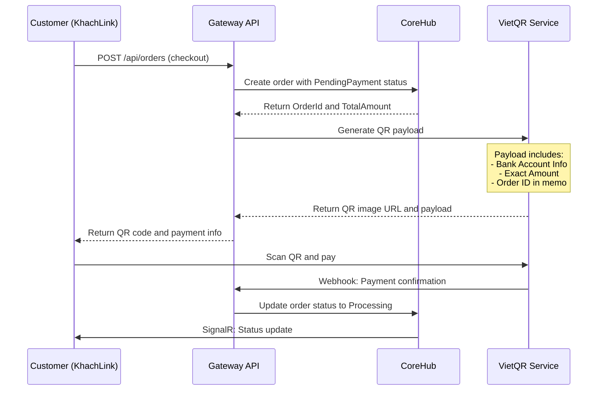
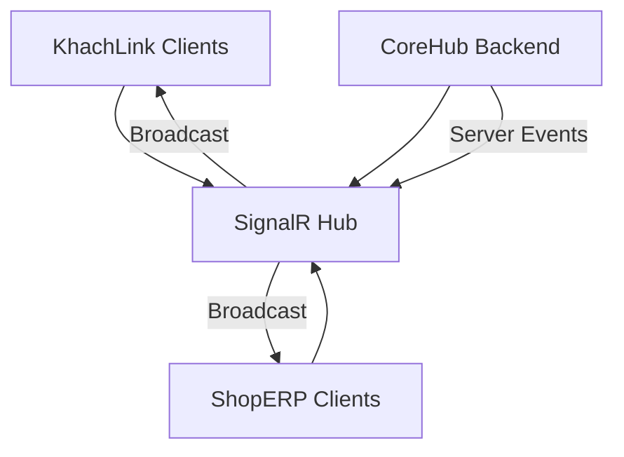

# Order Module Design Document

**Version:** 1.0  
**Date:** 2026-04-02  
**Author:** VanAn Development Team  
**Status:** GATE 1 - Analysis & Design  

---

## 1. DATABASE SCHEMA (PostgreSQL)

### 1.1 Orders Table

```sql
CREATE TABLE Orders (
    Id UUID PRIMARY KEY DEFAULT gen_random_uuid(),
    OrderId VARCHAR(50) UNIQUE NOT NULL, -- Human-readable order ID (e.g., ORD-20260402-001)
    TenantId UUID NOT NULL, -- Multi-tenancy support
    
    -- Customer Information
    CustomerName VARCHAR(200) NOT NULL,
    CustomerPhone VARCHAR(20),
    CustomerEmail VARCHAR(100),
    CustomerDeviceId VARCHAR(100), -- Zero-friction identity
    
    -- Order Details
    OrderType VARCHAR(20) NOT NULL DEFAULT 'DINEIN', -- DINEIN, TAKEAWAY, DELIVERY
    OrderStatus VARCHAR(20) NOT NULL DEFAULT 'Draft',
    
    -- Financial Calculations (2026 Tax Compliance)
    BasePrice DECIMAL(12,2) NOT NULL DEFAULT 0,
    Discount DECIMAL(12,2) NOT NULL DEFAULT 0,
    VAT_Amount DECIMAL(12,2) NOT NULL DEFAULT 0,
    ShippingFee DECIMAL(12,2) NOT NULL DEFAULT 0,
    TotalAmount DECIMAL(12,2) NOT NULL DEFAULT 0,
    
    -- Payment Information
    PaymentMethod VARCHAR(20), -- CASH, VIETQR, CREDIT_CARD
    PaymentStatus VARCHAR(20) DEFAULT 'Pending', -- Pending, Paid, Failed, Refunded
    VietQR_TransactionId VARCHAR(100),
    VietQR_Payload TEXT,
    
    -- Timestamps
    CreatedAt TIMESTAMP WITH TIME ZONE DEFAULT NOW(),
    UpdatedAt TIMESTAMP WITH TIME ZONE DEFAULT NOW(),
    CompletedAt TIMESTAMP WITH TIME ZONE,
    
    -- Notes & Metadata
    CustomerNotes TEXT,
    StaffNotes TEXT,
    TrackingCode VARCHAR(50), -- Social campaign tracking
    IsSyncedToCoreHub BOOLEAN DEFAULT FALSE,
    
    -- Constraints
    CONSTRAINT chk_order_status CHECK (OrderStatus IN ('Draft', 'PendingPayment', 'Processing', 'ReadyForPickup', 'Completed', 'Cancelled')),
    CONSTRAINT chk_payment_status CHECK (PaymentStatus IN ('Pending', 'Paid', 'Failed', 'Refunded')),
    CONSTRAINT chk_total_amount CHECK (TotalAmount >= 0)
);

-- Indexes for Performance
CREATE INDEX idx_orders_tenant_id ON Orders(TenantId);
CREATE INDEX idx_orders_status ON Orders(OrderStatus);
CREATE INDEX idx_orders_created_at ON Orders(CreatedAt);
CREATE INDEX idx_orders_customer_device ON Orders(CustomerDeviceId);
CREATE INDEX idx_orders_tracking_code ON Orders(TrackingCode);
```

### 1.2 OrderItems Table

```sql
CREATE TABLE OrderItems (
    Id UUID PRIMARY KEY DEFAULT gen_random_uuid(),
    OrderId UUID NOT NULL REFERENCES Orders(Id) ON DELETE CASCADE,
    TenantId UUID NOT NULL,
    
    -- Product Information
    ProductId UUID NOT NULL,
    ProductName VARCHAR(200) NOT NULL,
    ProductSKU VARCHAR(100),
    
    -- Order Item Details
    Quantity INTEGER NOT NULL CHECK (Quantity > 0),
    UnitPrice DECIMAL(12,2) NOT NULL CHECK (UnitPrice >= 0),
    BaseAmount DECIMAL(12,2) NOT NULL, -- Quantity * UnitPrice
    DiscountAmount DECIMAL(12,2) NOT NULL DEFAULT 0,
    VAT_Amount DECIMAL(12,2) NOT NULL DEFAULT 0,
    TotalAmount DECIMAL(12,2) NOT NULL,
    
    -- Customization (for drinks)
    Size VARCHAR(20), -- S, M, L
    SugarLevel VARCHAR(20), -- 0%, 30%, 50%, 70%, 100%
    IceLevel VARCHAR(20), -- 0%, 30%, 50%, 70%, 100%
    Toppings TEXT[], -- Array of topping names
    
    -- Timestamps
    CreatedAt TIMESTAMP WITH TIME ZONE DEFAULT NOW(),
    UpdatedAt TIMESTAMP WITH TIME ZONE DEFAULT NOW(),
    
    -- Constraints
    CONSTRAINT chk_quantity_positive CHECK (Quantity > 0),
    CONSTRAINT chk_unit_price_positive CHECK (UnitPrice >= 0),
    CONSTRAINT chk_total_amount_positive CHECK (TotalAmount >= 0)
);

-- Indexes for Performance
CREATE INDEX idx_order_items_order_id ON OrderItems(OrderId);
CREATE INDEX idx_order_items_product_id ON OrderItems(ProductId);
CREATE INDEX idx_order_items_tenant_id ON OrderItems(TenantId);
```

### 1.3 Order Status Workflow

```
Draft (Cart) → PendingPayment → Processing → ReadyForPickup → Completed
     ↓               ↓              ↓              ↓
   Cancelled ← Cancelled ← Cancelled ← Cancelled ← Cancelled
```

**Status Definitions:**
- **Draft**: Order in cart, not yet submitted
- **PendingPayment**: Order submitted, awaiting payment confirmation
- **Processing**: Payment confirmed, order being prepared
- **ReadyForPickup**: Order ready for customer pickup/delivery
- **Completed**: Order fulfilled and delivered
- **Cancelled**: Order cancelled (any stage before completion)

---

## 2. DYNAMIC QR PAYMENT INTEGRATION

### 2.1 VietQR Payload Generation Flow



### 2.2 VietQR Payload Structure

```json
{
  "bankAccount": {
    "bankId": "970418", // Vietcombank
    "accountNo": "1234567890",
    "accountName": "VAN AN GROUP"
  },
  "amount": 75000,
  "addInfo": "ORD-20260402-001",
  "template": "compact2"
}
```

### 2.3 Payment States

| State | Description | UI Action |
|-------|-------------|-----------|
| **Pending** | QR generated, waiting for payment | Show QR with countdown timer |
| **Paid** | Payment confirmed via webhook | Hide QR, show "Processing" status |
| **Failed** | Payment failed or expired | Show payment retry option |
| **Refunded** | Order cancelled after payment | Show refund confirmation |

---

## 3. REAL-TIME SIGNALR WORKFLOW

### 3.1 SignalR Hub Architecture



### 3.2 OrderHub Implementation

```csharp
public class OrderHub : Hub
{
    // Customer joins their order tracking group
    public async Task JoinOrderTracking(string orderId)
    {
        await Groups.AddToGroupAsync(Context.ConnectionId, $"order_{orderId}");
    }
    
    // Staff joins shop management group
    public async Task JoinShopManagement(string tenantId)
    {
        await Groups.AddToGroupAsync(Context.ConnectionId, $"shop_{tenantId}");
    }
    
    // Real-time order status updates
    public async Task NotifyOrderStatusChanged(string orderId, string status, string staffName)
    {
        await Clients.Group($"order_{orderId}")
            .SendAsync("OrderStatusChanged", new { 
                OrderId = orderId, 
                Status = status, 
                UpdatedAt = DateTime.UtcNow,
                UpdatedBy = staffName
            });
    }
    
    // New order notification for staff
    public async Task NotifyNewOrder(string tenantId, object orderDetails)
    {
        await Clients.Group($"shop_{tenantId}")
            .SendAsync("NewOrderReceived", orderDetails);
    }
}
```

### 3.3 Real-time Update Scenarios

| Event | Trigger | SignalR Message | UI Response |
|-------|---------|------------------|-------------|
| **Order Created** | Customer checkout | `NewOrderReceived` | ShopERP: New order notification |
| **Payment Confirmed** | VietQR webhook | `OrderStatusChanged` | KhachLink: Show "Processing" |
| **Status Updated** | Staff action | `OrderStatusChanged` | KhachLink: Update progress bar |
| **Order Ready** | Staff marks ready | `OrderStatusChanged` | KhachLink: Show pickup notification |

---

## 4. API CONTRACTS

### 4.1 Order Management Endpoints

#### 4.1.1 Create Order (Checkout)
```
POST /api/orders
Content-Type: application/json
Authorization: DeviceId (for customer identification)

Request Body:
{
  "customerName": "Nguyen Van A",
  "customerPhone": "0912345678",
  "customerEmail": "a@example.com",
  "orderType": "TAKEAWAY",
  "items": [
    {
      "productId": "uuid",
      "quantity": 2,
      "unitPrice": 35000,
      "size": "L",
      "sugarLevel": "50%",
      "iceLevel": "30%",
      "toppings": ["Tran Chau", "Pudding"]
    }
  ],
  "customerNotes": "Ít đường nhé",
  "trackingCode": "utm_campaign_123"
}

Response (201 Created):
{
  "orderId": "ORD-20260402-001",
  "id": "uuid",
  "status": "PendingPayment",
  "totalAmount": 75000,
  "paymentInfo": {
    "method": "VIETQR",
    "qrImageUrl": "https://api.vietqr.io/...",
    "payload": "000201010212...",
    "expiresIn": 300
  },
  "createdAt": "2026-04-02T11:30:00Z"
}
```

#### 4.1.2 Get Order Details (Tracking)
```
GET /api/orders/{orderId}

Response (200 OK):
{
  "orderId": "ORD-20260402-001",
  "status": "Processing",
  "orderType": "TAKEAWAY",
  "customerName": "Nguyen Van A",
  "items": [
    {
      "productName": "Trà Sữa Đậu Đỏ",
      "quantity": 2,
      "unitPrice": 35000,
      "totalAmount": 70000,
      "customizations": {
        "size": "L",
        "sugarLevel": "50%",
        "iceLevel": "30%",
        "toppings": ["Tran Chau", "Pudding"]
      }
    }
  ],
  "financials": {
    "basePrice": 70000,
    "discount": 0,
    "vatAmount": 5000,
    "shippingFee": 0,
    "totalAmount": 75000
  },
  "paymentStatus": "Paid",
  "estimatedReadyTime": "2026-04-02T11:45:00Z",
  "createdAt": "2026-04-02T11:30:00Z",
  "updatedAt": "2026-04-02T11:32:00Z"
}
```

#### 4.1.3 Update Order Status (Staff)
```
PUT /api/orders/{orderId}/status
Content-Type: application/json
Authorization: Bearer {staff_token}

Request Body:
{
  "status": "ReadyForPickup",
  "staffNotes": "Đơn hàng đã sẵn sàng",
  "estimatedReadyTime": "2026-04-02T11:45:00Z"
}

Response (200 OK):
{
  "orderId": "ORD-20260402-001",
  "previousStatus": "Processing",
  "newStatus": "ReadyForPickup",
  "updatedAt": "2026-04-02T11:40:00Z",
  "updatedBy": "Nguyen Van B"
}
```

### 4.2 Payment Webhook Endpoint

#### 4.2.1 VietQR Payment Confirmation
```
POST /api/payments/vietqr/webhook
Content-Type: application/json
X-VietQR-Signature: {hmac_signature}

Request Body:
{
  "transactionId": "txn_123456789",
  "orderId": "ORD-20260402-001",
  "amount": 75000,
  "status": "SUCCESS",
  "paidAt": "2026-04-02T11:32:15Z",
  "bankInfo": {
    "bankId": "970418",
    "accountNo": "****7890"
  }
}

Response (200 OK):
{
  "processed": true,
  "orderStatus": "Processing"
}
```

### 4.3 Error Responses

```json
{
  "error": {
    "code": "INVALID_ORDER_STATUS",
    "message": "Cannot transition from Completed to Processing",
    "details": {
      "currentStatus": "Completed",
      "requestedStatus": "Processing",
      "allowedTransitions": ["Completed"]
    }
  }
}
```

---

## 5. INTEGRATION POINTS

### 5.1 Multi-Tenancy Support
- All queries filtered by TenantId
- Shop-specific configuration for VietQR bank accounts
- Isolated order numbering per tenant

### 5.2 Tax Compliance (2026)
- VAT calculation: 10% on base amount after discount
- Audit trail for all financial changes
- Exportable tax reports

### 5.3 Inventory Integration
- Order status "Processing" triggers inventory deduction
- Automatic restock on "Cancelled" orders
- Low stock alerts via SignalR

---

## 6. SECURITY CONSIDERATIONS

### 6.1 Authentication & Authorization
- Customer: DeviceId-based identification
- Staff: JWT tokens with role-based access
- Webhook: HMAC signature verification

### 6.2 Data Protection
- PCI compliance for payment data
- PII encryption for customer information
- Audit logging for all status changes

---

## 7. NEXT STEPS (GATE 2)

Upon Architect approval, proceed to GATE 2 (TDD Implementation):

1. **Unit Tests** for Order domain logic
2. **Integration Tests** for API endpoints  
3. **SignalR Tests** for real-time workflows
4. **VietQR Integration Tests** with sandbox

---

## 8. APPROVAL REQUIRED

**Architect Review Required:**
- [ ] Database schema approval
- [ ] Payment flow approval  
- [ ] SignalR architecture approval
- [ ] API contract approval

**Ready for GATE 2 (TDD):** ❌ Awaiting Architect Approval
