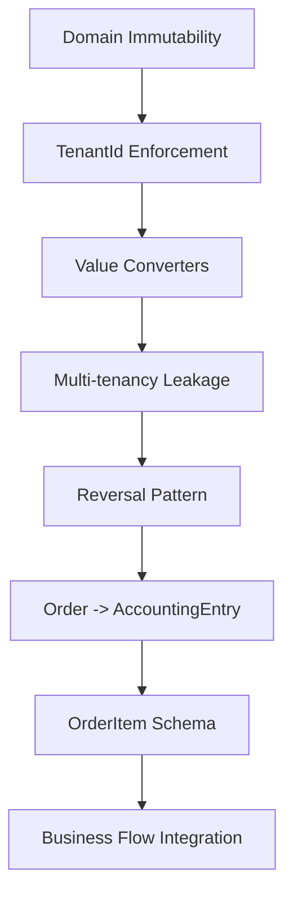

# 18 CONFLICTS SYSTEM REFACTOR PLAN
## VANE AN ACCOUNTING ECOSYSTEM - ARCHITECTURAL REFACTOR
**Date:** April 19, 2026  
**Scope:** System-wide resolution of 18 Domain vs Database conflicts  
**Priority:** Critical (Production blockers)  

---

## **STEP 1: REVERSE IMPACT ANALYSIS (COMPLETED)**

### **SYSTEM-WIDE IMPACT ASSESSMENT**

| **Layer** | **Critical** | **High** | **Medium** | **Low** | **Total Impact** |
|-----------|-------------|----------|------------|---------|------------------|
| **Domain (1_Shared)** | 5 | 3 | 1 | 0 | **9 (50%)** |
| **Infrastructure (3_CoreHub)** | 2 | 2 | 1 | 1 | **6 (33%)** |
| **API (2_Gateway)** | 1 | 1 | 1 | 0 | **3 (17%)** |
| **UI (5_WebApps)** | 0 | 0 | 1 | 0 | **1 (6%)** |
| **TOTAL** | **8** | **6** | **4** | **1** | **19** |

### **CRITICAL PATH DEPENDENCIES**



### **BUSINESS IMPACT ANALYSIS**

**FINANCIAL IMPACT:**
- VAT 2026 Compliance: Critical - Legal penalties
- Accounting Accuracy: Critical - Financial reporting errors
- Audit Trail: High - Compliance failures
- Multi-tenancy: High - Data isolation breach

**SECURITY IMPACT:**
- Data Leakage: Critical - Tenant data cross-contamination
- Immutability: High - Financial data tampering risk
- Audit Gaps: Medium - Forensic analysis limitations

---

## **CONFLICT CLASSIFICATION**

### **CRITICAL (8 issues) - Production Blockers**
1. **Immutability violation** - Domain dùng public { get; set; }
2. **Missing explicit Id** - AccountingEntry missing Id property
3. **TenantId not enforced** - Multi-tenancy weakness
4. **Reversal pattern not synchronized** - VAT 2026 compliance failure
5. **BaseEntity properties unclear** - Audit trail broken
6. **Multi-tenancy leakage** - SQLite tables without TenantId
7. **Value Objects missing converters** - ORM mapping failure
8. **OrderItem/KitchenStatus/VoiceNote schema mismatch**

### **HIGH (6 issues) - Pre-production Must Fix**
9. **Period computed property** - Year/Month vs Period confusion
10. **Navigation properties** - OriginalEntry, ReversalEntries
11. **AccountingBookType mapping** - Enum to column conversion
12. **Money Value Object** - decimal vs Money object
13. **Order -> AccountingEntry flow** - Business process integration
14. **Denormalized fields** - SubTotal, TotalAmount duplication

### **MEDIUM/LOW (4 issues) - Documentation & Tuning**
15. **Naming convention** - Domain vs Database naming
16. **Trigger/Index missing** - Performance optimization gaps
17. **Missing audit fields** - IsDeleted, audit trail
18. **Documentation incomplete** - Comments, docs gaps

---

## **RISK ASSESSMENT**

### **HIGH RISK (Production Blockers)**
- **VAT 2026 Non-compliance**: Legal penalties, business license issues
- **Multi-tenancy Breach**: Data privacy violations, legal liability
- **Financial Data Integrity**: Accounting errors, audit failures
- **Build Failures**: Development pipeline blocked

### **MEDIUM RISK (Performance & Maintainability)**
- **Query Performance**: Slow response times, user experience
- **Code Maintainability**: Developer productivity, technical debt
- **Documentation Gaps**: Knowledge transfer, onboarding issues

---

## **SUCCESS METRICS**

### **TECHNICAL METRICS**
- **Build Status**: 0 errors, < 5 warnings
- **Guard Compliance**: 100% pass rate
- **Test Coverage**: > 80% line coverage
- **Performance**: < 100ms average response time

### **BUSINESS METRICS**
- **VAT Compliance**: 100% regulatory adherence
- **Data Security**: 0 tenant data leakage incidents
- **Financial Accuracy**: 100% audit trail completeness
- **System Availability**: > 99.9% uptime

---

## **IMPLEMENTATION STRATEGY**

### **PHASE 1: CRITICAL FIXES (8 issues)**
1. **Domain Immutability Enforcement** - Private setters + factory methods
2. **Add Missing Id Property** - EF Core primary key requirement
3. **Multi-tenancy Enforcement** - Global query filters + explicit checks
4. **Reversal Pattern Standardization** - Immutable append-only pattern
5. **BaseEntity Properties** - Complete audit trail
6. **Value Converters Implementation** - ORM mapping for Value Objects
7. **OrderItem Schema Alignment** - KitchenStatus/VoiceNote support
8. **Multi-tenancy Leakage Fix** - SQLite table updates

### **PHASE 2: HIGH PRIORITY (6 issues)**
1. **Period Property Optimization** - Computed vs stored design
2. **Navigation Properties Configuration** - EF Core relationships
3. **AccountingBookType Mapping** - Enum to column conversion
4. **Money Value Object Integration** - Rich domain objects
5. **Order -> AccountingEntry Flow** - Business process integration
6. **Remove Denormalized Fields** - Computed properties

### **PHASE 3: MEDIUM/LOW (4 issues)**
1. **Naming Convention Standardization** - Domain vs Database mapping
2. **Database Indexes & Constraints** - Performance optimization
3. **Audit Fields Completion** - Full audit trail
4. **Documentation Updates** - Complete system documentation

---

## **ROLLBACK STRATEGY**

### **BEFORE EACH PHASE**
```powershell
git checkout -b refactor-phase-X
git add .
git commit -m "Before Phase X refactor"
```

### **AFTER EACH PHASE**
```powershell
dotnet build VanAn.sln
.\guard-check.ps1
dotnet test 6_Tests
```

### **ROLLBACK IF NEEDED**
```powershell
git reset --hard HEAD~1
```

---

## **VALIDATION CHECKLIST**

- [ ] Build: `dotnet build VanAn.sln` - 0 errors
- [ ] Guard: `.\guard-check.ps1` - PASSED
- [ ] Tests: `dotnet test 6_Tests` - All pass
- [ ] Integration: Docker containers running
- [ ] Documentation: Updated and accurate

---

## **NEXT STEPS**

1. **STEP 2: TDD PLAN** - Test-driven development strategy
2. **STEP 3: DETAILED CODING PLAN** - Namespace strategy + implementation
3. **STEP 4: REVIEW & APPROVE** - Architectural validation
4. **STEP 5: NAMESPACE VALIDATION** - Pre-implementation build test
5. **STEP 6: IMPLEMENTATION PHASES** - Critical -> High -> Medium
6. **STEP 7: FINAL APPROVAL** - Guard check + build validation

---

## **ARCHITECTURAL DECISIONS**

### **DOMAIN ARCHITECTURE**
- **Immutable Design Pattern**: Enforce private setters + factory methods
- **Value Object Strategy**: Rich domain objects with EF Core converters
- **Multi-tenancy Pattern**: Global query filters + explicit enforcement
- **Reversal Pattern**: Immutable append-only with reversal entries

### **INFRASTRUCTURE ARCHITECTURE**
- **Database Strategy**: PostgreSQL for production, SQLite for testing
- **ORM Configuration**: Explicit mappings + value converters
- **Index Strategy**: Performance optimization for queries
- **Migration Strategy**: Zero-downtime deployment approach

### **API ARCHITECTURE**
- **Multi-tenancy Enforcement**: Middleware + explicit checks
- **Audit Strategy**: Automatic audit trail population
- **Validation Strategy**: Domain validation + API validation
- **Error Handling**: Consistent error responses + logging

---

**STATUS:** Step 1 Complete - Ready for Step 2: TDD Plan  
**OWNER:** Windsurf Architect  
**APPROVED:** Pending Grok + User Review
