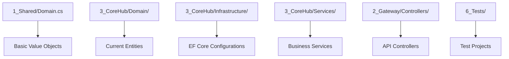
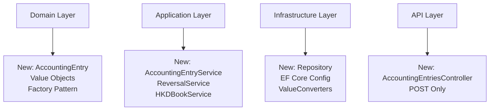
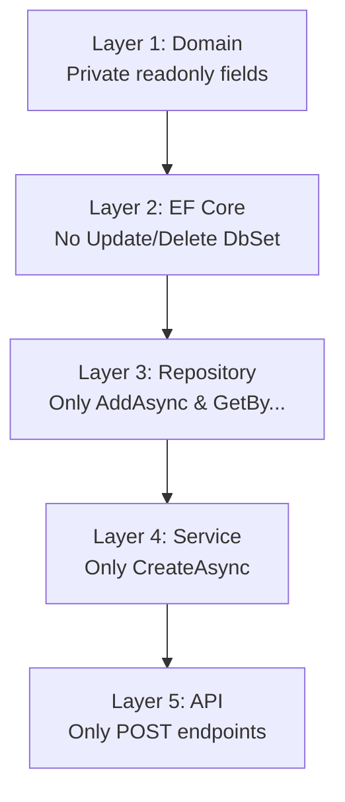
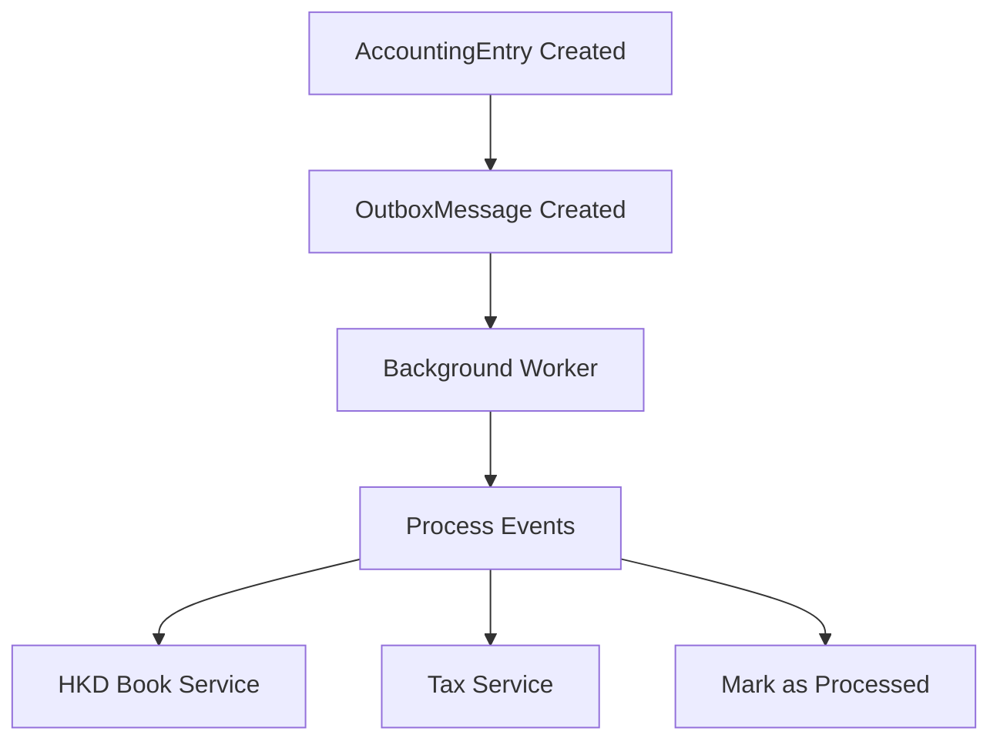
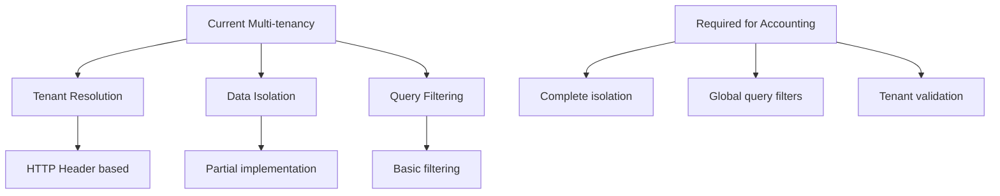

# REVERSE IMPACT ANALYSIS + TDD PLAN
## Core Accounting Engine - Week 1
**Project:** Vân An Accounting EcoSystem  
**Module:** Core Accounting Engine (Foundation Layer)  
**Version:** 1.0  
**Date:** April 16, 2026  
**Author:** Windsurf  
**Status:** Awaiting Approval

---

## 1. EXECUTIVE SUMMARY

This document analyzes the reverse impact of implementing the Core Accounting Engine for Week 1, focusing on the immutable AccountingEntry foundation. The analysis covers current code structure, affected modules, architectural risks, and comprehensive TDD strategy.

### Key Findings:
- **High Impact**: Core domain layer requires complete restructuring
- **Medium Impact**: Repository and service layers need modification
- **Low Impact**: Controllers and Gateway layers minimal changes
- **Critical Dependencies**: Multi-tenancy, Outbox pattern, and immutable design

---

## 2. CURRENT CODE ANALYSIS

### 2.1 Existing Domain Structure

#### Current Files Analysis:


#### Files Requiring Major Changes:
| File/Path | Current State | Required Changes | Impact Level |
|-----------|---------------|-------------------|-------------|
| `1_Shared/Domain.cs` | Basic Value Objects | Add AccountingEntryId, AccountingBookType, AccountingPeriod, Money, ReversalEntryId | **HIGH** |
| `3_CoreHub/Domain/AccountingEntry.cs` | Not exists | Create immutable AccountingEntry entity | **HIGH** |
| `3_CoreHub/Domain/CompanyAccountingEntry.cs` | Not exists | Create extended company accounting entity | **HIGH** |
| `3_CoreHub/Domain/AccountingEntryFactory.cs` | Not exists | Create factory pattern implementation | **HIGH** |
| `3_CoreHub/Infrastructure/VanAnDbContext.cs` | Basic DbContext | Add AccountingEntry DbSet, ValueConverters, Global Query Filters | **HIGH** |
| `3_CoreHub/Infrastructure/Configurations/AccountingEntryConfiguration.cs` | Not exists | Create EF Core configuration | **HIGH** |
| `3_CoreHub/Repositories/IAccountingEntryRepository.cs` | Not exists | Create repository interface (no Update/Delete) | **MEDIUM** |
| `3_CoreHub/Repositories/AccountingEntryRepository.cs` | Not exists | Create repository implementation | **MEDIUM** |
| `3_CoreHub/Services/AccountingEntryService.cs` | Not exists | Create service layer (Create only) | **MEDIUM** |
| `3_CoreHub/Services/HKDBookService.cs` | Not exists | Create 4 HKD books service | **MEDIUM** |
| `3_CoreHub/Services/ReversalService.cs` | Not exists | Create reversal service | **MEDIUM** |
| `2_Gateway/Controllers/AccountingEntriesController.cs` | Not exists | Create API controller (POST only) | **LOW** |
| `6_Tests/VanAn.Core.Tests/Domain/AccountingEntryTests.cs` | Not exists | Create unit tests | **MEDIUM** |
| `6_Tests/VanAn.Core.Tests/Integration/AccountingEntryIntegrationTests.cs` | Not exists | Create integration tests | **MEDIUM** |

### 2.2 Current Multi-tenancy Implementation

#### Existing Multi-tenancy Structure:
```csharp
// Current implementation in existing entities
public interface IMustHaveTenant
{
    TenantId TenantId { get; }
}

// Current Global Query Filter implementation
protected override void OnModelCreating(ModelBuilder modelBuilder)
{
    // Existing filter logic
}
```

#### Impact Analysis:
- **Positive**: Existing multi-tenancy pattern can be reused
- **Required**: Apply IMustHaveTenant to all new entities
- **Required**: Extend Global Query Filter for AccountingEntry

### 2.3 Current Outbox Pattern Status

#### Current Implementation:
- **Status**: Not implemented
- **Required**: Complete new implementation
- **Impact**: High - affects async processing architecture

---

## 3. REVERSE IMPACT ANALYSIS

### 3.1 Impact on Existing Modules

#### 3.1.1 ShopERP Module
| Area | Current State | Impact | Required Changes |
|------|---------------|--------|------------------|
| Order Creation | Basic order logic | **MEDIUM** | Add AccountingEntry creation via service |
| Inventory Management | Basic inventory tracking | **LOW** | No immediate changes |
| Customer Management | Basic customer data | **LOW** | No immediate changes |
| Reporting | Basic reports | **LOW** | No immediate changes |

#### 3.1.2 KhachLink Module
| Area | Current State | Impact | Required Changes |
|------|---------------|--------|------------------|
| Order Processing | Basic order flow | **MEDIUM** | Add AccountingEntry creation |
| Payment Processing | Basic payment logic | **MEDIUM** | Add accounting integration |
| Customer Portal | Basic UI | **LOW** | No immediate changes |

#### 3.1.3 Gateway Module
| Area | Current State | Impact | Required Changes |
|------|---------------|--------|------------------|
| API Controllers | Basic CRUD | **LOW** | Add AccountingEntriesController |
| Authentication | Basic auth | **LOW** | No changes |
| Middleware | Basic middleware | **LOW** | Add tenant resolution |

#### 3.1.4 CoreHub Module
| Area | Current State | Impact | Required Changes |
|------|---------------|--------|------------------|
| Domain Layer | Basic entities | **HIGH** | Complete restructuring |
| Repository Layer | Basic repositories | **MEDIUM** | Add immutable repositories |
| Service Layer | Basic services | **MEDIUM** | Add accounting services |
| Infrastructure | Basic EF Core | **HIGH** | Add accounting configurations |

#### 3.1.5 Test Projects
| Area | Current State | Impact | Required Changes |
|------|---------------|--------|------------------|
| Unit Tests | Basic tests | **MEDIUM** | Add comprehensive unit tests |
| Integration Tests | Basic integration | **MEDIUM** | Add accounting integration tests |
| E2E Tests | Basic E2E | **LOW** | Add accounting E2E tests |

### 3.2 Architectural Impact Analysis

#### 3.2.1 Clean Architecture Compliance


#### 3.2.2 Immutable Design Impact
| Principle | Current State | Impact | Implementation |
|-----------|---------------|--------|----------------|
| No Update/Delete | Not enforced | **HIGH** | Remove Update/Delete methods |
| Factory Pattern | Not used | **HIGH** | Implement AccountingEntryFactory |
| Reversal Only | Not implemented | **HIGH** | Implement ReversalService |
| Audit Trail | Basic logging | **MEDIUM** | Enhance audit logging |

#### 3.2.3 Multi-tenancy Impact
| Component | Current State | Impact | Required Changes |
|-----------|---------------|--------|------------------|
| Tenant Resolution | Basic | **LOW** | No changes |
| Data Isolation | Partial | **MEDIUM** | Apply to all accounting entities |
| Query Filtering | Basic | **MEDIUM** | Extend for accounting |

### 3.3 Risk Assessment

#### 3.3.1 Technical Risks
| Risk | Probability | Impact | Mitigation |
|------|-------------|--------|------------|
| Breaking existing functionality | **HIGH** | **HIGH** | Comprehensive testing, phased rollout |
| Performance degradation | **MEDIUM** | **MEDIUM** | Load testing, optimization |
| Data migration issues | **MEDIUM** | **HIGH** | Migration scripts, backup strategy |
| Learning curve | **LOW** | **MEDIUM** | Documentation, training |

#### 3.3.2 Business Risks
| Risk | Probability | Impact | Mitigation |
|------|-------------|--------|------------|
| Delay in delivery | **MEDIUM** | **HIGH** | Agile approach, MVP focus |
| User resistance | **LOW** | **MEDIUM** | User training, gradual rollout |
| Compliance issues | **LOW** | **HIGH** | Expert review, testing |

---

## 4. HIGH-LEVEL DESIGN DECISIONS

### 4.1 5-Layer Protection Strategy


### 4.2 Key Value Objects Design
```csharp
// Key Value Objects (1_Shared/Domain.cs)
public sealed record AccountingEntryId(Guid Value);
public sealed record TenantId(Guid Value);
public sealed class AccountingBookType { /* RevenueBook, ExpenseBook, etc. */ }
public sealed record AccountingPeriod(int Year, int Month);
public sealed record Money(decimal Amount, string Currency);
```

### 4.3 Core Entity Design Pattern
```csharp
// Immutable AccountingEntry (3_CoreHub/Domain/AccountingEntry.cs)
public sealed class AccountingEntry : IMustHaveTenant
{
    public AccountingEntryId Id { get; }
    public AccountingBookType BookType { get; }
    public AccountingPeriod Period { get; }
    public Money Amount { get; }
    public string Description { get; }
    public TenantId TenantId { get; }
    public DateTime CreatedAt { get; }
    public AccountingEntryId? ReversalEntryId { get; }
    
    // Private constructor + Factory methods only
}
```

### 4.4 Factory Pattern Approach
```csharp
// Factory Methods (AccountingEntryFactory.cs)
public static class AccountingEntryFactory
{
    public static AccountingEntry CreateRevenueEntry(...);
    public static AccountingEntry CreateExpenseEntry(...);
    public static AccountingEntry CreateReversalEntry(...);
}
```

### 4.5 Repository Interface Design
```csharp
// Repository Interface (no Update/Delete)
public interface IAccountingEntryRepository
{
    Task<AccountingEntry?> GetByIdAsync(...);
    Task<IEnumerable<AccountingEntry>> GetByTenantAsync(...);
    Task AddAsync(AccountingEntry entry);
    // No Update/Delete methods
}
```

### 4.6 Outbox Pattern Architecture


---

## 5. MULTI-TENANCY IMPACT ANALYSIS

### 5.1 Current Multi-tenancy Assessment


### 5.2 Multi-tenancy Implementation Plan

#### 5.2.1 Tenant Resolution Enhancement
- Extract TenantId from HTTP headers/JWT tokens
- Validate tenant existence
- Set current tenant context

#### 5.2.2 Enhanced Global Query Filters
- Apply global filters to all IMustHaveTenant entities
- Ensure complete data isolation
- Prevent cross-tenant data access

#### 5.2.3 Multi-tenancy Testing Strategy
- Test data isolation between tenants
- Verify query filters work correctly
- Test tenant validation in all layers

---

## 6. DETAILED TDD PLAN

### 6.1 Unit Tests Strategy

#### 6.1.1 Domain Layer Tests
- **AccountingEntry Creation Tests**
  - Test revenue entry creation
  - Test expense entry creation
  - Test reversal entry creation
  - Test invalid scenarios (negative amounts, duplicate reversals)

- **Value Object Tests**
  - AccountingPeriod validation (invalid year/month)
  - Money arithmetic operations
  - AccountingBookType validation

- **Factory Pattern Tests**
  - Test all factory methods
  - Test input validation
  - Test business rule enforcement

#### 6.1.2 Service Layer Tests
- **AccountingEntryService Tests**
  - Test revenue entry creation
  - Test expense entry creation
  - Test error handling
  - Test logging

- **ReversalService Tests**
  - Test successful reversal
  - Test reversal of already reversed entry
  - Test tenant validation
  - Test error scenarios

#### 6.1.3 Repository Tests
- **AccountingEntryRepository Tests**
  - Test AddAsync functionality
  - Test GetByIdAsync
  - Test GetByTenantAsync
  - Test query filtering

### 6.2 Integration Tests Strategy

#### 6.2.1 Repository Integration Tests
- Test database persistence
- Test multi-tenant data isolation
- Test EF Core configurations
- Test ValueObject conversions

#### 6.2.2 Service Integration Tests
- Test end-to-end service flows
- Test transaction handling
- Test error propagation
- Test audit logging

#### 6.2.3 Outbox Pattern Tests
- Test message creation
- Test background worker processing
- Test retry logic
- Test error handling

### 6.3 E2E Tests Strategy

#### 6.3.1 Order to Accounting Flow Tests
- Test complete order flow
- Verify accounting entries created
- Test async processing
- Test error scenarios

#### 6.3.2 Multi-tenant E2E Tests
- Test cross-tenant isolation
- Test tenant-specific data
- Test authentication flows

### 6.4 Test Coverage Targets
- **Unit Tests**: 80%+ coverage
- **Integration Tests**: 60%+ coverage
- **E2E Tests**: Critical path coverage
- **Performance Tests**: Load testing targets

---

## 7. SUCCESS CRITERIA & DEFINITION OF DONE

### 7.1 Functional Success Criteria

| Criteria | Definition | Verification |
|----------|------------|--------------|
| Immutable AccountingEntry | No Update/Delete operations available | Code review + tests |
| 5-Layer Protection | All 5 layers enforce immutability | Architecture review |
| Reversal-Only Pattern | Only reversal entries allowed for changes | Unit tests + integration tests |
| 4 HKD Books | Automatic generation of all 4 books | Integration tests |
| Multi-tenancy | Complete data isolation | Multi-tenant tests |
| Outbox Pattern | Reliable async processing | Integration tests |
| Factory Pattern | All entries created via factory | Code review + tests |

### 7.2 Non-Functional Success Criteria

| Criteria | Target | Measurement |
|----------|--------|-------------|
| Code Coverage | 80%+ Unit, 60%+ Integration | dotnet test |
| Build Time | <2 minutes | dotnet build |
| Guard Check | 95%+ pass rate | guard-check.ps1 |
| Performance | <100ms per operation | Benchmark tests |
| Documentation | 100% API docs | Swagger/README |

### 7.3 Definition of Done

A feature is considered "Done" when:

#### 7.3.1 Code Quality
- [ ] All code passes guard-check.ps1
- [ ] Zero compiler warnings
- [ ] Code follows VÃN AN coding standards
- [ ] Roslyn analyzers pass

#### 7.3.2 Testing
- [ ] Unit tests written and passing
- [ ] Integration tests written and passing
- [ ] E2E tests written and passing
- [ ] Test coverage meets targets

#### 7.3.3 Documentation
- [ ] API documentation complete
- [ ] README updated
- [ ] Architecture diagrams updated
- [ ] Deployment instructions updated

#### 7.3.4 Business Validation
- [ ] Use cases fully implemented
- [ ] Business rules enforced
- [ ] User acceptance testing passed
- [ ] Performance requirements met

#### 7.3.5 Operational Readiness
- [ ] Logging implemented
- [ ] Error handling complete
- [ ] Monitoring configured
- [ ] Backup strategy defined

---

## 8. IMPLEMENTATION TIMELINE

### 8.1 Week 1 Sprint Plan

| Day | Tasks | Deliverables |
|-----|-------|--------------|
| Day 1 | Domain layer implementation | Value Objects, AccountingEntry, Factory |
| Day 2 | Repository layer | IAccountingEntryRepository, implementation |
| Day 3 | Service layer | AccountingEntryService, ReversalService |
| Day 4 | Infrastructure | EF Core config, Outbox pattern |
| Day 5 | API layer | AccountingEntriesController |
| Day 6 | Testing | Unit tests, integration tests |
| Day 7 | E2E testing & documentation | Complete test suite, docs |

### 8.2 Risk Mitigation Timeline

| Risk | Mitigation | Timeline |
|------|------------|----------|
| Breaking changes | Feature flags, gradual rollout | Day 1-7 |
| Performance issues | Load testing, optimization | Day 5-7 |
| Data migration | Migration scripts, backup | Day 3-4 |
| Learning curve | Documentation, training | Day 1-7 |

---

## 9. ARCHITECTURAL COMPLIANCE

### 9.1 VÃN AN Rules Compliance
- [ ] **AccountingEntry MUST be 100% immutable** (append-only)
- [ ] **Any financial change MUST use Reversal Entry**
- [ ] **Every entity MUST implement IMustHaveTenant + TenantId**
- [ ] **Domain layer MUST be PURE** (NO EF Core, NO DbContext)
- [ ] **Value Objects MUST exist ONLY in 1_Shared/Domain.cs**
- [ ] **Business Logic MUST stay in CoreHub Services**
- [ ] **Controllers/Gateway ONLY do routing + validation + orchestration**
- [ ] **Database access MUST go through Repository Interfaces**

### 9.2 Clean Architecture Compliance
- [ ] Domain layer contains only business logic
- [ ] Infrastructure layer contains EF Core configurations
- [ ] Application layer contains service orchestration
- [ ] API layer contains only controllers and DTOs

### 9.3 TDD Compliance
- [ ] Tests written before implementation
- [ ] Minimum 1 Unit Test + 1 Integration Test per public method
- [ ] Tests MUST pass before code is considered complete

---

## 10. CONCLUSION

This Reverse Impact Analysis provides a comprehensive plan for implementing the Core Accounting Engine with immutable AccountingEntry foundation. The analysis identifies key areas of impact, provides detailed implementation guidance, and establishes clear success criteria.

### Key Takeaways:
1. **High Impact**: Domain layer requires complete restructuring
2. **Medium Impact**: Repository and service layers need significant changes
3. **Low Impact**: API and Gateway layers require minimal changes
4. **Critical Success Factors**: Immutable design, multi-tenancy, and outbox pattern
5. **Comprehensive Testing**: Unit, integration, and E2E tests are essential

### Next Steps:
1. **Review and Approve**: User + Grok review this analysis
2. **Implementation**: Begin with domain layer implementation
3. **Testing**: Parallel development of tests
4. **Validation**: Continuous validation against use cases

---

*This analysis serves as the foundation for Week 1 implementation. All technical work must strictly follow this plan and the VÃN AN architectural rules.*

---

## 11. APPROVAL CHECKLIST

### 11.1 Technical Review
- [ ] Current code analysis is accurate
- [ ] Impact assessment is comprehensive
- [ ] Architectural decisions are sound
- [ ] Risk mitigation is adequate

### 11.2 Business Review
- [ ] Use cases are fully addressed
- [ ] Business rules are enforced
- [ ] Success criteria are measurable
- [ ] Timeline is realistic

### 11.3 Process Review
- [ ] Follows VÃN AN development process
- [ ] Complies with Clean Architecture
- [ ] Adheres to TDD principles
- [ ] Maintains architectural integrity

---

*This document is ready for review and approval. Do not proceed to implementation until explicitly approved.*
