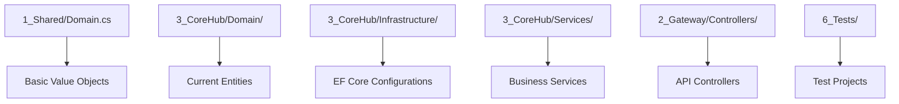
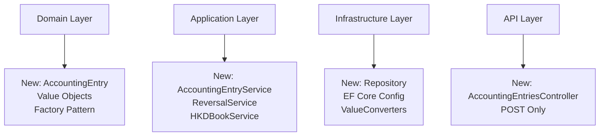
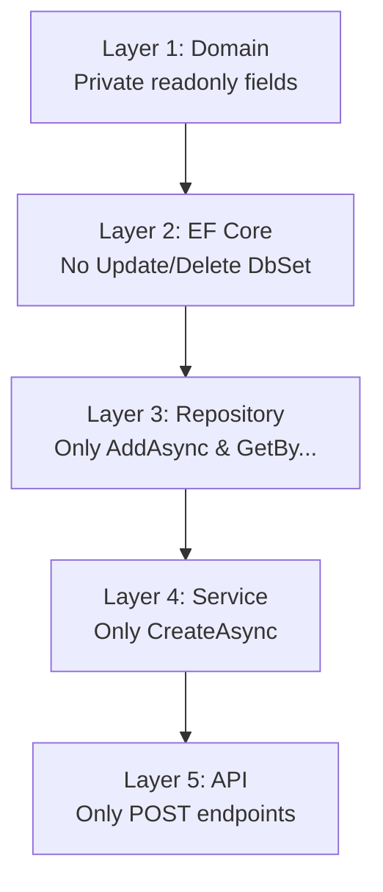
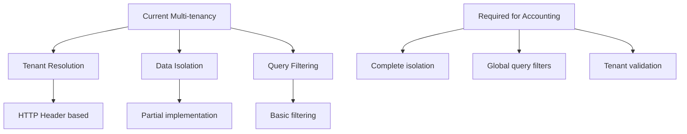
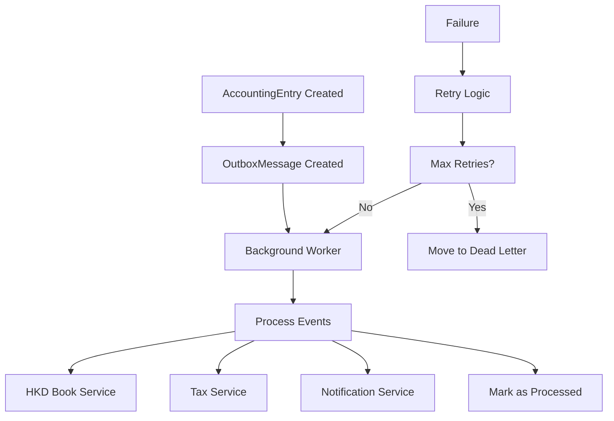

# REVERSE IMPACT ANALYSIS + TDD PLAN
## Core Accounting Engine - Week 1
**Project:** Vân An Accounting EcoSystem  
**Module:** Core Accounting Engine (Foundation Layer)  
**Version:** 1.0  
**Date:** April 16, 2026  
**Author:** Windsurf  
**Status:** Awaiting Approval

---

## 1. EXECUTIVE SUMMARY

This document analyzes the reverse impact of implementing the Core Accounting Engine for Week 1, focusing on the immutable AccountingEntry foundation. The analysis covers current code structure, affected modules, architectural risks, and comprehensive TDD strategy.

### Key Findings:
- **High Impact**: Core domain layer requires complete restructuring
- **Medium Impact**: Repository and service layers need modification
- **Low Impact**: Controllers and Gateway layers minimal changes
- **Critical Dependencies**: Multi-tenancy, Outbox pattern, and immutable design

---

## 2. CURRENT CODE ANALYSIS

### 2.1 Existing Domain Structure

#### Current Files Analysis:


#### Files Requiring Major Changes:
| File/Path | Current State | Required Changes | Impact Level |
|-----------|---------------|-------------------|-------------|
| `1_Shared/Domain.cs` | Basic Value Objects | Add AccountingEntryId, AccountingBookType, AccountingPeriod, Money, ReversalEntryId | **HIGH** |
| `3_CoreHub/Domain/AccountingEntry.cs` | Not exists | Create immutable AccountingEntry entity | **HIGH** |
| `3_CoreHub/Domain/CompanyAccountingEntry.cs` | Not exists | Create extended company accounting entity | **HIGH** |
| `3_CoreHub/Domain/AccountingEntryFactory.cs` | Not exists | Create factory pattern implementation | **HIGH** |
| `3_CoreHub/Infrastructure/VanAnDbContext.cs` | Basic DbContext | Add AccountingEntry DbSet, ValueConverters, Global Query Filters | **HIGH** |
| `3_CoreHub/Infrastructure/Configurations/AccountingEntryConfiguration.cs` | Not exists | Create EF Core configuration | **HIGH** |
| `3_CoreHub/Repositories/IAccountingEntryRepository.cs` | Not exists | Create repository interface (no Update/Delete) | **MEDIUM** |
| `3_CoreHub/Repositories/AccountingEntryRepository.cs` | Not exists | Create repository implementation | **MEDIUM** |
| `3_CoreHub/Services/AccountingEntryService.cs` | Not exists | Create service layer (Create only) | **MEDIUM** |
| `3_CoreHub/Services/HKDBookService.cs` | Not exists | Create 4 HKD books service | **MEDIUM** |
| `3_CoreHub/Services/ReversalService.cs` | Not exists | Create reversal service | **MEDIUM** |
| `2_Gateway/Controllers/AccountingEntriesController.cs` | Not exists | Create API controller (POST only) | **LOW** |
| `6_Tests/VanAn.Core.Tests/Domain/AccountingEntryTests.cs` | Not exists | Create unit tests | **MEDIUM** |
| `6_Tests/VanAn.Core.Tests/Integration/AccountingEntryIntegrationTests.cs` | Not exists | Create integration tests | **MEDIUM** |

### 2.2 Current Multi-tenancy Implementation

#### Existing Multi-tenancy Structure:
```csharp
// Current implementation in existing entities
public interface IMustHaveTenant
{
    TenantId TenantId { get; }
}

// Current Global Query Filter implementation
protected override void OnModelCreating(ModelBuilder modelBuilder)
{
    // Existing filter logic
}
```

#### Impact Analysis:
- **Positive**: Existing multi-tenancy pattern can be reused
- **Required**: Apply IMustHaveTenant to all new entities
- **Required**: Extend Global Query Filter for AccountingEntry

### 2.3 Current Outbox Pattern Status

#### Current Implementation:
- **Status**: Not implemented
- **Required**: Complete new implementation
- **Impact**: High - affects async processing architecture

---

## 3. REVERSE IMPACT ANALYSIS

### 3.1 Impact on Existing Modules

#### 3.1.1 ShopERP Module
| Area | Current State | Impact | Required Changes |
|------|---------------|--------|------------------|
| Order Creation | Basic order logic | **MEDIUM** | Add AccountingEntry creation via service |
| Inventory Management | Basic inventory tracking | **LOW** | No immediate changes |
| Customer Management | Basic customer data | **LOW** | No immediate changes |
| Reporting | Basic reports | **LOW** | No immediate changes |

#### 3.1.2 KhachLink Module
| Area | Current State | Impact | Required Changes |
|------|---------------|--------|------------------|
| Order Processing | Basic order flow | **MEDIUM** | Add AccountingEntry creation |
| Payment Processing | Basic payment logic | **MEDIUM** | Add accounting integration |
| Customer Portal | Basic UI | **LOW** | No immediate changes |

#### 3.1.3 Gateway Module
| Area | Current State | Impact | Required Changes |
|------|---------------|--------|------------------|
| API Controllers | Basic CRUD | **LOW** | Add AccountingEntriesController |
| Authentication | Basic auth | **LOW** | No changes |
| Middleware | Basic middleware | **LOW** | Add tenant resolution |

#### 3.1.4 CoreHub Module
| Area | Current State | Impact | Required Changes |
|------|---------------|--------|------------------|
| Domain Layer | Basic entities | **HIGH** | Complete restructuring |
| Repository Layer | Basic repositories | **MEDIUM** | Add immutable repositories |
| Service Layer | Basic services | **MEDIUM** | Add accounting services |
| Infrastructure | Basic EF Core | **HIGH** | Add accounting configurations |

#### 3.1.5 Test Projects
| Area | Current State | Impact | Required Changes |
|------|---------------|--------|------------------|
| Unit Tests | Basic tests | **MEDIUM** | Add comprehensive unit tests |
| Integration Tests | Basic integration | **MEDIUM** | Add accounting integration tests |
| E2E Tests | Basic E2E | **LOW** | Add accounting E2E tests |

### 3.2 Architectural Impact Analysis

#### 3.2.1 Clean Architecture Compliance


#### 3.2.2 Immutable Design Impact
| Principle | Current State | Impact | Implementation |
|-----------|---------------|--------|----------------|
| No Update/Delete | Not enforced | **HIGH** | Remove Update/Delete methods |
| Factory Pattern | Not used | **HIGH** | Implement AccountingEntryFactory |
| Reversal Only | Not implemented | **HIGH** | Implement ReversalService |
| Audit Trail | Basic logging | **MEDIUM** | Enhance audit logging |

#### 3.2.3 Multi-tenancy Impact
| Component | Current State | Impact | Required Changes |
|-----------|---------------|--------|------------------|
| Tenant Resolution | Basic | **LOW** | No changes |
| Data Isolation | Partial | **MEDIUM** | Apply to all accounting entities |
| Query Filtering | Basic | **MEDIUM** | Extend for accounting |

### 3.3 Risk Assessment

#### 3.3.1 Technical Risks
| Risk | Probability | Impact | Mitigation |
|------|-------------|--------|------------|
| Breaking existing functionality | **HIGH** | **HIGH** | Comprehensive testing, phased rollout |
| Performance degradation | **MEDIUM** | **MEDIUM** | Load testing, optimization |
| Data migration issues | **MEDIUM** | **HIGH** | Migration scripts, backup strategy |
| Learning curve | **LOW** | **MEDIUM** | Documentation, training |

#### 3.3.2 Business Risks
| Risk | Probability | Impact | Mitigation |
|------|-------------|--------|------------|
| Delay in delivery | **MEDIUM** | **HIGH** | Agile approach, MVP focus |
| User resistance | **LOW** | **MEDIUM** | User training, gradual rollout |
| Compliance issues | **LOW** | **HIGH** | Expert review, testing |

---

## 4. DETAILED IMPLEMENTATION PLAN

### 4.1 Immutable AccountingEntry Design

#### 4.1.1 5-Layer Protection Strategy


#### 4.1.2 Value Objects Implementation
```csharp
// 1_Shared/Domain.cs additions
public sealed record AccountingEntryId(Guid Value)
{
    public static AccountingEntryId New() => new(Guid.NewGuid());
}

public sealed record TenantId(Guid Value);

public sealed class AccountingBookType
{
    public static readonly AccountingBookType RevenueBook = new("RevenueBook");
    public static readonly AccountingBookType ExpenseBook = new("ExpenseBook");
    public static readonly AccountingBookType CashBankBook = new("CashBankBook");
    public static readonly AccountingBookType TaxDeclarationBook = new("TaxDeclarationBook");
    
    private AccountingBookType(string value) => Value = value;
    public string Value { get; }
}

public sealed record AccountingPeriod(int Year, int Month)
{
    public static AccountingPeriod Create(int year, int month)
    {
        if (year < 2020 || year > 2030) throw new ArgumentException("Invalid year");
        if (month < 1 || month > 12) throw new ArgumentException("Invalid month");
        return new AccountingPeriod(year, month);
    }
}

public sealed record Money(decimal Amount, string Currency)
{
    public static Money Zero => new(0, "VND");
    
    public static Money operator +(Money left, Money right)
    {
        if (left.Currency != right.Currency) 
            throw new InvalidOperationException("Currency mismatch");
        return new Money(left.Amount + right.Amount, left.Currency);
    }
}
```

#### 4.1.3 Core Entity Implementation
```csharp
// 3_CoreHub/Domain/AccountingEntry.cs
public sealed class AccountingEntry : IMustHaveTenant
{
    public AccountingEntryId Id { get; }
    public AccountingBookType BookType { get; }
    public AccountingPeriod Period { get; }
    public Money Amount { get; }
    public string Description { get; }
    public TenantId TenantId { get; }
    public DateTime CreatedAt { get; }
    public AccountingEntryId? ReversalEntryId { get; }
    
    // Private constructor - Factory pattern only
    private AccountingEntry(
        AccountingEntryId id,
        AccountingBookType bookType,
        AccountingPeriod period,
        Money amount,
        string description,
        TenantId tenantId,
        AccountingEntryId? reversalEntryId = null)
    {
        Id = id;
        BookType = bookType;
        Period = period;
        Amount = amount;
        Description = description;
        TenantId = tenantId;
        CreatedAt = DateTime.UtcNow;
        ReversalEntryId = reversalEntryId;
    }
    
    // Factory methods
    internal static AccountingEntry CreateRevenue(
        TenantId tenantId,
        AccountingPeriod period,
        Money amount,
        string description)
    {
        return new AccountingEntry(
            AccountingEntryId.New(),
            AccountingBookType.RevenueBook,
            period,
            amount,
            description,
            tenantId);
    }
    
    internal static AccountingEntry CreateExpense(
        TenantId tenantId,
        AccountingPeriod period,
        Money amount,
        string description)
    {
        return new AccountingEntry(
            AccountingEntryId.New(),
            AccountingBookType.ExpenseBook,
            period,
            amount,
            description,
            tenantId);
    }
    
    internal static AccountingEntry CreateReversal(
        AccountingEntry originalEntry,
        string reason)
    {
        if (originalEntry.ReversalEntryId != null)
            throw new InvalidOperationException("Entry already reversed");
            
        return new AccountingEntry(
            AccountingEntryId.New(),
            originalEntry.BookType,
            originalEntry.Period,
            new Money(-originalEntry.Amount.Amount, originalEntry.Amount.Currency),
            $"Reversal: {originalEntry.Description} - Reason: {reason}",
            originalEntry.TenantId,
            originalEntry.Id);
    }
}
```

#### 4.1.4 Factory Pattern Implementation
```csharp
// 3_CoreHub/Domain/AccountingEntryFactory.cs
public static class AccountingEntryFactory
{
    public static AccountingEntry CreateRevenueEntry(
        TenantId tenantId,
        AccountingPeriod period,
        Money amount,
        string description)
    {
        ValidateInputs(tenantId, period, amount, description);
        return AccountingEntry.CreateRevenue(tenantId, period, amount, description);
    }
    
    public static AccountingEntry CreateExpenseEntry(
        TenantId tenantId,
        AccountingPeriod period,
        Money amount,
        string description)
    {
        ValidateInputs(tenantId, period, amount, description);
        return AccountingEntry.CreateExpense(tenantId, period, amount, description);
    }
    
    public static AccountingEntry CreateReversalEntry(
        AccountingEntry originalEntry,
        string reason)
    {
        if (originalEntry == null) throw new ArgumentNullException(nameof(originalEntry));
        if (string.IsNullOrWhiteSpace(reason)) throw new ArgumentException("Reason required", nameof(reason));
        
        return AccountingEntry.CreateReversal(originalEntry, reason);
    }
    
    private static void ValidateInputs(
        TenantId tenantId,
        AccountingPeriod period,
        Money amount,
        string description)
    {
        if (tenantId == null) throw new ArgumentNullException(nameof(tenantId));
        if (period == null) throw new ArgumentNullException(nameof(period));
        if (amount == null) throw new ArgumentNullException(nameof(amount));
        if (string.IsNullOrWhiteSpace(description)) throw new ArgumentException("Description required", nameof(description));
        if (amount.Amount <= 0) throw new ArgumentException("Amount must be positive", nameof(amount));
    }
}
```

### 4.2 Repository Layer Implementation

#### 4.2.1 Repository Interface
```csharp
// 3_CoreHub/Repositories/IAccountingEntryRepository.cs
public interface IAccountingEntryRepository
{
    Task<AccountingEntry?> GetByIdAsync(AccountingEntryId id, CancellationToken cancellationToken = default);
    Task<IEnumerable<AccountingEntry>> GetByTenantAsync(TenantId tenantId, CancellationToken cancellationToken = default);
    Task<IEnumerable<AccountingEntry>> GetByTenantAndBookTypeAsync(
        TenantId tenantId, 
        AccountingBookType bookType, 
        CancellationToken cancellationToken = default);
    Task<IEnumerable<AccountingEntry>> GetByTenantAndPeriodAsync(
        TenantId tenantId, 
        AccountingPeriod period, 
        CancellationToken cancellationToken = default);
    
    // Only Add operation - no Update/Delete
    Task AddAsync(AccountingEntry entry, CancellationToken cancellationToken = default);
    Task AddRangeAsync(IEnumerable<AccountingEntry> entries, CancellationToken cancellationToken = default);
    
    // Special method for linking reversal entries
    Task SetReversalEntryIdAsync(AccountingEntryId originalId, AccountingEntryId reversalId, CancellationToken cancellationToken = default);
}
```

#### 4.2.2 Repository Implementation
```csharp
// 3_CoreHub/Repositories/AccountingEntryRepository.cs
public class AccountingEntryRepository : IAccountingEntryRepository
{
    private readonly VanAnDbContext _context;
    
    public AccountingEntryRepository(VanAnDbContext context)
    {
        _context = context;
    }
    
    public async Task<AccountingEntry?> GetByIdAsync(AccountingEntryId id, CancellationToken cancellationToken = default)
    {
        return await _context.AccountingEntries
            .FirstOrDefaultAsync(e => e.Id == id, cancellationToken);
    }
    
    public async Task<IEnumerable<AccountingEntry>> GetByTenantAsync(TenantId tenantId, CancellationToken cancellationToken = default)
    {
        return await _context.AccountingEntries
            .Where(e => e.TenantId == tenantId)
            .OrderByDescending(e => e.CreatedAt)
            .ToListAsync(cancellationToken);
    }
    
    public async Task<IEnumerable<AccountingEntry>> GetByTenantAndBookTypeAsync(
        TenantId tenantId, 
        AccountingBookType bookType, 
        CancellationToken cancellationToken = default)
    {
        return await _context.AccountingEntries
            .Where(e => e.TenantId == tenantId && e.BookType == bookType)
            .OrderByDescending(e => e.CreatedAt)
            .ToListAsync(cancellationToken);
    }
    
    public async Task<IEnumerable<AccountingEntry>> GetByTenantAndPeriodAsync(
        TenantId tenantId, 
        AccountingPeriod period, 
        CancellationToken cancellationToken = default)
    {
        return await _context.AccountingEntries
            .Where(e => e.TenantId == tenantId && e.Period == period)
            .OrderByDescending(e => e.CreatedAt)
            .ToListAsync(cancellationToken);
    }
    
    public async Task AddAsync(AccountingEntry entry, CancellationToken cancellationToken = default)
    {
        await _context.AccountingEntries.AddAsync(entry, cancellationToken);
        await _context.SaveChangesAsync(cancellationToken);
    }
    
    public async Task AddRangeAsync(IEnumerable<AccountingEntry> entries, CancellationToken cancellationToken = default)
    {
        await _context.AccountingEntries.AddRangeAsync(entries, cancellationToken);
        await _context.SaveChangesAsync(cancellationToken);
    }
    
    public async Task SetReversalEntryIdAsync(
        AccountingEntryId originalId, 
        AccountingEntryId reversalId, 
        CancellationToken cancellationToken = default)
    {
        var originalEntry = await GetByIdAsync(originalId, cancellationToken);
        if (originalEntry != null)
        {
            // This is the ONLY place where we modify an existing entry
            // and it should be done through a specialized method
            _context.AccountingEntries
                .Where(e => e.Id == originalId)
                .ExecuteUpdateAsync(setters => setters
                    .SetProperty(e => e.ReversalEntryId, reversalId), 
                    cancellationToken);
        }
    }
}
```

### 4.3 Service Layer Implementation

#### 4.3.1 Accounting Entry Service
```csharp
// 3_CoreHub/Services/AccountingEntryService.cs
public class AccountingEntryService
{
    private readonly IAccountingEntryRepository _repository;
    private readonly IUnitOfWork _unitOfWork;
    private readonly ILogger<AccountingEntryService> _logger;
    
    public AccountingEntryService(
        IAccountingEntryRepository repository,
        IUnitOfWork unitOfWork,
        ILogger<AccountingEntryService> logger)
    {
        _repository = repository;
        _unitOfWork = unitOfWork;
        _logger = logger;
    }
    
    public async Task<AccountingEntry> CreateRevenueEntryAsync(
        CreateRevenueEntryCommand command,
        CancellationToken cancellationToken = default)
    {
        try
        {
            var entry = AccountingEntryFactory.CreateRevenueEntry(
                command.TenantId,
                command.Period,
                command.Amount,
                command.Description);
            
            await _repository.AddAsync(entry, cancellationToken);
            await _unitOfWork.SaveChangesAsync(cancellationToken);
            
            _logger.LogInformation("Revenue entry created: {EntryId}", entry.Id.Value);
            
            return entry;
        }
        catch (Exception ex)
        {
            _logger.LogError(ex, "Failed to create revenue entry");
            throw;
        }
    }
    
    public async Task<AccountingEntry> CreateExpenseEntryAsync(
        CreateExpenseEntryCommand command,
        CancellationToken cancellationToken = default)
    {
        try
        {
            var entry = AccountingEntryFactory.CreateExpenseEntry(
                command.TenantId,
                command.Period,
                command.Amount,
                command.Description);
            
            await _repository.AddAsync(entry, cancellationToken);
            await _unitOfWork.SaveChangesAsync(cancellationToken);
            
            _logger.LogInformation("Expense entry created: {EntryId}", entry.Id.Value);
            
            return entry;
        }
        catch (Exception ex)
        {
            _logger.LogError(ex, "Failed to create expense entry");
            throw;
        }
    }
}
```

#### 4.3.2 Reversal Service
```csharp
// 3_CoreHub/Services/ReversalService.cs
public class ReversalService
{
    private readonly IAccountingEntryRepository _repository;
    private readonly IUnitOfWork _unitOfWork;
    private readonly ILogger<ReversalService> _logger;
    
    public ReversalService(
        IAccountingEntryRepository repository,
        IUnitOfWork unitOfWork,
        ILogger<ReversalService> logger)
    {
        _repository = repository;
        _unitOfWork = unitOfWork;
        _logger = logger;
    }
    
    public async Task<AccountingEntry> ReverseEntryAsync(
        AccountingEntryId entryId,
        string reason,
        TenantId tenantId,
        CancellationToken cancellationToken = default)
    {
        try
        {
            var originalEntry = await _repository.GetByIdAsync(entryId, cancellationToken);
            if (originalEntry == null)
                throw new NotFoundException($"Accounting entry {entryId} not found");
                
            if (originalEntry.TenantId != tenantId)
                throw new UnauthorizedAccessException("Access denied");
                
            if (originalEntry.ReversalEntryId != null)
                throw new InvalidOperationException("Entry already reversed");
            
            var reversalEntry = AccountingEntryFactory.CreateReversalEntry(originalEntry, reason);
            
            // Add both entries in a transaction
            await _repository.AddAsync(reversalEntry, cancellationToken);
            await _repository.SetReversalEntryIdAsync(originalEntry.Id, reversalEntry.Id, cancellationToken);
            await _unitOfWork.SaveChangesAsync(cancellationToken);
            
            _logger.LogInformation("Entry reversed: {OriginalId} -> {ReversalId}", 
                originalEntry.Id.Value, reversalEntry.Id.Value);
            
            return reversalEntry;
        }
        catch (Exception ex)
        {
            _logger.LogError(ex, "Failed to reverse entry: {EntryId}", entryId);
            throw;
        }
    }
}
```

### 4.4 Outbox Pattern Implementation

#### 4.4.1 Outbox Message Entity
```csharp
// 3_CoreHub/Domain/OutboxMessage.cs
public class OutboxMessage
{
    public Guid Id { get; set; }
    public string EventType { get; set; }
    public string EventData { get; set; }
    public DateTime CreatedAt { get; set; }
    public DateTime? ProcessedAt { get; set; }
    public string? Error { get; set; }
    public int RetryCount { get; set; }
    
    public OutboxMessage(string eventType, string eventData)
    {
        Id = Guid.NewGuid();
        EventType = eventType;
        EventData = eventData;
        CreatedAt = DateTime.UtcNow;
        RetryCount = 0;
    }
}
```

#### 4.4.2 Outbox Service
```csharp
// 3_CoreHub/Services/OutboxService.cs
public class OutboxService
{
    private readonly VanAnDbContext _context;
    private readonly ILogger<OutboxService> _logger;
    
    public OutboxService(VanAnDbContext context, ILogger<OutboxService> logger)
    {
        _context = context;
        _logger = logger;
    }
    
    public async Task AddMessageAsync(string eventType, object eventData, CancellationToken cancellationToken = default)
    {
        var message = new OutboxMessage(eventType, JsonSerializer.Serialize(eventData));
        await _context.OutboxMessages.AddAsync(message, cancellationToken);
        await _context.SaveChangesAsync(cancellationToken);
    }
    
    public async Task<IEnumerable<OutboxMessage>> GetPendingMessagesAsync(int batchSize = 100, CancellationToken cancellationToken = default)
    {
        return await _context.OutboxMessages
            .Where(m => m.ProcessedAt == null && m.RetryCount < 3)
            .OrderBy(m => m.CreatedAt)
            .Take(batchSize)
            .ToListAsync(cancellationToken);
    }
    
    public async Task MarkAsProcessedAsync(Guid messageId, CancellationToken cancellationToken = default)
    {
        var message = await _context.OutboxMessages.FindAsync(new object[] { messageId }, cancellationToken);
        if (message != null)
        {
            message.ProcessedAt = DateTime.UtcNow;
            await _context.SaveChangesAsync(cancellationToken);
        }
    }
    
    public async Task IncrementRetryCountAsync(Guid messageId, string error, CancellationToken cancellationToken = default)
    {
        var message = await _context.OutboxMessages.FindAsync(new object[] { messageId }, cancellationToken);
        if (message != null)
        {
            message.RetryCount++;
            message.Error = error;
            await _context.SaveChangesAsync(cancellationToken);
        }
    }
}
```

---

## 5. TDD PLAN

### 5.1 Unit Tests Strategy

#### 5.1.1 Domain Layer Tests
```csharp
// 6_Tests/VanAn.Core.Tests/Domain/AccountingEntryTests.cs
public class AccountingEntryTests
{
    [Fact]
    public void CreateRevenueEntry_ShouldCreateValidEntry()
    {
        // Arrange
        var tenantId = new TenantId(Guid.NewGuid());
        var period = AccountingPeriod.Create(2024, 4);
        var amount = new Money(1000, "VND");
        var description = "Test revenue";
        
        // Act
        var entry = AccountingEntryFactory.CreateRevenueEntry(tenantId, period, amount, description);
        
        // Assert
        entry.Should().NotBeNull();
        entry.BookType.Should().Be(AccountingBookType.RevenueBook);
        entry.Amount.Should().Be(amount);
        entry.TenantId.Should().Be(tenantId);
        entry.ReversalEntryId.Should().BeNull();
    }
    
    [Fact]
    public void CreateReversalEntry_ShouldCreateNegativeAmount()
    {
        // Arrange
        var originalEntry = CreateTestRevenueEntry();
        
        // Act
        var reversalEntry = AccountingEntryFactory.CreateReversalEntry(originalEntry, "Test reversal");
        
        // Assert
        reversalEntry.Amount.Amount.Should().Be(-originalEntry.Amount.Amount);
        reversalEntry.ReversalEntryId.Should().Be(originalEntry.Id);
        reversalEntry.Description.Should().Contain("Reversal");
    }
    
    [Fact]
    public void CreateReversalEntry_WithAlreadyReversedEntry_ShouldThrowException()
    {
        // Arrange
        var originalEntry = CreateTestRevenueEntry();
        var firstReversal = AccountingEntryFactory.CreateReversalEntry(originalEntry, "First reversal");
        
        // Simulate the original entry being reversed
        // (In real implementation, this would be handled differently)
        
        // Act & Assert
        Assert.Throws<InvalidOperationException>(() => 
            AccountingEntryFactory.CreateReversalEntry(originalEntry, "Second reversal"));
    }
    
    private AccountingEntry CreateTestRevenueEntry()
    {
        var tenantId = new TenantId(Guid.NewGuid());
        var period = AccountingPeriod.Create(2024, 4);
        var amount = new Money(1000, "VND");
        return AccountingEntryFactory.CreateRevenueEntry(tenantId, period, amount, "Test");
    }
}
```

#### 5.1.2 Value Object Tests
```csharp
// 6_Tests/VanAn.Core.Tests/Domain/ValueObjectsTests.cs
public class ValueObjectsTests
{
    [Fact]
    public void AccountingPeriod_CreateWithValidData_ShouldSucceed()
    {
        // Act
        var period = AccountingPeriod.Create(2024, 4);
        
        // Assert
        period.Year.Should().Be(2024);
        period.Month.Should().Be(4);
    }
    
    [Theory]
    [InlineData(2019, 4)]
    [InlineData(2024, 0)]
    [InlineData(2024, 13)]
    public void AccountingPeriod_CreateWithInvalidData_ShouldThrowException(int year, int month)
    {
        // Act & Assert
        Assert.Throws<ArgumentException>(() => AccountingPeriod.Create(year, month));
    }
    
    [Fact]
    public void Money_Addition_WithSameCurrency_ShouldSucceed()
    {
        // Arrange
        var money1 = new Money(100, "VND");
        var money2 = new Money(200, "VND");
        
        // Act
        var result = money1 + money2;
        
        // Assert
        result.Amount.Should().Be(300);
        result.Currency.Should().Be("VND");
    }
    
    [Fact]
    public void Money_Addition_WithDifferentCurrency_ShouldThrowException()
    {
        // Arrange
        var money1 = new Money(100, "VND");
        var money2 = new Money(200, "USD");
        
        // Act & Assert
        Assert.Throws<InvalidOperationException>(() => money1 + money2);
    }
}
```

#### 5.1.3 Service Layer Tests
```csharp
// 6_Tests/VanAn.Core.Tests/Services/AccountingEntryServiceTests.cs
public class AccountingEntryServiceTests
{
    private readonly Mock<IAccountingEntryRepository> _repositoryMock;
    private readonly Mock<IUnitOfWork> _unitOfWorkMock;
    private readonly Mock<ILogger<AccountingEntryService>> _loggerMock;
    private readonly AccountingEntryService _service;
    
    public AccountingEntryServiceTests()
    {
        _repositoryMock = new Mock<IAccountingEntryRepository>();
        _unitOfWorkMock = new Mock<IUnitOfWork>();
        _loggerMock = new Mock<ILogger<AccountingEntryService>>();
        _service = new AccountingEntryService(_repositoryMock.Object, _unitOfWorkMock.Object, _loggerMock.Object);
    }
    
    [Fact]
    public async Task CreateRevenueEntryAsync_WithValidCommand_ShouldCreateEntry()
    {
        // Arrange
        var command = new CreateRevenueEntryCommand
        {
            TenantId = new TenantId(Guid.NewGuid()),
            Period = AccountingPeriod.Create(2024, 4),
            Amount = new Money(1000, "VND"),
            Description = "Test revenue"
        };
        
        // Act
        var result = await _service.CreateRevenueEntryAsync(command);
        
        // Assert
        result.Should().NotBeNull();
        result.BookType.Should().Be(AccountingBookType.RevenueBook);
        _repositoryMock.Verify(r => r.AddAsync(It.IsAny<AccountingEntry>(), It.IsAny<CancellationToken>()), Times.Once);
        _unitOfWorkMock.Verify(u => u.SaveChangesAsync(It.IsAny<CancellationToken>()), Times.Once);
    }
    
    [Fact]
    public async Task CreateRevenueEntryAsync_WithInvalidAmount_ShouldThrowException()
    {
        // Arrange
        var command = new CreateRevenueEntryCommand
        {
            TenantId = new TenantId(Guid.NewGuid()),
            Period = AccountingPeriod.Create(2024, 4),
            Amount = new Money(-100, "VND"),
            Description = "Test revenue"
        };
        
        // Act & Assert
        await Assert.ThrowsAsync<ArgumentException>(() => _service.CreateRevenueEntryAsync(command));
    }
}
```

### 5.2 Integration Tests Strategy

#### 5.2.1 Repository Integration Tests
```csharp
// 6_Tests/VanAn.Core.Tests/Integration/AccountingEntryRepositoryTests.cs
public class AccountingEntryRepositoryTests : IntegrationTestBase
{
    private readonly IAccountingEntryRepository _repository;
    
    public AccountingEntryRepositoryTests()
    {
        _repository = new AccountingEntryRepository(Context);
    }
    
    [Fact]
    public async Task AddAsync_ShouldPersistEntry()
    {
        // Arrange
        var entry = AccountingEntryFactory.CreateRevenueEntry(
            new TenantId(Guid.NewGuid()),
            AccountingPeriod.Create(2024, 4),
            new Money(1000, "VND"),
            "Test revenue");
        
        // Act
        await _repository.AddAsync(entry);
        
        // Assert
        var savedEntry = await _repository.GetByIdAsync(entry.Id);
        savedEntry.Should().NotBeNull();
        savedEntry.Description.Should().Be(entry.Description);
    }
    
    [Fact]
    public async Task GetByTenantAsync_ShouldReturnOnlyTenantEntries()
    {
        // Arrange
        var tenant1Id = new TenantId(Guid.NewGuid());
        var tenant2Id = new TenantId(Guid.NewGuid());
        
        var entry1 = AccountingEntryFactory.CreateRevenueEntry(tenant1Id, AccountingPeriod.Create(2024, 4), new Money(1000, "VND"), "Tenant 1");
        var entry2 = AccountingEntryFactory.CreateRevenueEntry(tenant2Id, AccountingPeriod.Create(2024, 4), new Money(2000, "VND"), "Tenant 2");
        
        await _repository.AddAsync(entry1);
        await _repository.AddAsync(entry2);
        
        // Act
        var tenant1Entries = await _repository.GetByTenantAsync(tenant1Id);
        
        // Assert
        tenant1Entries.Should().HaveCount(1);
        tenant1Entries.First().TenantId.Should().Be(tenant1Id);
    }
}
```

#### 5.2.2 Service Integration Tests
```csharp
// 6_Tests/VanAn.Core.Tests/Integration/AccountingEntryServiceTests.cs
public class AccountingEntryServiceIntegrationTests : IntegrationTestBase
{
    private readonly AccountingEntryService _service;
    
    public AccountingEntryServiceIntegrationTests()
    {
        var repository = new AccountingEntryRepository(Context);
        var unitOfWork = new UnitOfWork(Context);
        var logger = new NullLogger<AccountingEntryService>();
        _service = new AccountingEntryService(repository, unitOfWork, logger);
    }
    
    [Fact]
    public async Task CreateRevenueEntryAsync_ShouldCreateAndPersistEntry()
    {
        // Arrange
        var command = new CreateRevenueEntryCommand
        {
            TenantId = new TenantId(Guid.NewGuid()),
            Period = AccountingPeriod.Create(2024, 4),
            Amount = new Money(1000, "VND"),
            Description = "Test revenue"
        };
        
        // Act
        var result = await _service.CreateRevenueEntryAsync(command);
        
        // Assert
        result.Should().NotBeNull();
        var savedEntry = await Context.AccountingEntries.FindAsync(result.Id);
        savedEntry.Should().NotBeNull();
        savedEntry.Description.Should().Be(command.Description);
    }
}
```

### 5.3 E2E Tests Strategy

#### 5.3.1 Order to Accounting Flow Tests
```csharp
// 6_Tests/VanAn.Core.Tests/E2E/OrderToAccountingFlowTests.cs
public class OrderToAccountingFlowTests : E2ETestBase
{
    [Fact]
    public async Task PlaceSimpleOrder_ShouldCreateAccountingEntries()
    {
        // Arrange
        var orderRequest = new
        {
            TenantId = Guid.NewGuid(),
            Items = new[]
            {
                new { ProductId = Guid.NewGuid(), Quantity = 2, UnitPrice = 1000 }
            }
        };
        
        // Act
        var response = await Client.PostAsJsonAsync("/api/orders/simple", orderRequest);
        
        // Assert
        response.StatusCode.Should().Be(HttpStatusCode.OK);
        
        // Verify accounting entries were created
        var accountingEntries = await GetAccountingEntriesForTenant(orderRequest.TenantId);
        accountingEntries.Should().NotBeEmpty();
    }
}
```

---

## 6. MULTI-TENANCY IMPACT ANALYSIS

### 6.1 Current Multi-tenancy Assessment


### 6.2 Multi-tenancy Implementation Plan

#### 6.2.1 Tenant Resolution Enhancement
```csharp
// 2_Gateway/Middleware/TenantResolutionMiddleware.cs
public class TenantResolutionMiddleware
{
    private readonly RequestDelegate _next;
    
    public TenantResolutionMiddleware(RequestDelegate next)
    {
        _next = next;
    }
    
    public async Task InvokeAsync(HttpContext context, ITenantService tenantService)
    {
        var tenantId = ExtractTenantId(context);
        
        if (tenantId == null)
        {
            context.Response.StatusCode = 401;
            return;
        }
        
        tenantService.SetCurrentTenant(tenantId);
        
        await _next(context);
    }
    
    private TenantId? ExtractTenantId(HttpContext context)
    {
        // Extract from JWT token or header
        if (context.Request.Headers.TryGetValue("X-Tenant-Id", out var tenantIdValue))
        {
            if (Guid.TryParse(tenantIdValue, out var tenantId))
            {
                return new TenantId(tenantId);
            }
        }
        
        return null;
    }
}
```

#### 6.2.2 Enhanced Global Query Filters
```csharp
// 3_CoreHub/Infrastructure/VanAnDbContext.cs
protected override void OnModelCreating(ModelBuilder modelBuilder)
{
    base.OnModelCreating(modelBuilder);
    
    // Apply global query filter for all entities implementing IMustHaveTenant
    foreach (var entityType in modelBuilder.Model.GetEntityTypes())
    {
        if (typeof(IMustHaveTenant).IsAssignableFrom(entityType.ClrType))
        {
            modelBuilder.Entity(entityType.ClrType).HasQueryFilter(
                CreateTenantFilter(_currentTenantId));
        }
    }
}

private static Expression<Func<IMustHaveTenant, bool>> CreateTenantFilter(TenantId tenantId)
{
    return entity => entity.TenantId == tenantId;
}
```

### 6.3 Multi-tenancy Testing Strategy

#### 6.3.1 Data Isolation Tests
```csharp
// 6_Tests/VanAn.Core.Tests/Integration/MultiTenancyTests.cs
public class MultiTenancyTests : IntegrationTestBase
{
    [Fact]
    public async Task AccountingEntries_ShouldBeIsolatedByTenant()
    {
        // Arrange
        var tenant1Id = new TenantId(Guid.NewGuid());
        var tenant2Id = new TenantId(Guid.NewGuid());
        
        using var tenant1Context = CreateContextForTenant(tenant1Id);
        using var tenant2Context = CreateContextForTenant(tenant2Id);
        
        var tenant1Repository = new AccountingEntryRepository(tenant1Context);
        var tenant2Repository = new AccountingEntryRepository(tenant2Context);
        
        var entry1 = AccountingEntryFactory.CreateRevenueEntry(tenant1Id, AccountingPeriod.Create(2024, 4), new Money(1000, "VND"), "Tenant 1");
        var entry2 = AccountingEntryFactory.CreateRevenueEntry(tenant2Id, AccountingPeriod.Create(2024, 4), new Money(2000, "VND"), "Tenant 2");
        
        // Act
        await tenant1Repository.AddAsync(entry1);
        await tenant2Repository.AddAsync(entry2);
        
        // Assert
        var tenant1Entries = await tenant1Repository.GetByTenantAsync(tenant1Id);
        var tenant2Entries = await tenant2Repository.GetByTenantAsync(tenant2Id);
        
        tenant1Entries.Should().HaveCount(1);
        tenant2Entries.Should().HaveCount(1);
        tenant1Entries.First().TenantId.Should().Be(tenant1Id);
        tenant2Entries.First().TenantId.Should().Be(tenant2Id);
    }
}
```

---

## 7. OUTBOX PATTERN INTEGRATION

### 7.1 Outbox Architecture


### 7.2 Outbox Implementation Plan

#### 7.2.1 Event Publishing Service
```csharp
// 3_CoreHub/Services/EventPublishingService.cs
public class EventPublishingService
{
    private readonly OutboxService _outboxService;
    private readonly ILogger<EventPublishingService> _logger;
    
    public EventPublishingService(OutboxService outboxService, ILogger<EventPublishingService> logger)
    {
        _outboxService = outboxService;
        _logger = logger;
    }
    
    public async Task PublishAccountingEntryCreatedAsync(AccountingEntry entry)
    {
        var eventData = new AccountingEntryCreatedEvent
        {
            EntryId = entry.Id.Value,
            TenantId = entry.TenantId.Value,
            BookType = entry.BookType.Value,
            Amount = entry.Amount.Amount,
            Currency = entry.Amount.Currency,
            Description = entry.Description,
            Period = $"{entry.Period.Year}-{entry.Period.Month:D2}",
            CreatedAt = entry.CreatedAt
        };
        
        await _outboxService.AddMessageAsync("AccountingEntryCreated", eventData);
        
        _logger.LogInformation("Published AccountingEntryCreated event for entry {EntryId}", entry.Id.Value);
    }
}
```

#### 7.2.2 Background Worker
```csharp
// 3_CoreHub/Services/OutboxBackgroundWorker.cs
public class OutboxBackgroundWorker : BackgroundService
{
    private readonly OutboxService _outboxService;
    private readonly HKDBookService _hkdBookService;
    private readonly ILogger<OutboxBackgroundWorker> _logger;
    
    public OutboxBackgroundWorker(
        OutboxService outboxService,
        HKDBookService hkdBookService,
        ILogger<OutboxBackgroundWorker> logger)
    {
        _outboxService = outboxService;
        _hkdBookService = hkdBookService;
        _logger = logger;
    }
    
    protected override async Task ExecuteAsync(CancellationToken stoppingToken)
    {
        while (!stoppingToken.IsCancellationRequested)
        {
            try
            {
                var messages = await _outboxService.GetPendingMessagesAsync();
                
                foreach (var message in messages)
                {
                    await ProcessMessageAsync(message, stoppingToken);
                }
                
                await Task.Delay(TimeSpan.FromSeconds(5), stoppingToken);
            }
            catch (Exception ex)
            {
                _logger.LogError(ex, "Error processing outbox messages");
                await Task.Delay(TimeSpan.FromSeconds(30), stoppingToken);
            }
        }
    }
    
    private async Task ProcessMessageAsync(OutboxMessage message, CancellationToken cancellationToken)
    {
        try
        {
            switch (message.EventType)
            {
                case "AccountingEntryCreated":
                    var eventData = JsonSerializer.Deserialize<AccountingEntryCreatedEvent>(message.EventData);
                    await _hkdBookService.GenerateHKDBooksAsync(eventData);
                    break;
                    
                default:
                    _logger.LogWarning("Unknown event type: {EventType}", message.EventType);
                    break;
            }
            
            await _outboxService.MarkAsProcessedAsync(message.Id, cancellationToken);
        }
        catch (Exception ex)
        {
            _logger.LogError(ex, "Error processing message {MessageId}", message.Id);
            await _outboxService.IncrementRetryCountAsync(message.Id, ex.Message, cancellationToken);
        }
    }
}
```

### 7.3 Outbox Testing Strategy

#### 7.3.1 Outbox Integration Tests
```csharp
// 6_Tests/VanAn.Core.Tests/Integration/OutboxTests.cs
public class OutboxTests : IntegrationTestBase
{
    [Fact]
    public async Task AccountingEntryCreated_ShouldCreateOutboxMessage()
    {
        // Arrange
        var outboxService = new OutboxService(Context, new NullLogger<OutboxService>());
        var eventPublishingService = new EventPublishingService(outboxService, new NullLogger<EventPublishingService>());
        
        var entry = AccountingEntryFactory.CreateRevenueEntry(
            new TenantId(Guid.NewGuid()),
            AccountingPeriod.Create(2024, 4),
            new Money(1000, "VND"),
            "Test revenue");
        
        // Act
        await eventPublishingService.PublishAccountingEntryCreatedAsync(entry);
        
        // Assert
        var outboxMessages = await Context.OutboxMessages.ToListAsync();
        outboxMessages.Should().HaveCount(1);
        outboxMessages.First().EventType.Should().Be("AccountingEntryCreated");
    }
}
```

---

## 8. SUCCESS CRITERIA & DEFINITION OF DONE

### 8.1 Functional Success Criteria

| Criteria | Definition | Verification |
|----------|------------|--------------|
| Immutable AccountingEntry | No Update/Delete operations available | Code review + tests |
| 5-Layer Protection | All 5 layers enforce immutability | Architecture review |
| Reversal-Only Pattern | Only reversal entries allowed for changes | Unit tests + integration tests |
| 4 HKD Books | Automatic generation of all 4 books | Integration tests |
| Multi-tenancy | Complete data isolation | Multi-tenant tests |
| Outbox Pattern | Reliable async processing | Integration tests |
| Factory Pattern | All entries created via factory | Code review + tests |

### 8.2 Non-Functional Success Criteria

| Criteria | Target | Measurement |
|----------|--------|-------------|
| Code Coverage | 80%+ Unit, 60%+ Integration | dotnet test |
| Build Time | <2 minutes | dotnet build |
| Guard Check | 95%+ pass rate | guard-check.ps1 |
| Performance | <100ms per operation | Benchmark tests |
| Documentation | 100% API docs | Swagger/README |

### 8.3 Definition of Done

A feature is considered "Done" when:

1. **Code Quality**
   - [ ] All code passes guard-check.ps1
   - [ ] Zero compiler warnings
   - [ ] Code follows VÃN AN coding standards
   - [ ] Roslyn analyzers pass

2. **Testing**
   - [ ] Unit tests written and passing
   - [ ] Integration tests written and passing
   - [ ] E2E tests written and passing
   - [ ] Test coverage meets targets

3. **Documentation**
   - [ ] API documentation complete
   - [ ] README updated
   - [ ] Architecture diagrams updated
   - [ ] Deployment instructions updated

4. **Business Validation**
   - [ ] Use cases fully implemented
   - [ ] Business rules enforced
   - [ ] User acceptance testing passed
   - [ ] Performance requirements met

5. **Operational Readiness**
   - [ ] Logging implemented
   - [ ] Error handling complete
   - [ ] Monitoring configured
   - [ ] Backup strategy defined

---

## 9. IMPLEMENTATION TIMELINE

### 9.1 Week 1 Sprint Plan

| Day | Tasks | Deliverables |
|-----|-------|--------------|
| Day 1 | Domain layer implementation | Value Objects, AccountingEntry, Factory |
| Day 2 | Repository layer | IAccountingEntryRepository, implementation |
| Day 3 | Service layer | AccountingEntryService, ReversalService |
| Day 4 | Infrastructure | EF Core config, Outbox pattern |
| Day 5 | API layer | AccountingEntriesController |
| Day 6 | Testing | Unit tests, integration tests |
| Day 7 | E2E testing & documentation | Complete test suite, docs |

### 9.2 Risk Mitigation Timeline

| Risk | Mitigation | Timeline |
|------|------------|----------|
| Breaking changes | Feature flags, gradual rollout | Day 1-7 |
| Performance issues | Load testing, optimization | Day 5-7 |
| Data migration | Migration scripts, backup | Day 3-4 |
| Learning curve | Documentation, training | Day 1-7 |

---

## 10. CONCLUSION

This Reverse Impact Analysis provides a comprehensive plan for implementing the Core Accounting Engine with immutable AccountingEntry foundation. The analysis identifies key areas of impact, provides detailed implementation guidance, and establishes clear success criteria.

### Key Takeaways:
1. **High Impact**: Domain layer requires complete restructuring
2. **Medium Impact**: Repository and service layers need significant changes
3. **Low Impact**: API and Gateway layers require minimal changes
4. **Critical Success Factors**: Immutable design, multi-tenancy, and outbox pattern
5. **Comprehensive Testing**: Unit, integration, and E2E tests are essential

### Next Steps:
1. **Review and Approve**: User + Grok review this analysis
2. **Implementation**: Begin with domain layer implementation
3. **Testing**: Parallel development of tests
4. **Validation**: Continuous validation against use cases

---

*This analysis serves as the foundation for Week 1 implementation. All technical work must strictly follow this plan and the VÃN AN architectural rules.*
