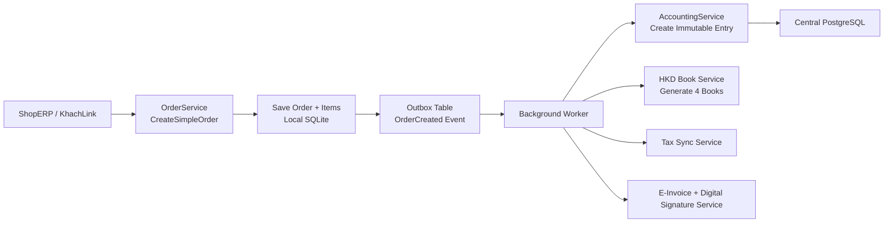
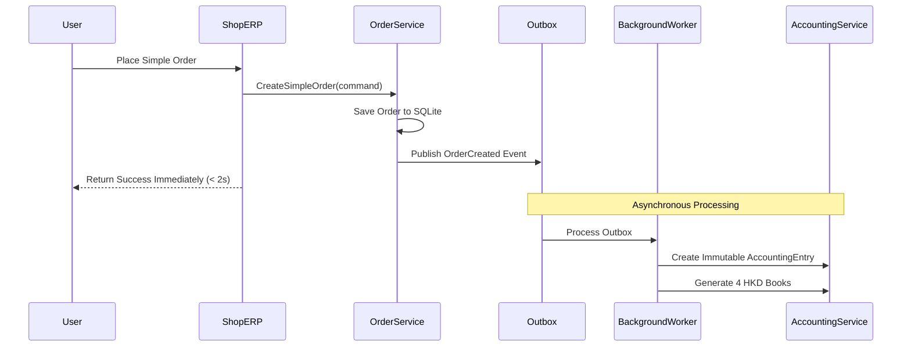

# USE CASE & BUSINESS DESIGN DOCUMENT
## Core Accounting Engine - Week 1
**Project:** Vân An Accounting EcoSystem  
**Module:** Core Accounting Engine (Foundation Layer)  
**Version:** 1.3  
**Date:** April 16, 2026  
**Authors:** User + Grok  
**Status:** Approved

### 1. Business Objectives for Week 1

Build a solid **immutable accounting foundation** that serves as the core engine for the entire system, capable of supporting:
- Household Business Accounting according to Circular 152/2025/TT-BTC (cash basis, 4 accounting books)
- Foundation for future expansion to Trading & Service Company accounting (accrual basis, accounts receivable/payable, double-entry)
- Strict adherence to **immutable + reversal-only** principle
- Strong **offline-first** capability with safe synchronization
- Smooth user experience (Order creation must not be blocked by accounting, tax sync, or e-invoice processes)

### 2. Detailed Use Cases

**UC-01: Create New Accounting Entry**
- **Actor**: ShopERP, KhachLink, External API, Accountant
- **Precondition**: User is authenticated with valid TenantId
- **Postcondition**: Immutable AccountingEntry is created and automatically posted to relevant books
- **Main Flow**:
  1. Validate input data (amount, period, book type, tenant, etc.)
  2. Use AccountingEntryFactory to create immutable entry
  3. Automatically generate entries in 4 HKD books (if applicable)
  4. Publish Domain Event "AccountingEntryCreated"
  5. Record audit log

**UC-02: Create Reversal Entry**
- **Actor**: Accountant or System
- **Hard Rule**: Only reversal is allowed. Direct modification or deletion of original entry is prohibited.
- **Main Flow**:
  1. Find original entry
  2. Verify it has not been reversed
  3. Create reversal entry (negative amount) via Factory
  4. Link both entries using ReversalEntryId
  5. Regenerate corresponding book entries

**UC-06: Place Simple Order (E2E Testing Entry Point)**
- **Actor**: Tester, Postman, ShopERP UI
- **Purpose**: Simple, fast entry point for end-to-end testing
- **Request**: `{ TenantId, CustomerId?, Items: [{ProductId, Quantity, UnitPrice}] }` 
- **Response**: Immediate success with OrderId (does not wait for accounting processing)

**UC-04: Offline to Online Delta Synchronization**
- Ensure idempotency and prevent duplicate entries

### 3. Core Business Rules (Golden Rules)

1. **Immutable Principle**: Once created, an AccountingEntry cannot be modified or deleted.
2. **Reversal Only**: Any financial change must be done through a reversal entry.
3. **4 HKD Accounting Books** (per Circular 152):
   - Cash & Bank Book
   - Purchase Book
   - Sales Book
   - Tax Declaration Book
4. **Multi-tenancy**: Every entity must have TenantId with Global Query Filter.
5. **Eventual Consistency**: Order response time must be under 2 seconds. Accounting, tax, and e-invoice processes run asynchronously.
6. **Full Audit Trail**: Record CreatedAt, CreatedBy, ReversalId, and Reference for every entry.

### 4. Data Flow Diagram



### 5. Processing Flow



### 6. Domain Model Design

#### Key Value Objects:
- **AccountingEntryId**: Strongly-typed unique identifier for accounting entries
- **TenantId**: Multi-tenancy identifier
- **AccountingBookType**: Type of accounting book (RevenueBook, ExpenseBook, CashBankBook, TaxDeclarationBook)
- **AccountingPeriod**: Accounting period (Year, Month)
- **Money**: Monetary amount with currency (VND)
- **AccountNumber**: Chart of accounts number (111, 112, 131, 331, 511, 632...)
- **ReversalEntryId**: Reference to the original entry being reversed

#### Main Entities:
```csharp
// Immutable core entity
public sealed class AccountingEntry
{
    public AccountingEntryId Id { get; }
    public AccountingBookType BookType { get; }
    public AccountingPeriod Period { get; }
    public Money Amount { get; }
    public string Description { get; }
    public TenantId TenantId { get; }
    public DateTime CreatedAt { get; }
    public AccountingEntryId? ReversalEntryId { get; }
    
    // Private constructor - Factory pattern only
    private AccountingEntry(...) { }
}

// Extended entity for future company accounting
public sealed class CompanyAccountingEntry : AccountingEntry
{
    public AccountNumber AccountNumber { get; }
    public AccountingEntryType EntryType { get; }
    public string? ReferenceNumber { get; }
    public string? CustomerId { get; }
    public string? SupplierId { get; }
    public DateTime? DueDate { get; }
}
```

#### Factory Pattern:
```csharp
public static class AccountingEntryFactory
{
    public static AccountingEntry CreateRevenueEntry(TenantId tenantId, AccountingPeriod period, Money amount, string description);
    public static AccountingEntry CreateExpenseEntry(TenantId tenantId, AccountingPeriod period, Money amount, string description);
    public static AccountingEntry CreateReversalEntry(AccountingEntry originalEntry, string reason);
}
```

#### Outbox Pattern:
```csharp
// OutboxMessages table for reliable async processing
public class OutboxMessage
{
    public Guid Id { get; set; }
    public string EventType { get; set; }
    public string EventData { get; set; }
    public DateTime CreatedAt { get; set; }
    public DateTime? ProcessedAt { get; set; }
    public string? Error { get; set; }
    public int RetryCount { get; set; }
}
```

### 7. Non-Functional Requirements

| Requirement | Target | Measurement |
|--------------|--------|-------------|
| Order response time | < 2 seconds | API response time |
| Immutable accounting | 100% | No Update/Delete operations |
| Offline mode | Full functionality | SQLite local database |
| Audit trail | Complete | All changes logged |
| E2E testing | Ready | Test endpoints available |
| Multi-tenancy | Complete | Data isolation |
| Data consistency | Eventual | Async processing |

### 8. Integration Points

#### External Systems:
- **ShopERP**: Order creation, inventory management
- **KhachLink**: Customer orders, payments
- **Tax Authority**: Tax report submission
- **E-Invoice Service**: Electronic invoice generation

#### Internal Services:
- **OrderService**: Order management
- **AccountingService**: Core accounting logic
- **HKDBookService**: 4 HKD books generation
- **TaxService**: Tax calculations and reports
- **InvoiceService**: E-invoice processing
- **SyncService**: Offline-online synchronization

### 9. Error Handling & Edge Cases

#### Common Errors:
- **Invalid tenant**: Return 403 Forbidden
- **Invalid accounting period**: Return 400 Bad Request
- **Duplicate entry**: Return 409 Conflict
- **Reversal of already reversed entry**: Return 400 Bad Request

#### Edge Cases:
- **Network disconnection**: Queue in Outbox, retry when online
- **Database failure**: Fallback to SQLite, sync later
- **Concurrent orders**: Handle with proper locking
- **Large amounts**: Validate business rules, flag for review

### 10. Testing Strategy

#### Unit Tests:
- Factory method validation
- Value object creation
- Business rule enforcement
- Immutable property validation

#### Integration Tests:
- End-to-end order flow
- Outbox pattern processing
- Multi-tenant data isolation
- Offline sync functionality

#### E2E Tests:
- Complete order lifecycle
- Tax report generation
- Invoice processing
- Offline-online scenarios

### 11. Success Criteria

#### Functional:
- [ ] Immutable AccountingEntry working
- [ ] 4 HKD books auto-generated
- [ ] Reversal-only pattern enforced
- [ ] Multi-tenancy working
- [ ] Offline mode functional

#### Non-Functional:
- [ ] Order response < 2 seconds
- [ ] 100% audit trail coverage
- [ ] Zero data corruption
- [ ] Complete test coverage
- [ ] Documentation complete

### 12. Dependencies & Prerequisites

#### Technical Dependencies:
- .NET 8 runtime
- PostgreSQL database
- SQLite for offline mode
- Redis for caching
- Docker for deployment

#### Business Dependencies:
- Circular 152/2025/TT-BTC compliance
- Tax authority integration
- E-invoice service provider
- Customer data migration

### 13. Risks & Mitigations

| Risk | Probability | Impact | Mitigation |
|------|-------------|--------|------------|
| Performance issues | Medium | High | Load testing, optimization |
| Data corruption | Low | Critical | Immutable design, backups |
| Sync conflicts | Medium | Medium | Conflict resolution strategy |
| Tax regulation changes | Low | High | Flexible architecture |

### 14. Version History

| Version | Date | Changes | Author |
|---------|------|---------|--------|
| 1.0 | 16/04/2026 | Initial version | User + Grok |
| 1.1 | - | - | - |
| 1.2 | - | - | - |
| 1.3 | 16/04/2026 | Final approved version | User + Grok |

---

*This document serves as the foundation for Week 1 implementation. All technical implementation must strictly follow these business requirements and design specifications.*
